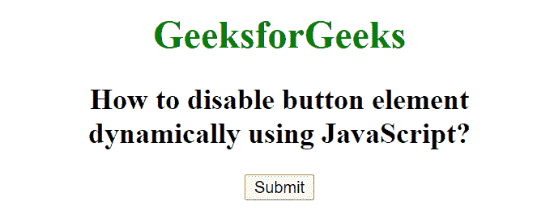
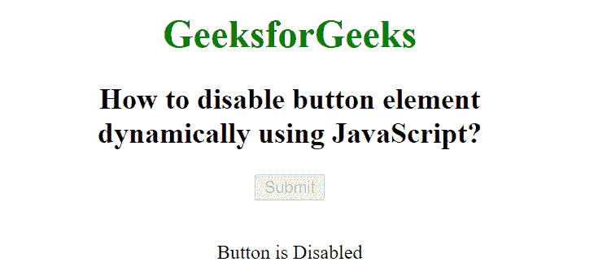

# 如何使用 JavaScript 动态禁用按钮元素？

> 原文:[https://www . geesforgeks . org/how-disable-button-element-dynamic-use-JavaScript/](https://www.geeksforgeeks.org/how-to-disable-button-element-dynamically-using-javascript/)

HTML DOM 中的按钮禁用属性用于设置或返回按钮元素是否被禁用。禁用的元素不可点击且不可用。它包含一个布尔值。

**语法:**用于设置按钮禁用属性。

```html
buttonObject.disabled = "value"
```

**属性值:**

*   **true:** 定义按钮元素被禁用。
*   **false:** 为默认值。它定义了不禁用按钮。

**返回值:**返回一个布尔值，代表按钮是否被禁用。

**示例:**

## 超文本标记语言

```html
<!DOCTYPE html>
<html>

<head>
    <title>
        How to disable button element
        dynamically using JavaScript?
    </title>
</head>

<body style="text-align:center">

    <h1 style="color: green;">
        GeeksforGeeks
    </h1>

    <h2>
        How to disable button element<br>
        dynamically using JavaScript?
    </h2>

    <!-- Assigning id to Button. -->
    <button id="GFG" onclick="Geeks()">
        Submit
    </button>

    <br><br>

    <p id="sudo"></p>

    <script>
        function Geeks() {

            document.getElementById("GFG")
                .disabled = "true";

            document.getElementById("sudo")
                .innerHTML = "Button is Disabled";
        } 
    </script>
</body>

</html>
```

**输出:**

**点击按钮前:**



**点击按钮后:**



**支持的浏览器:**DOM 按钮禁用属性支持的浏览器如下:

*   谷歌 Chrome
*   微软公司出品的 web 浏览器
*   火狐浏览器
*   歌剧
*   旅行队