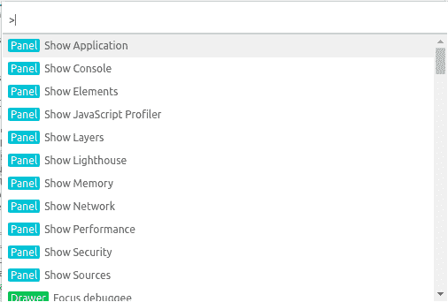
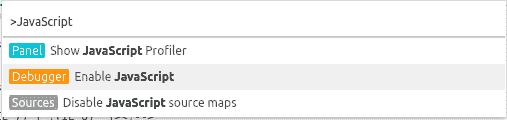
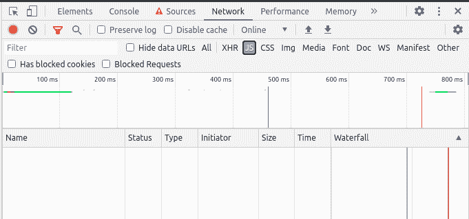
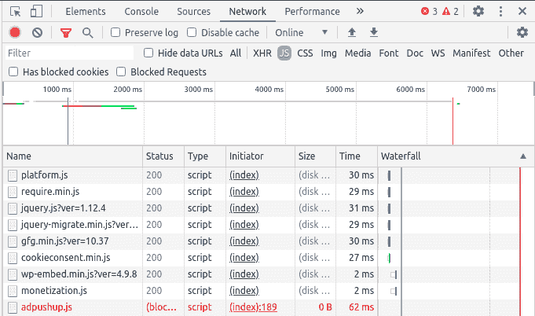

# 如何在 Chrome 开发者工具中禁用 JavaScript？

> 原文:[https://www . geesforgeks . org/如何禁用浏览器中的 JavaScript-开发人员-工具/](https://www.geeksforgeeks.org/how-to-disable-javascript-in-chrome-developer-tools/)

我们很少想看到没有 JavaScript 的网页是什么样子，基本上，当时我们想从那个页面禁用 JavaScript，在每个浏览器中，都有不同的方法。在本文中，我们将在 Chrome 开发工具中禁用 JavaScript。

**在 Chrome 开发者工具中禁用 JavaScript:**要禁用 JavaScript，按照步骤的顺序进行，为了更好的理解，我们增加了每个步骤的截图。

*   在 WindowsOS 中按 **(Ctrl + Shift + I)** ，在 MacOS 中按 **(command+shift+I)** ，打开 Chrome 开发者工具，打开检查元素选项。
*   之后，在 WindowsOS 中按 **(Ctrl+Shift+P)** ，在 MacOS 中按**(命令+shift+P)** 打开命令菜单。

*   接下来，在搜索中输入 JavaScript，选择**禁用 JavaScript** 则 JavaScript 将被禁用。

*   **来源**旁边的黄色警告图标向您保证 JavaScript 已被禁用。

*   只要你打开了 Chrome 开发工具，JavaScript 就会在这个标签中保持禁用状态。重装页面后，在 Chrome 开发者工具的**网络**中，JavaScript 会消失。

如果你想看页面，那页面在加载时是如何依赖 JavaScript 的。

*   再次在 WindowsOS 中选择 **(Ctrl+Shift+P)** ，在 MacOS 中选择**(命令+shift+P)** ，选择启用 JavaScript 命令。

