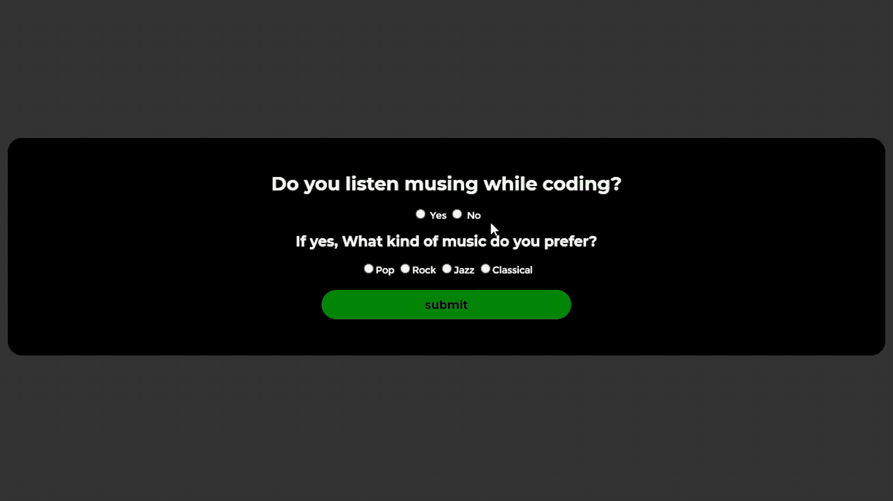
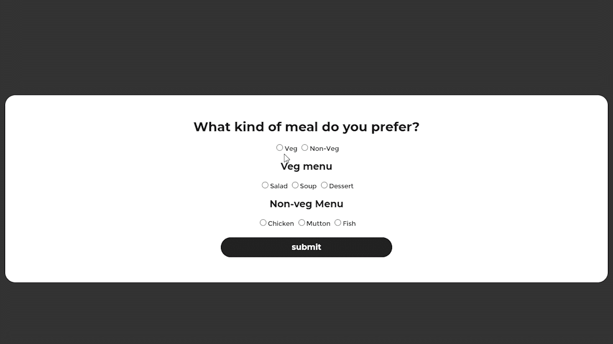

# 如何用 JavaScript 禁用单选按钮？

> 原文:[https://www . geesforgeks . org/如何使用 javascript 禁用单选按钮/](https://www.geeksforgeeks.org/how-to-disable-radio-button-using-javascript/)

在 [HTML](https://www.geeksforgeeks.org/html-tutorials/) 中，我们有一个功能，通过它我们可以从多个给定的选项中选择一个选项，并且我们可以在单选按钮的帮助下做到这一点。因此，在本文中，我们将学习如何在某些情况下禁用这些单选按钮。我们将看到单选按钮是如何工作的，以及为什么我们需要禁用它们，我们将有一些标准的例子来更好地理解我们将要做的事情。

**单选按钮**基本上是一些可选择的按钮，我们可以用这些按钮从多个给定的选项中选择一个选项，我们必须从所有单选按钮选项中选择几乎一个选项。

**为什么我们需要禁用它们？**

我们使用单选按钮从多个选项中选择任何一个选项，但是在某些情况下，我们必须禁用它们。例如，我们有两个问题，我们是否喜欢玩游戏，如果我们选择是，那么我们可以从多个选项中选择任何选项，但是如果我们首先选择否，那么我们必须禁用那些我们用户无法选择的游戏选项，我们将在示例中看到这一点，并获得更好的理解。

**我们将如何禁用单选按钮:**在 HTML 中对于输入元素我们有一个属性叫做 [disabled](https://www.geeksforgeeks.org/html-select-disabled-attribute/) ，这是一个布尔值属性，我们可以在 true 或者 false 之间进行选择，我们将使用这个属性来禁用单选按钮。

**例 1:** 在本例中，我们有两个问题第一个是**“是”**或**“否”**的问题，如果用户选择“是”，单选按钮将不会被禁用如果用户选择“否”，则我们将禁用单选按钮。

## 超文本标记语言

```html
<!DOCTYPE html>
<html lang="en">

<head>

    <!-- CSS code required for the page -->
    <style>
        body {
            display: flex;
            align-items: center;
            justify-content: center;
            margin-top: 10%;
            background: rgb(51, 51, 51);
        }

        .main {
            width: 60%;
            height: 100%;
            background-color: #f2f2f2;
            display: flex;
            flex-direction: column;
            align-items: center;
            justify-content: center;
            padding: 30px;
            border-radius: 20px;
            background-color: rgb(0, 0, 0);
            color: white;
            font-family: montserrat;
            font-size: 0.8rem;
        }

        #submit {
            width: 30%;
            margin: 20px;
            height: 40px;
            border-radius: 20px;
            background-color: rgb(0, 133, 7);
            color: rgb(0, 0, 0);
            font-family: montserrat;
            font-size: 1rem;
            font-weight: bold;
            border: none;
            cursor: pointer;
        }

        #submit:hover {
            background-color: rgb(0, 98, 5);
            color: rgb(0, 0, 0);
        }
    </style>
</head>

<body>
    <div class="main">
        <h1>Do you listen musing while coding?</h1>

        <div class="question1">
            <label>
                <input name="music" type="radio"
                    id="yes" value="yes" /> Yes
            </label>
            <label>
                <input name="music" type="radio" id="no"
                    value="no" onchange="check()" /> No
            </label>
        </div>

        <h2>
            If yes, What kind of music
            do you prefer?
        </h2>

        <div class="question2">
            <label>
                <input type="radio" name="Musics"
                    id="Pop" value="pop" />Pop</label>
            <label>
                <input type="radio" name="Musics"
                    id="Rock" value="rock" />Rock</label>
            <label>
                <input type="radio" name="Musics"
                    id="Jazz" value="jazz" />Jazz</label>
            <label>
                <input type="radio" name="Musics"
                    id="Classical" value="classical" />
                    Classical
                </label>
        </div>

        <button id="submit" onclick="message()">
            submit
        </button>
    </div>

    <script>

        // This function will check if the user has
        // selected any option from the question 1
        function check() {
            if (document.getElementById('no').checked) {
                document.getElementById('Pop').disabled = true;
                document.getElementById('Rock').disabled = true;
                document.getElementById('Jazz').disabled = true;
                document.getElementById('Classical').disabled = true;
            }

            else {
                document.getElementById('Pop').disabled = false;
                document.getElementById('Rock').disabled = false;
                document.getElementById('Jazz').disabled = false;
                document.getElementById('Classical').disabled = false;
            }
        }

        // This function will give the message after
        // the user clicks on the submit button.
        function message() {
            if (document.getElementById('yes').checked) {
                if (document.getElementById('Pop').checked) {
                    alert("You like pop music");
                }
                else if (document.getElementById('Rock').checked) {
                    alert("You like rock music");
                }
                else if (document.getElementById('Jazz').checked) {
                    alert("You like jazz music");
                }
                else if (document.getElementById('Classical').checked) {
                    alert("You like classical music");
                }
            }
            else {
                alert("You don't listen musing while coding");
            }
            alert("Thank you for your response!");
        }
    </script>
</body>

</html>
```

**输出:**



**例 2:** 在本例中，我们将有三个问题，在第一个问题的基础上，我们将禁用其余两个问题中的一个问题，反之亦然。

## 超文本标记语言

```html
<!DOCTYPE html>
<html lang="en">

<head>

    <!-- CSS code required for the page -->
    <style>
        body {
            display: flex;
            align-items: center;
            justify-content: center;
            margin-top: 10%;
            background: rgb(51, 51, 51);
        }

        .main {
            width: 60%;
            height: 100%;
            background-color: #f2f2f2;
            display: flex;
            flex-direction: column;
            align-items: center;
            justify-content: center;
            padding: 30px;
            border-radius: 20px;
            background-color: rgb(255, 255, 255);
            color: rgb(27, 27, 27);
            font-family: montserrat;
            font-size: 0.8rem;
        }

        #submit {
            width: 30%;
            margin: 20px;
            height: 40px;
            border-radius: 20px;
            background-color: rgb(34, 34, 34);
            color: rgb(255, 255, 255);
            font-family: montserrat;
            font-size: 1rem;
            font-weight: bold;
            border: none;
            cursor: pointer;
        }

        #submit:hover {
            background-color: rgb(0, 98, 5);
            color: rgb(0, 0, 0);
        }
    </style>
</head>

<body>
    <div class="main">
        <h1>What kind of meal do you prefer?</h1>

        <div class="question">
            <label> <input type="radio" name="meal"
                id="veg" onchange="check()">Veg</label>
            <label> <input type="radio" name="meal"
                id="nonveg" onchange="check()">
                Non-Veg
            </label>
        </div>

        <h2>Veg menu</h2>

        <div class="veg_menu">
            <label> <input type="radio"
                name="veg_meal" id="salad">Salad</label>
            <label> <input type="radio"
                name="veg_meal" id="soup">Soup</label>
            <label> <input type="radio"
                name="veg_meal" id="dessert">Dessert
            </label>
        </div>

        <h2>Non-veg Menu</h2>

        <div class="non-veg_menu">
            <label> <input type="radio"
                name="non_veg_meal" id="chicken">Chicken</label>
            <label> <input type="radio" name="non_veg_meal"
                id="mutton">Mutton</label>
            <label> <input type="radio" name="non_veg_meal"
                id="fish">Fish</label>
        </div>
        <button id="submit" onclick="message(),resetMessage()">
            submit
        </button>
    </div>

    <script>
        function check() {
            if (document.getElementById('veg').checked) {
                document.getElementById('chicken').disabled = true;
                document.getElementById('mutton').disabled = true;
                document.getElementById('fish').disabled = true;
                document.getElementById('salad').disabled = false;
                document.getElementById('soup').disabled = false;
                document.getElementById('dessert').disabled = false;
            }
            else if (document.getElementById('nonveg').checked) {
                document.getElementById('salad').disabled = true;
                document.getElementById('soup').disabled = true;
                document.getElementById('dessert').disabled = true;
                document.getElementById('chicken').disabled = false;
                document.getElementById('mutton').disabled = false;
                document.getElementById('fish').disabled = false;
            }
        }
        function message() {
            if (document.getElementById('veg').checked) {
                if (document.getElementById('salad').checked) {
                    alert("You have selected Salad");
                }
                else if (document.getElementById('soup').checked) {
                    alert("You have selected Soup");
                }
                else if (document.getElementById('dessert').checked) {
                    alert("You have selected Dessert");
                }
                else {
                    alert("Please select a meal");
                }
            }
            else if (document.getElementById('nonveg').checked) {
                if (document.getElementById('chicken').checked) {
                    alert("You have selected Chicken");
                }
                else if (document.getElementById('mutton').checked) {
                    alert("You have selected Mutton");
                }
                else if (document.getElementById('fish').checked) {
                    alert("You have selected Fish");
                }
                else {
                    alert("Please select a meal");
                }
            }
            else {
                alert("Please select a meal");
            }
        }
    </script>
</body>

</html>
```

#### **输出:**

