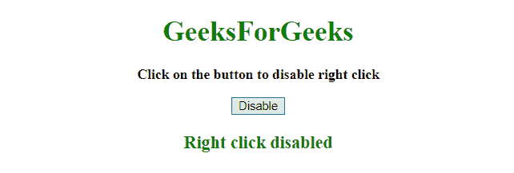
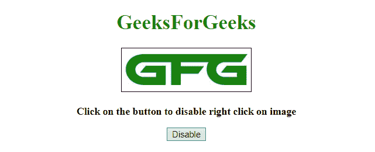
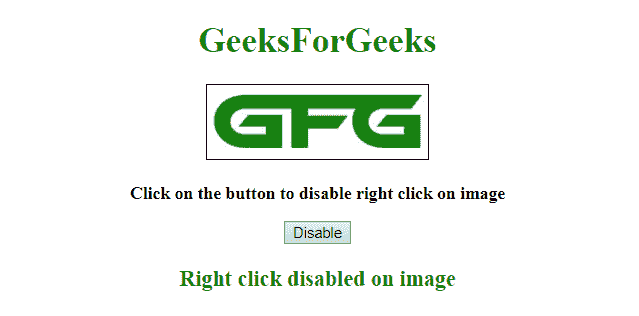

# 如何用 JavaScript 禁用网页右键？

> 原文:[https://www . geesforgeks . org/如何禁用-右键单击-网页-使用-javascript/](https://www.geeksforgeeks.org/how-to-disable-right-click-on-web-page-using-javascript/)

JavaScript 方法用于禁用页面上的右键单击。使用的方法如下:

*   **[HTML DOM addEventListener() Method](https://www.geeksforgeeks.org/html-dom-addeventlistener-method/):** This method attaches an event handler to the document.

    **语法:**

    ```
    document.addEventListener(event, function, useCapture)

    ```

    **参数:**

    *   **事件:**必选参数。它指定作为事件名称的字符串。
    *   **功能:**必选参数。它指定事件发生时要运行的函数。当事件发生时，事件对象作为第一个参数传递给函数。事件对象的类型取决于定义的事件。例如，“点击”事件属于 MouseEvent 对象。
    *   **使用捕捉:**为可选参数。它指定布尔值，该值指示事件应该在捕获阶段还是在冒泡阶段执行。
    *   **true:** 指定事件应该在捕获阶段执行。
    *   **false:** 指定事件应该在冒泡阶段执行。
*   **preventDefault() Event Method** This method cancels the event if it can be cancelled, meaning that it stops the default action that belongs to the event. For example- Clicking on a “Submit” button, prevent it from submitting a form.

    **语法:**

    ```
    event.preventDefault()

    ```

    **参数:**不接受任何参数。

**示例 1:** 本示例通过为**“上下文菜单”事件**添加事件侦听器并调用 **preventDefault()方法**来禁用右键单击。

```
<!DOCTYPE HTML> 
<html> 
    <head> 
        <title> 
            Disable right click on my web page
        </title>
    </head> 

    <body style = "text-align:center;"> 

        <h1 style = "color:green;" > 
            GeeksForGeeks 
        </h1> 

        <p id = "GFG_UP" style = "font-size: 16px; font-weight: bold;"> 
        </p>

        <button onclick = "gfg_Run()"> 
            Disable
        </button>

        <p id = "GFG_DOWN" style = 
            "color:green; font-size: 20px; font-weight: bold;">
        </p>

        <script>
            var el_up = document.getElementById("GFG_UP");
            var el_down = document.getElementById("GFG_DOWN");
            el_up.innerHTML = "Click on the button to disable right click";

            function gfg_Run() {
                document.addEventListener('contextmenu', 
                        event => event.preventDefault());
                el_down.innerHTML = "Right click disabled";
            }         
        </script> 
    </body> 
</html>                    
```

**输出:**

*   **点击按钮前:**
    
*   **点击按钮后:**
    

**示例 2:** 本示例通过为**“上下文菜单”事件**添加事件侦听器并调用 **preventDefault()方法**来禁用图像上的右键单击。因为，有时我们不希望用户保存图像。

```
<!DOCTYPE HTML> 
<html> 
    <head> 
        <title> 
            Disable right click on my web page
        </title>

        <style>
            img {
                border: 1px solid;
            }
        </style>
    </head> 

    <body style = "text-align:center;"> 

        <h1 style = "color:green;" > 
            GeeksForGeeks 
        </h1>

        

        <p id = "GFG_UP" style = "font-size: 16px; font-weight: bold;"> 
        </p>

        <button onclick = "gfg_Run()"> 
            Disable
        </button>

        <p id = "GFG_DOWN" style = 
            "color:green; font-size: 20px; font-weight: bold;">
        </p>

        <script>
            var el_up = document.getElementById("GFG_UP");
            var el_down = document.getElementById("GFG_DOWN");
            el_up.innerHTML =
                "Click on the button to disable right click on image";

            function gfg_Run() {
                document.addEventListener("contextmenu",                         

                function(e) {
                    if (e.target.nodeName === "IMG") {
                        e.preventDefault();
                    }
                }, false);

                el_down.innerHTML = "Right click disabled on image";
            }         
        </script> 
    </body> 
</html>                    
```

**输出:**

*   **点击按钮前:**
    
*   **点击按钮后:**
    