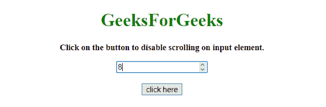
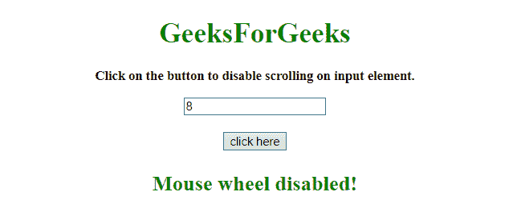

# 如何使用 JavaScript/jQuery 禁用<input type="”number”">字段滚动改号？

> 原文:[https://www . geesforgeks . org/如何禁用滚动更改输入中的数字-类型-数字-字段-使用-javascript-jquery/](https://www.geeksforgeeks.org/how-to-disable-scroll-to-change-number-in-input-typenumber-field-using-javascript-jquery/)

给定一个包含<input type="“number”">属性的 HTML 文档，任务是使用 JavaScript/jQuery 禁用鼠标滚轮来更改数值。

**进场:**

*   选择元素。
*   向该元素添加一个事件，该事件将在滚动开始时调用一个函数。
*   滚动时使元素模糊。

**示例 1:** 该示例使用 JavaScript 实现了上述方法。

```
<!DOCTYPE HTML>  
<html>  

<head> 
    <title> 
        How to disable scroll to change number
        value in <input type="number"> 
        attribute in JavaScript/jQuery?
    </title>

    <script src=
"https://ajax.googleapis.com/ajax/libs/jquery/3.4.1/jquery.min.js">
    </script>
</head> 

<body style = "text-align:center;">  

    <h1 style = "color:green;" >  
        GeeksForGeeks  
    </h1>

    <p id = "GFG_UP" style = 
        "font-size: 15px; font-weight: bold;">
    </p>

    <form>
        <input id = "input" type = "number" />
    </form>

    <br>

    <button onclick = "GFG_FUN()">
        click here
    </button>

    <p id = "GFG_DOWN" style =
        "font-size: 24px; font-weight: bold; color: green;">
    </p>

    <script>
        var el_up = document.getElementById("GFG_UP");
        var el_down = document.getElementById("GFG_DOWN");

        el_up.innerHTML = "Click on the button to disable"
                    + " scrolling on input element.";

        function GFG_FUN() {
            var input = document.getElementById("input");

            input.addEventListener("mousewheel", 
                function(event){ 
                    this.blur() 
                });

            el_down.innerHTML = "Mouse wheel disabled!";
        }
    </script> 
</body>  

</html>
```

**输出:**

*   **点击按钮前:**
    
*   **点击按钮后:**
    

**示例 2:** 该示例使用 jQuery 实现了上述方法。

```
<!DOCTYPE HTML>  
<html>  

<head> 
    <title> 
        How to disable scroll to change number value
        in <input type="number"> attribute
        in JavaScript/jQuery?
    </title>

    <script src=
"https://ajax.googleapis.com/ajax/libs/jquery/3.4.1/jquery.min.js">
    </script>
</head> 

<body style = "text-align:center;">  

    <h1 style = "color:green;" >  
        GeeksForGeeks  
    </h1>

    <p id = "GFG_UP" style = 
        "font-size: 15px; font-weight: bold;">
    </p>

    <form>
        <input id = "input" type = "number" />
    </form>

    <br>

    <button onclick = "GFG_FUN()">
        click here
    </button>

    <p id = "GFG_DOWN" style = 
        "font-size: 24px; font-weight: bold; color: green;">
    </p>

    <script>
        var el_up = document.getElementById("GFG_UP");
        var el_down = document.getElementById("GFG_DOWN");

        el_up.innerHTML = "Click on the button to disable"
                        + " scrolling on input element.";

        function GFG_FUN() {
            $('#input').on("wheel", function (e) {
                $(this).blur();
            });

            el_down.innerHTML = "Mouse wheel disabled!";
        }
    </script> 
</body>  

</html>
```

**输出:**

*   **点击按钮前:**
    
*   **点击按钮后:**
    