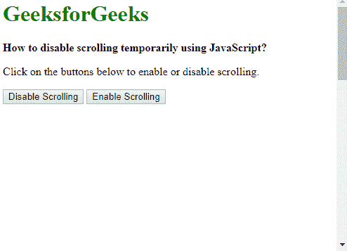

# 如何使用 JavaScript 暂时禁用滚动？

> 原文:[https://www . geesforgeks . org/如何禁用滚动-暂时使用-javascript/](https://www.geeksforgeeks.org/how-to-disable-scrolling-temporarily-using-javascript/)

使用 JavaScript 可以使用两种方法禁用滚动:

**方法 1:覆盖窗口，滚动功能**

当窗口滚动时，触发**窗口滚动**事件。覆盖此功能并在每次滚动时将其设置到固定位置将有效地禁用滚动效果。

使用 [**窗口.页面设置**](https://www.geeksforgeeks.org/html-window-pageyoffset-property/) 和**文档. documentElement.scrollTop** 值可以找到从顶部开始的当前滚动位置。这两个属性返回当前的 y 滚动位置。它们一起使用或运算符，因为其中一个运算符在某些浏览器上可能返回 0。

同样，使用 [**窗口、页面设置**](https://www.geeksforgeeks.org/html-window-pagexoffset-property/) 和**文档、文档元素、滚动列表**值可以找到左侧的当前滚动位置。这两个属性返回当前的 x 滚动位置。

然后将 **window.scrollTo()** 方法与这两个值一起使用，将当前页面的滚动位置设置为该值。

要启用向后滚动，window.onscroll 将被空白函数覆盖。这将使页面再次滚动。

**语法:**

```
function disableScroll() {
    // Get the current page scroll position
    scrollTop = window.pageYOffset || document.documentElement.scrollTop;
    scrollLeft = window.pageXOffset || document.documentElement.scrollLeft,

        // if any scroll is attempted, set this to the previous value
        window.onscroll = function() {
            window.scrollTo(scrollLeft, scrollTop);
        };
}

function enableScroll() {
    window.onscroll = function() {};
}
```

**示例:**覆盖窗口。滚动功能

```
<!DOCTYPE html>
<html>

<head>
    <title>How to disable scrolling 
      temporarily using JavaScript?</title>
    <style>
        .scrollable-place {
            height: 1000px;
        }
    </style>
</head>

<body>
    <h1 style="color: green">
      GeeksforGeeks
  </h1>

    <b>How to disable scrolling temporarily
      using JavaScript?</b>
    <p>Click on the buttons below to enable or disable scrolling.</p>

    <p class="scrollable-place">
        <button onclick="disableScroll()">Disable Scrolling</button>
        <button onclick="enableScroll()">Enable Scrolling</button>
    </p>

    <script>
        function disableScroll() {
            // Get the current page scroll position
            scrollTop = 
              window.pageYOffset || document.documentElement.scrollTop;
            scrollLeft = 
              window.pageXOffset || document.documentElement.scrollLeft,

                // if any scroll is attempted,
                // set this to the previous value
                window.onscroll = function() {
                    window.scrollTo(scrollLeft, scrollTop);
                };
        }

        function enableScroll() {
            window.onscroll = function() {};
        }
    </script>
</body>

</html>
```

**输出:**


**方法二:将身体高度设置为 100%，溢出为隐藏**

在此方法中，创建一个新的 CSS 类，其中高度设置为 100%，并且通过将溢出属性设置为隐藏来禁用滚动条。

```
.stop-scrolling {
    height: 100%;
    overflow: hidden;
}
```

每当必须禁用滚动时，使用**document . body . class list . add(" class name ")**方法将该类添加到正文中。此方法将指定的类名添加到 body 元素的类列表中。

要启用向后滚动，使用**document . body . class list . remove(" class name ")**方法从正文中删除该类。此方法将指定的类名移除到 body 元素的类列表中。这将使页面再次滚动。

**语法:**

```
function disableScroll() {
    document.body.classList.add("stop-scrolling");
}

function enableScroll() {
    document.body.classList.remove("stop-scrolling");
}
```

**示例:**将身体高度设置为 100%，溢出设置为隐藏

```
<!DOCTYPE html>
<html>

<head>
    <title>How to disable scrolling
      temporarily using JavaScript?</title>
    <style>
        .scrollable-place {
            height: 1000px;
        }

        .stop-scrolling {
            height: 100%;
            overflow: hidden;
        }
    </style>
</head>

<body>
    <h1 style="color: green">GeeksforGeeks</h1>
    <b>How to disable scrolling temporarily using JavaScript?</b>

    <p>Click on the buttons below to enable or disable scrolling.</p>

    <p class="scrollable-place">
        <button onclick="disableScroll()">Disable Scrolling</button>
        <button onclick="enableScroll()">Enable Scrolling</button>
    </p>

    <script>
        function disableScroll() {
            document.body.classList.add("stop-scrolling");
        }

        function enableScroll() {
            document.body.classList.remove("stop-scrolling");
        }
    </script>
</body>

</html>
```

**输出:**


JavaScript 最出名的是网页开发，但它也用于各种非浏览器环境。您可以通过以下 [JavaScript 教程](https://www.geeksforgeeks.org/javascript-tutorial/)和 [JavaScript 示例](https://www.geeksforgeeks.org/javascript-examples/)从头开始学习 JavaScript。