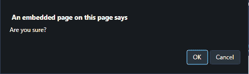

# 使用 JavaScript / jQuery 点击T3】

> 原文:[https://www . geesforgeks . org/how-display-confirmation-dialog-when-click-an-a-link-use-JavaScript-jquery/](https://www.geeksforgeeks.org/how-to-display-confirmation-dialog-when-clicking-an-a-link-using-javascript-jquery/)

给定

**使用 JavaScript** 点击< a >链接时显示确认对话框

*   **onclick Event:** This event occurs when the user clicks on an element.

    **语法:**

    *   **在 HTML 中:**

        ```
        <element onclick="myScript">
        ```

    *   **在 JavaScript 中:**

        ```
        object.addEventListener("click", myScript);
        ```

    *   **在 JavaScript 中，使用 addEventListener()方法:**

        ```
        object.onclick = function() {myScript};
        ```

*   **addEventListener() Method:** This method adds an event handler to the document.

    **语法:**

    ```
    document.addEventListener(event, function, useCapture)
    ```

    **参数:**

    *   **事件:**此参数为必填项。它指定字符串，即事件的名称。
    *   **功能:**此参数为必选项。它指定事件发生时要运行的函数。当事件发生时，事件对象作为第一个参数传递给函数。类型取决于指定的事件。例如，“点击”事件属于 MouseEvent 对象。
    *   **使用捕捉:**此参数是可选的。它指定了一个布尔值，这意味着事件应该在捕获阶段还是在冒泡阶段执行。
        *   **true:** 事件处理程序在捕获阶段执行。
        *   **false:** 事件处理程序在冒泡阶段执行。

**示例 1:** 本示例将**确认()方法**添加到与 **onclick 事件**的链接中。这将验证您是否要继续。

```
<!DOCTYPE HTML> 
<html> 
    <head> 
        <title> 
            Display a confirmation dialog when
            clicking an a tag link
        </title>
    </head> 

    <body style = "text-align:center;">

        <h1 style = "color:green;" > 
            GeeksForGeeks 
        </h1>

        <p id = "GFG_UP" style =
            "font-size: 15px; font-weight: bold;">
        </p>

        <a href="#" onclick="return confirm('Are you sure?')">
            Link
        </a>

        <br><br>

        <p id = "GFG_DOWN" style = 
            "color:green; font-size: 20px; font-weight: bold;">
        </p>

        <script>
            var el_up = document.getElementById("GFG_UP");

            el_up.innerHTML = 
                "Click on the LINK for further confirmation."; 
        </script> 
    </body> 
</html>                    
```

**输出:**

*   **点击按钮前:**
    
*   **点击按钮后:**
    

**示例 2:** 本示例向所有链接添加一个**类确认**。之后，它在 **onclick 事件**上将**事件监听器**添加到该类的元素中。然后调用方法单独处理**确认对话框**。

```
<!DOCTYPE HTML> 
<html> 
    <head> 
        <title> 
            Display a confirmation dialog when
            clicking an a tag link
        </title>
    </head> 

    <body style = "text-align:center;">

        <h1 style = "color:green;" > 
            GeeksForGeeks 
        </h1>

        <p id = "GFG_UP" style =
            "font-size: 15px; font-weight: bold;">
        </p>

        <a href="#" class="confirm">Link</a>

        <br><br>

        <p id = "GFG_DOWN" style =
            "color:green; font-size: 20px; font-weight: bold;">
        </p>

        <script>
            var el_up = document.getElementById("GFG_UP");

            el_up.innerHTML =
                    "Click on the LINK for further confirmation."; 

            var el = document.getElementsByClassName('confirm');

            var confirmThis = function (e) {
                if (!confirm('Are you sure?')) e.preventDefault();
            };

            for (var i = 0, l = el.length; i < l; i++) {
                el[i].addEventListener('click', confirmThis, false);
            }
        </script> 
    </body> 
</html>                    
```

**输出:**

*   **点击按钮前:**
    
*   **点击按钮后:**
    

**使用 jQuery** 点击< a >链接时显示确认对话框

*   **jQuery on() Method:** This method adds one or more event handlers for the selected elements and child elements.

    **语法:**

    ```
    $(selector).on(event, childSelector, data, function, map)
    ```

    **参数:**

    *   **事件:**此参数为必填项。它指定一个或多个要附加到选定元素的事件或命名空间。如果有多个事件值，这些值用空格隔开。事件必须是有效的。
    *   **儿童选择器:**该参数可选。它指定事件处理程序应该只附加到已定义的子元素。
    *   **数据:**此参数为可选。它指定要传递给函数的附加数据。
    *   **功能:**此参数为必选项。它指定事件发生时要运行的函数。
    *   **映射:**它指定了一个事件映射({event:func()，event:func()，…})，该事件映射有一个或多个要添加到所选元素的事件，以及事件发生时要运行的函数。

**示例 1:** 本示例向 all 链接添加一个**类确认**。之后，它在 **onclick 事件**上将**事件监听器**添加到该类的元素中。然后调用**确认对话框**。

```
<!DOCTYPE HTML> 
<html> 
    <head> 
        <title> 
            Display a confirmation dialog when 
            clicking an a tag link
        </title>

        <script src =
"https://ajax.googleapis.com/ajax/libs/jquery/3.4.0/jquery.min.js">
        </script>
    </head> 

    <body style = "text-align:center;">

        <h1 style = "color:green;" > 
            GeeksForGeeks 
        </h1>

        <p id = "GFG_UP" style =
            "font-size: 15px; font-weight: bold;">
        </p>

        <a href="#" class="confirm">Link</a>

        <br><br>

        <p id = "GFG_DOWN" style = 
            "color:green; font-size: 20px; font-weight: bold;">
        </p>

        <script>
            $("#GFG_UP").
                text("Click on the LINK for further confirmation."); 

            $('.confirm').on('click', function () {
                return confirm('Are you sure?');
            });
        </script> 
    </body> 
</html>                    
```

**输出:**

*   **点击按钮前:**
    
*   **点击按钮后:**
    

**示例 2:** 本示例将**确认()方法**添加到与 **onclick 事件**的链接中。这将验证您是否要继续。

```
<!DOCTYPE HTML> 
<html> 
    <head> 
        <title> 
            Display a confirmation dialog when 
            clicking an a tag link
        </title>

        <script src =
"https://ajax.googleapis.com/ajax/libs/jquery/3.4.0/jquery.min.js">
        </script>
    </head> 

    <body style = "text-align:center;"> 

        <h1 style = "color:green;" > 
            GeeksForGeeks 
        </h1>

        <p id = "GFG_UP" style = 
            "font-size: 15px; font-weight: bold;">
        </p>

        <a href="#" onclick="return confirm('Are you sure?')">
            Link
        </a>

        <br><br>

        <p id = "GFG_DOWN" style = 
            "color:green; font-size: 20px; font-weight: bold;">
        </p>

        <script>
            $("#GFG_UP").
                text("Click on the LINK for further confirmation."); 
        </script> 
    </body> 
</html>                    
```

**输出:**

*   **点击按钮前:**
    
*   **点击按钮后:**
    

jQuery 是一个开源的 JavaScript 库，它简化了 HTML/CSS 文档之间的交互，它以其“少写多做”的理念而闻名。
跟随本 [jQuery 教程](https://www.geeksforgeeks.org/jquery-tutorials/)和 [jQuery 示例](https://www.geeksforgeeks.org/jquery-examples/)可以从头开始学习 jQuery。