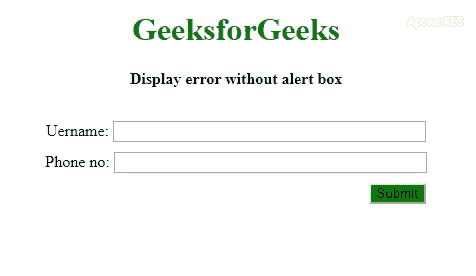

# 如何用 JavaScript 显示无警告框的错误？

> 原文:[https://www . geesforgeks . org/如何使用 javascript 显示没有警告的错误框/](https://www.geeksforgeeks.org/how-to-display-error-without-alert-box-using-javascript/)

JavaScript 中的错误可以在不使用警告框的情况下显示，但是使用警告框是传统的方法。我们可以用两种方法显示错误，而不使用警告框。

**方法 1:** 通过使用 **[文本内容](https://www.geeksforgeeks.org/html-dom-textcontent-property/)** 属性。 **textContent** 基本上是用来动态改变任意节点的内容。借助该属性，我们可以显示任何内容并吸引用户的注意力，就像 **[警告框](https://www.geeksforgeeks.org/javascript-dialogue-boxes/)** 一样

*   **语法:**

    ```html
    node.textContent = "Some error message"

    // To draw attention
    node.style.color = "red";  

    ```

*   **例:**

    ```html
    <!DOCTYPE html>
    <html lang="en">

    <head>
        <meta charset="UTF-8">
        <meta name="viewport" 
              content="width=device-width, 
                       initial-scale=1.0">
        <title>Demo</title>
        <style>
            h1 {
                color: green;
            }
            .container {
                padding: 15px;
                width: 400px;
            }

            label,
            input {
                margin-bottom: 10px;
            }

            button {
                float: right;
                margin-right: 10px;
                background-color: green;
            }
        </style>
    </head>

    <body>
        <center>
            <h1>GeeksforGeeks</h1>
            <b>Display error without alert box</b> 
            <br><br>
            <div class="container">
                <div>
                    <label>Uername:</label>
                    <input type="text" size="40">
                </div>
                <div>
                    <label>Phone no:</label>
                    <input type="text"
                           id="number" size="40">
                    <span id="error"></span>
                </div>
                <button type="submit" 
                        onclick="errorMessage()">
                    Submit
                </button>
            </div>
        </center>
    </body>
    <script>
        function errorMessage() {
            var error = document.getElementById("error")
            if (isNaN(document.getElementById("number").value)) 
            {

                // Changing content and color of content
                error.textContent = "Please enter a valid number"
                error.style.color = "red"
            } else {
                error.textContent = ""
            }
        }
    </script>

    </html>
    ```

*   **输出:**
    

**方法 2:** 通过使用 **[innerHTML](https://www.geeksforgeeks.org/html-dom-innerhtml-property/)** 属性。**内置 HTML** 可用于更改选定节点的 HTML。代替 **textContent** 和 **innerHTML** ，还可以使用 **[innerText](https://www.geeksforgeeks.org/html-dom-innertext-property/)** ，会导致同样的输出。

*   **语法:**

    ```html
    node.innerHTML = "<span style='color: red;'>
                        Please enter a valid number
                      </span>"
    ```

*   **例:**

    ```html
    <!DOCTYPE html>
    <html lang="en">

    <head>
        <meta charset="UTF-8">
        <meta name="viewport"
            content="width=device-width, 
                    initial-scale=1.0">
        <title>Demo</title>
        <style>
            h1 {
                color: green;
            }
            .container {
                padding: 15px;
                width: 400px;
            }

            label,
            input {
                margin-bottom: 10px;
            }

            button {
                float: right;
                margin-right: 10px;
                background-color: green;
            }
        </style>
    </head>

    <body>
        <center>
            <h1>GeeksforGeeks</h1>
            <b>Display error without alert box</b> 
            <br><br>
            <div class="container">
                <div>
                    <label>Uername:</label>
                    <input type="text" size="40">
                </div>
                <div>
                    <label>Phone no:</label>
                    <input type="text"
                        id="number" size="40">
                    <span id="error"></span>
                </div>
                <button type="submit"
                        onclick="errorMessage()">
                    Submit
                </button>
            </div>
        </center>
    </body>
    <script>
        function errorMessage() {
            var error = document.getElementById("error")
            if (isNaN(document.getElementById("number").value)) 
            {

                // Changing HTML to draw attention
                error.innerHTML = "<span style='color: red;'>"+
                            "Please enter a valid number</span>"
            } else {
                error.innerHTML = ""
            }
        }
    </script>

    </html>                    
    ```

*   **输出:**
    

CSS 是网页的基础，通过设计网站和网络应用程序用于网页开发。你可以通过以下 [CSS 教程](https://www.geeksforgeeks.org/css-tutorials/)和 [CSS 示例](https://www.geeksforgeeks.org/css-examples/)从头开始学习 CSS。