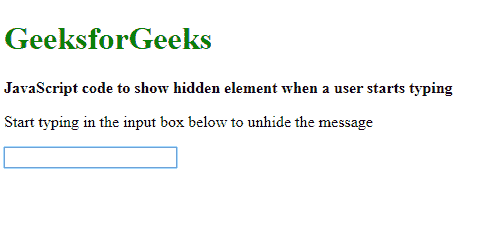
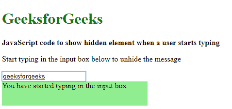

# 当用户开始使用 JavaScript 打字时，如何显示隐藏元素？

> 原文:[https://www . geesforgeks . org/how-display-hidden-element-当用户开始键入时-使用-javascript/](https://www.geeksforgeeks.org/how-to-display-hidden-element-when-a-user-starts-typing-using-javascript/)

**方法 1:使用 oninput 属性输入元素:**每当用户开始对输入元素进行键入时，就会触发 **oninput** 属性。这可用于检测<输入>或<文本区域>元素的变化。使用该属性值调用函数。

该函数选择隐藏元素，并将其显示属性更改为“block”。这将取消隐藏元素，前提是使用“无”显示属性隐藏该元素。在这个函数中可以使用其他显示元素的方法。

因此，每当用户开始在输入框中键入时，就会触发该功能并显示隐藏元素。

**语法:**

```
<input oninput="showElem()"></input>
function showElem() {
    document.querySelector('.box').style.display = "block";
}
```

**示例:**

```
<!DOCTYPE html>
<html>

<head>
    <title>
        How to display hidden element when a
        user starts typing using JavaScript ?
    </title>

    <style>
        .box {
            height: 50px;
            width: 300px;
            background-color: lightgreen;

            /* hide the element by default */
            display: none;
        }
    </style>
</head>

<body>
    <h1 style="color: green">
        GeeksforGeeks
    </h1>

    <b>
        JavaScript code to show hidden
        element when a user starts typing
    </b>

    <p>
        Start typing in the input box
        below to unhide the message
    </p>

    <input oninput="showElem()"></input>

    <div class="box">
        You have started typing
        in the input box
    </div>

    <script type="text/javascript">
        function showElem() {
            document.querySelector('.box').style.display
                    = "block";
        }
    </script>
</body>

</html>
```

**输出:**

*   **打字前:**
    
*   **输入后:**
    

**方法二:在输入框中添加事件监听器:****add event listener()**方法用于在任意元素中添加事件处理程序。每当目标元素发生指定的事件时，就会执行指定的函数。

该方法使用**输入**事件。每当在<输入>或<文本区>元素中检测到变化时，该事件触发。

首先选择并存储用户将要键入的输入。然后在这个输入框中调用 addEventListener()方法。然后在方法内部创建一个新函数。

该函数选择隐藏元素，并将其显示属性更改为“block”。这将取消隐藏元素，前提是该元素被“无”显示属性隐藏。在这个函数中可以使用其他显示元素的方法。

因此，每当用户开始在输入框中键入时，就会触发该功能并显示隐藏元素。

**语法:**

```
let inputBox = document.querySelector('.inputBox')

inputBox.addEventListener('input', function() {
    document.querySelector('.box').style.display = "block";
});
```

**示例:**

```
<!DOCTYPE html>
<html>

<head>
    <title>
        How to display hidden element when a
        user starts typing using JavaScript ?
    </title>

    <style>
        .box {
            height: 50px;
            width: 300px;
            background-color: lightgreen;

            /* hide the element by default */
            display: none;
        }
    </style>
</head>

<body>
    <h1 style="color: green">
        GeeksforGeeks
    </h1>

    <b>
        JavaScript code to show hidden element
        when a user starts typing
    </b>

    <p>
        Start typing in the input box
        below to unhide the message
    </p>

    <input class="inputBox"></input>

    <div class="box">
        You have started typing in
        the input box
    </div>

    <script type="text/javascript">
        let inputBox = document.querySelector('.inputBox')

        inputBox.addEventListener('input', function() {
            document.querySelector('.box').style.display
                    = "block";
        });
    </script>
</body>

</html>
```

**输出:**

*   **打字前:**
    
*   **输入后:**
    