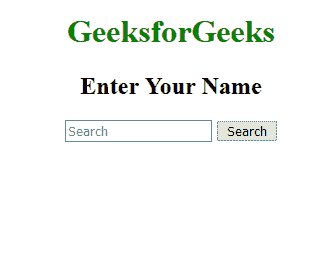
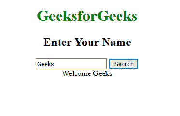

# 如何在 JSP 中使用 ajax 在同一页面显示另一个页面的搜索结果？

> 原文:[https://www . geeksforgeeks . org/如何使用 jsp 中的 ajax 在同一页上显示另一页的搜索结果/](https://www.geeksforgeeks.org/how-to-display-search-result-of-another-page-on-same-page-using-ajax-in-jsp/)

在这个例子中，我们创建了一个搜索栏，在 JSP 中使用 ajax 在同一个页面上显示结果。AJAX 代表异步 JavaScript 和 XML。其中 Ajax 主要用于在同一网页上显示另一个网页内容，而不刷新页面。你可以在这里阅读更多关于 ajax 技术[的内容。](https://www.geeksforgeeks.org/ajax-introduction/)

**方法:**
我们使用 JQuery ready 函数来确保我们的 JavaScript 在页面加载之前不会执行。在就绪功能中，
我们执行一个简单的使用点击事件，它是提交底部的 id，应该在该底部执行操作。

```
var fn=$("#user_input").val();
$.post("SearchResult.jsp", {n3:fn}, function(data){    
$("#msg").html(data); 
});
```

在上面的代码中

*   **$(“user _ input”)。value():** 从文本字段中获取输入值，其中 *user_input* 是 id。
*   **$。post("SearchResult.jsp "，{n3:fn}，function(data){}):** 在这种情况下 *fn* 值作为参数被传递到**index.jsp**页面，该页面从数据库中搜索结果并显示在同一页面上。 *fn* 值可以在**index.jsp**通过使用`request.getParameter("n3")`获得。
*   **$(“# msg”)。html(数据):** msg 是 div 标签的 id 意思，它只会在 div 标签里面显示结果。

**示例:**

*   **index.html**T3

    ```
    <!DOCTYPE html>
    <html>

    <head>
        <title>search result of another page on 
          same page using ajax in JSP</title>
        <meta charset="UTF-8">
        <meta name="viewport"
              content="width=device-width, 
                       initial-scale=1.0">
    </head>

    <body>
        <center>
            <div>
                <h1 style="color:green">
                  GeeksforGeeks</h1>
                <h2>Enter Your Name</h2>
                <input placeholder="Search" 
                       type="text" 
                       id="user_input"/>

                <button type="Submit" id="sub">
                  Search
              </button>
            </div>
        </center>

        <div class="box_1" id="msg">
            <script type="text/javascript" 
                    src=
    "https://ajax.googleapis.com/ajax/libs/jquery/1.6.0/jquery.min.js">
          </script>

            <script src="jquery-3.2.1.js"></script>
            <script>
                $(document).ready(function() {
                    $("#sub").click(function() {
                        var fn = $("#user_input").val();
                        $.post("index.jsp", {
                            n3: fn
                        }, function(data) {
                            $("#msg").html(data);
                        });

                    });
                });
            </script>
        </div>
    </body>

    </html>
    ```

    T4】
*   **index.jsp**T3

    ```
    <html>

    <body>
        <center>
            <%     
             String uname=request.getParameter("n3");
             out.println("Welcome "+uname);
             %>
        </center>
    </body>

    </html>
    ```

    T4】

**输出**
**前:**

**后:**
