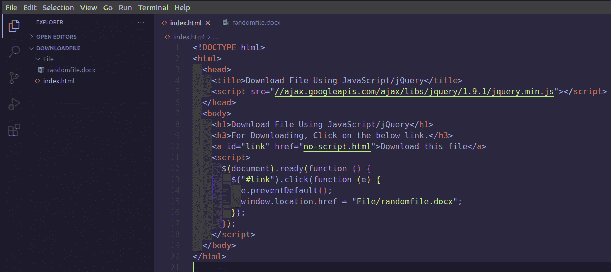

# 如何使用 JavaScript/jQuery 下载文件？

> 原文:[https://www . geesforgeks . org/如何下载文件-使用-javascript-jquery/](https://www.geeksforgeeks.org/how-to-download-file-using-javascript-jquery/)

假设你想下载一个文件，当你点击一个链接。为了下载文件，我们在这里提到了实现以及文件夹结构，在这里您可以看到文件的位置。

**进场:**

*   在普通的网页上创建一个锚点标签链接。当我们点击一个锚标签链接时，我们想下载一个文件(下载这个文件)。

## 超文本标记语言

```
<!DOCTYPE html>
<html>

<head>
    <title>
        Download File Using 
        JavaScript/jQuery
    </title>
</head>

<body>
    <h1>
        Download File Using 
        JavaScript/jQuery
    </h1>

    <a id="link" href="#">
        Download this file
    </a>
</body>

</html>
```

*   提供以下 JavaScript 代码:

```
$(document).ready(function () {
      $("#link").click(function (e) {
          e.preventDefault();
          window.location.href = "File/randomfile.docx";
      });
});

// Note: url= your file path

```

*   **注意:**用你的文件路径替换上面的网址。
    实现和文件夹结构如下所示。



**示例:**

## 超文本标记语言

```
<!DOCTYPE html>
<html>

<head>
    <script src=
"https://ajax.googleapis.com/ajax/libs/jquery/1.9.1/jquery.min.js">
    </script>
</head>

<body>
    <h1>
        Download File Using 
        JavaScript/jQuery
    </h1>

    <h3>
        For Downloading, Click 
        on the below link.
    </h3>

    <a id="link" href="no-script.html">
        Download this file
    </a>

    <script>
        $(document).ready(function () {
            $("#link").click(function (e) {
                e.preventDefault();

                window.location.href 
                    = "File/randomfile.docx";
            });
        });
    </script>
</body>

</html>
```

**输出:**

<video class="wp-video-shortcode" id="video-500564-1" width="640" height="360" preload="metadata" controls=""><source type="video/webm" src="https://media.geeksforgeeks.org/wp-content/uploads/20201008125653/Screencast-from-08-10-20-124101-PM-IST.webm?_=1">[https://media.geeksforgeeks.org/wp-content/uploads/20201008125653/Screencast-from-08-10-20-124101-PM-IST.webm](https://media.geeksforgeeks.org/wp-content/uploads/20201008125653/Screencast-from-08-10-20-124101-PM-IST.webm)</video>

jQuery 是一个开源的 JavaScript 库，它简化了 HTML/CSS 文档之间的交互，它以其“少写多做”的理念而闻名。
跟随本 [jQuery 教程](https://www.geeksforgeeks.org/jquery-tutorials/)和 [jQuery 示例](https://www.geeksforgeeks.org/jquery-examples/)可以从头开始学习 jQuery。