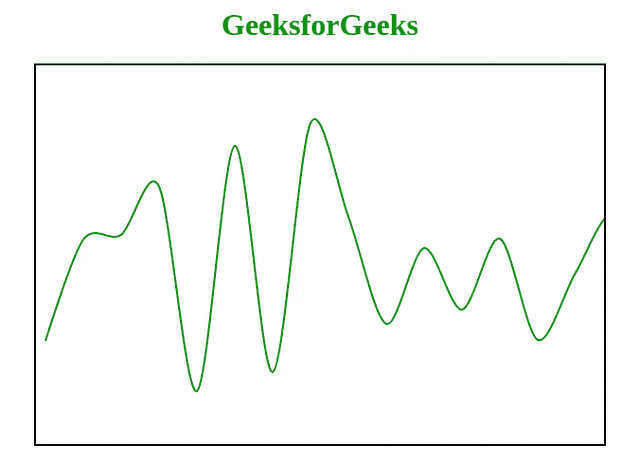

# 如何用 JavaScript 绘制多点平滑曲线？

> 原文:[https://www . geesforgeks . org/如何使用 javascript 绘制多点平滑曲线/](https://www.geeksforgeeks.org/how-to-draw-smooth-curve-through-multiple-points-using-javascript/)

用多个点绘制一条平滑的曲线是一项具有挑战性的任务。有许多算法可以帮助我们使用特定的点绘制曲线。[贝塞尔曲线](https://www.geeksforgeeks.org/html-canvas-draw-bezier-curve/)是曲线绘制技术之一。关于如何使用 JavaScript 通过多个点绘制一条平滑的曲线，总是有很多讨论。所以，我们被赋予通过多个点绘制一条平滑的曲线。

为了画线，我们应该有一个线的斜率。因此，这里我们通过 x 和 y 的多重输入来计算直线的斜率。为了绘制平滑曲线，我们应该有多个输入/点，通过这些输入/点我们可以绘制平滑曲线。在这里，我们试图得到一个随机数，并试图为其绘制一条平滑的曲线。

在这里，我们给你一些关于使用多个点绘制平滑曲线的想法。请仔细阅读此代码，我们将进一步解释。

**示例:**

```html
<!DOCTYPE html>
<html>

<head>
    <title>
        Smooth Curve
    </title>

    <style> 
        #GFG { 
            border: 2px solid black; 
        } 
        h1{ 
            color: green; 
        } 
    </style> 
</head>

<body>
    <center>
        <h1>GeeksforGeeks</h1> 

        <canvas id="GFG"
            width="600" height="400">
        </canvas>
    </center>

    <script>
        var cv = document.getElementById("GFG");
        var ctx = cv.getContext("2d");

        function gradient(a, b) {
            return (b.y-a.y)/(b.x-a.x);
        }

        function bzCurve(points, f, t) {
            if (typeof(f) == 'undefined') f = 0.3;
            if (typeof(t) == 'undefined') t = 0.6;

            ctx.beginPath();
            ctx.moveTo(points[0].x, points[0].y);

            var m = 0;
            var dx1 = 0;
            var dy1 = 0;

            var preP = points[0];

            for (var i = 1; i < points.length; i++) {
                var curP = points[i];
                nexP = points[i + 1];
                if (nexP) {
                    m = gradient(preP, nexP);
                    dx2 = (nexP.x - curP.x) * -f;
                    dy2 = dx2 * m * t;
                } else {
                    dx2 = 0;
                    dy2 = 0;
                }

                ctx.bezierCurveTo(
                    preP.x - dx1, preP.y - dy1,
                    curP.x + dx2, curP.y + dy2,
                    curP.x, curP.y
                );

                dx1 = dx2;
                dy1 = dy2;
                preP = curP;
            }
            ctx.stroke();
        }

        // Generate random data 
        var lines = [];     
        var X = 10;
        var t = 40; // control the width of X.
        for (var i = 0; i < 100; i++ ) {
            Y = Math.floor((Math.random() * 300) + 50);
            p = { x: X, y: Y };
            lines.push(p);
            X = X + t;
        }

        // Draw smooth line 
        ctx.setLineDash([0]);
        ctx.lineWidth = 2;
        ctx.strokeStyle = "green";
        bzCurve(lines, 0.3, 1);
    </script> 
</body>

</html>
```

**输出:**


**解释:**当我们运行这个程序时，每次它都会接受随机输入，这就是为什么它会在每次执行时生成一条新的平滑曲线。

*   [先决条件:HTML 画布基础知识](https://www.geeksforgeeks.org/html-canvas-basics/)
*   画布对象引用使用 DOM 概念存储在变量' cv '中。
*   没有画布的绘画背景，什么也画不出来。

    ```html
     var cv = document.getElementById("GFG");
            var ctx = cv.getContext("2d");

    ```

*   返回直线斜率的梯度函数。

    ```html
    function gradient(a, b) {
                return (b.y-a.y)/(b.x-a.x);
            }
    ```

*   [开始路径](https://www.geeksforgeeks.org/html-canvas-beginpath-method/)方法用于启动或重置路径。
*   [移动到](https://www.geeksforgeeks.org/html-canvas-moveTo-method/)方法用于将路径移动到画布中的指定点。

    ```html
      ctx.beginPath();
            ctx.moveTo(points[0].x, points[0].y);

    ```

*   [描边](https://www.geeksforgeeks.org/html-canvas-stroke-method/)用于绘制你用所有这些方法定义的路径。

    ```html
    ctx.stroke();
    ```