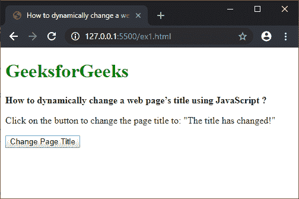
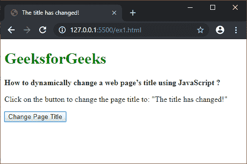
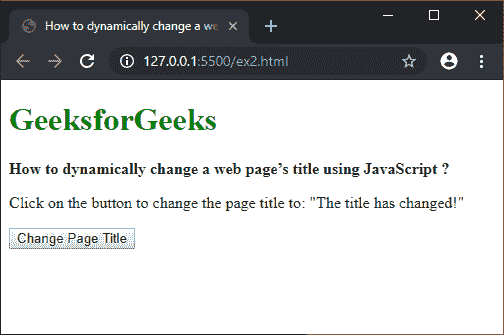
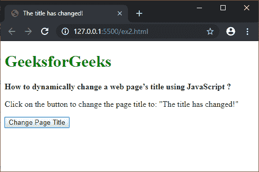

# 如何使用 JavaScript 动态更改网页标题？

> 原文:[https://www . geesforgeks . org/如何使用 javascript 动态更改网页标题/](https://www.geeksforgeeks.org/how-to-dynamically-change-the-title-of-web-page-using-javascript/)

给定一个包含页面标题的网页，任务是使用 JavaScript 动态更改网页的标题。

**方法 1:使用 document.title 属性:****document . title**属性用于设置或返回文档的当前标题。可以通过将新标题作为字符串分配给此属性来更改页面标题。这将把网站的标题改为首选标题。
**语法:**

```
newPageTitle = 'The title has changed!';
document.title = newPageTitle;
```

**示例:**

```
<!DOCTYPE html>
<html>

<head>
    <title>
        How to dynamically change a web
        page’s title using JavaScript ?
    </title>
</head>

<body>
    <h1 style="color: green">
        GeeksforGeeks
    </h1>

    <b>
        How to dynamically change a web
        page’s title using JavaScript ?
    </b>

    <p>
        Click on the button to change the page
        title to: "The title has changed!"
    </p>

    <button onclick="changePageTitle()">
        Change Page Title
    </button>

    <script type="text/javascript">
        function changePageTitle() {
            newPageTitle = 'The title has changed!';
            document.title = newPageTitle;
        }
    </script>
</body>

</html>
```

**输出:**

*   **点击按钮前:**
    
*   **点击按钮后:**
    

**方法二:使用 querySelector()方法:**使用**文档. querySelector()** 方法选择文档中的元素。可以通过在选择器中将标题元素指定为参数来选择标题元素。这将返回页面的当前标题元素。

元素的 **textContent** 属性返回特定节点的文本内容。可以通过将所需的新标题作为字符串分配给 textContent 属性来更改页面的标题。这将把网站的标题改为首选标题。

**语法:**

```
newPageTitle = 'The title has changed!';
document.querySelector('title').textContent = newPageTitle;
```

**示例:**

```
<!DOCTYPE html>
<html>

<head>
    <title>
        How to dynamically change a web
        page’s title using JavaScript ?
    </title>
</head>

<body>
    <h1 style="color: green">
        GeeksforGeeks
    </h1>

    <b>
        How to dynamically change a web
        page’s title using JavaScript ?
    </b>

    <p>
        Click on the button to change the page
        title to: "The title has changed!"
    </p>

    <button onclick="changePageTitle()">
        Change Page Title
    </button>

    <script type="text/javascript">
        function changePageTitle() {
            newPageTitle = 'The title has changed!';
            document.querySelector('title').textContent
                    = newPageTitle;
        }
    </script>
</body>

</html>
```

**输出:**

*   **点击按钮前:**
    
*   **点击按钮后:**
    