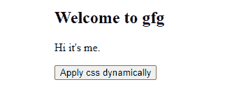
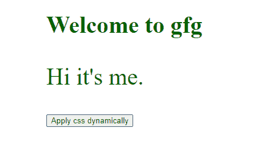

# 如何在 JavaScript 中动态创建和应用 CSS 类？

> 原文:[https://www . geesforgeks . org/如何动态创建和应用 CSS-in-class-JavaScript/](https://www.geeksforgeeks.org/how-to-dynamically-create-and-apply-css-class-in-javascript/)

在本文中，我们将看到如何动态创建一个 CSS 类，并使用 JavaScript 动态应用于元素。为此，我们首先创建一个类，并将其分配给要应用 CSS 属性的 HTML 元素。我们可以在 JavaScript 中使用**类名**和**类列表**属性。

**进场:**

*   用于在 JavaScript 中添加类的**类名**属性。它会覆盖所选元素的现有类。如果我们不想覆盖，那么我们必须在类名前添加一个空格。

```html
// It overwrites existing classes 

var h2 = document.querySelector("h2");
h2.className = "test";

// Add new class to existing classes
// Note space before new class name

h2.className = " test";
```

*   **类列表**属性也用于在 JavaScript 中添加一个类，但是它不会覆盖现有的类，并且会在所选元素类列表中添加一个新的类。

```html
// Add new class to existing classes

var p = document.querySelector("p");
p.classList.add("test");
```

*   在向元素中添加新的类之后，我们选择新的类(测试)，然后在 JavaScript 中的 style 属性的帮助下，向它应用 CSS 属性。

```html
// Select all elements with class test 

var temp = document.querySelectorAll(".test");

// Apply CSS property to it
for (var i = 0; i < temp.length; i++) {
  temp[i].style.color = "white";
  temp[i].style.backgroundColor = "black";
}
```

以下是这方面的实施情况:

**示例:**

## 超文本标记语言

```html
<!DOCTYPE html>
<html lang="en">

<head>
    <meta charset="UTF-8">
</head>

<body>
    <h2 class="hello"> Welcome to gfg </h2>

    <p id="hi">Hi it's me.</p>

    <button onclick="apply()">
        Apply css dynamically
    </button>

    <script>
        function apply() {
            // It overwrites existing classes
            var h2 = document.querySelector("h2");
            h2.className = "test";

            // Add new class to existing classes
            var p = document.querySelector("p");
            p.classList.add("test");

            // Select all elements with class test
            var temp = document.querySelectorAll(".test");

            // Apply CSS property to it
            for (var i = 0; i < temp.length; i++) {
                temp[i].style.color = "green";
                temp[i].style.fontSize = "40px";
            }
        }
    </script>
</body>

</html>
```

**输出:**

**点击按钮前:**



**点击按钮后:**

