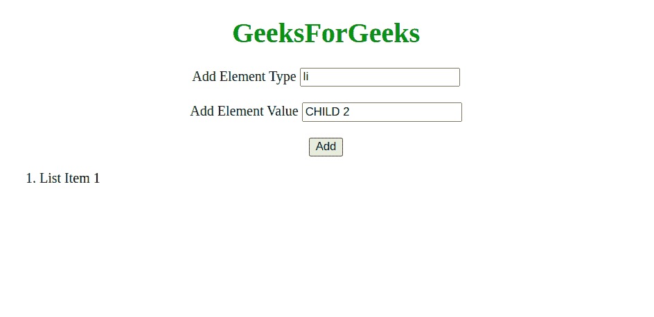
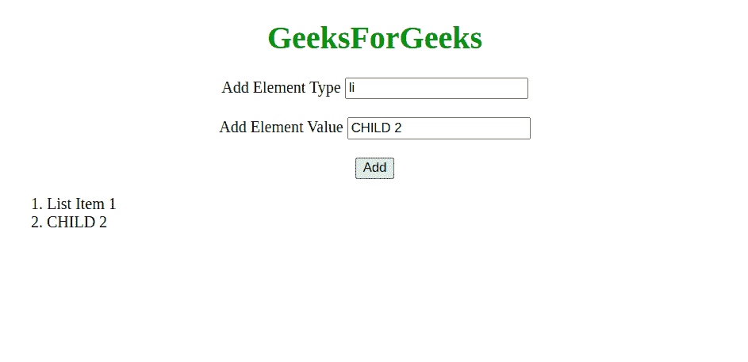
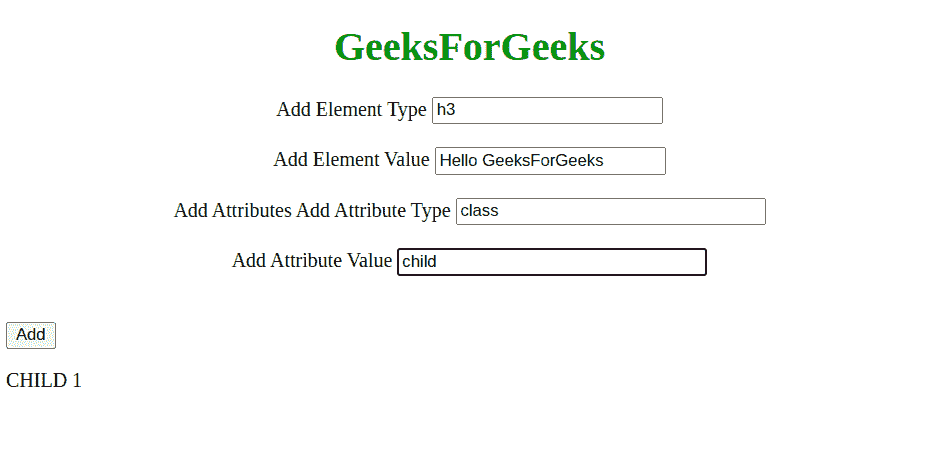
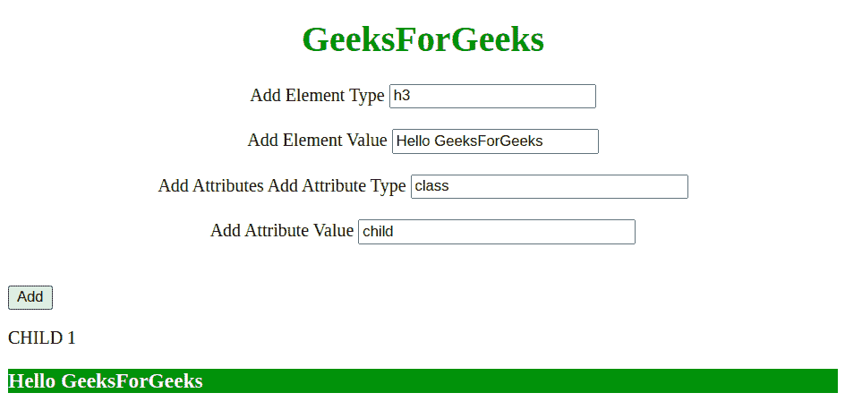

# 如何在 JavaScript 中动态创建新元素？

> 原文:[https://www . geesforgeks . org/如何动态创建新的 javascript 元素/](https://www.geeksforgeeks.org/how-to-dynamically-create-new-elements-in-javascript/)

借助 **createElement()方法**，可以在 JavaScript 中动态创建新元素。可以使用**设置属性()方法**设置创建元素的属性。下面给出的例子将演示这种方法。

**示例 1:** 在此示例中，新创建的元素作为子元素添加到父元素中。指定要创建的元素的类型，并添加其值或指定元素的文本节点。

## 超文本标记语言

```html
<!DOCTYPE HTML>
<html>

<head>
    <title>
        How to dynamically create 
        new elements in JavaScript?
    </title>
</head>

<body>
    <h1 style="text-align:center; color:green;">
        GeeksForGeeks
    </h1>

    <!-- Form to add item -->
    <form action="#" style="text-align:center;">

        <!-- Type of Element -->
        <label for="type">
            Add Element Type
        </label>

        <input type="text" id="type" 
            placeholder="Like: div, h1, li...." 
            value="li" />
        <br /><br />

        <!-- Text/Value for the element --->
        <label for="value">
            Add Element Value
        </label>

        <input type="text" id="value" 
            placeholder="Like: Hello GeeksForGeeks" 
            value="CHILD 2" />
        <br /><br />

        <!-- Submit the Form -->
        <button type="button" 
            onClick="addItem()">
            Add
        </button>
    </form>

    <!-- Parent tag where we add 
        item as child -->
    <ol id="parent">
        <li>List Item 1</li>
    </ol>

    <script>

        // Define the addItem() function
        // to be called through onclick
        function addItem() {

            // Get type of element from form
            let type = document.
                getElementById("type").value;

            // Get the text/value for the tag
            // from the form
            let value = document.
                getElementById("value").value;

            // createElement() is used for
            // creating a new element
            type
                = document.createElement(type);

            // Use value as textnode in this example
            type.appendChild(
                document.createTextNode(value));

            // Append as child to the parent
            // tag i.e. ol
            document.getElementById(
                "parent").appendChild(type);
        }
    </script>
</body>

</html>
```

**输出:**

**点击按钮前:**



**点击按钮后:**



**示例 2:** 在本例中，一个新创建的元素及其属性被添加到页面的主体元素中。只能使用两个参数输入属性，即属性类型和属性值。添加“子”项的 CSS 是为了方便。

## 超文本标记语言

```html
<!DOCTYPE HTML>
<html>

<head>
    <title>
        How to dynamically create 
        new elements in JavaScript?
    </title>

    <style>
        /* CSS for child item */
        .child {
            color: white;
            background-color: green;
        }
    </style>
</head>

<body id="body">
    <h1 style="text-align:center; color:green;">
        GeeksForGeeks
    </h1>
    <!-- Form to add item -->
    <form action="#" style="text-align: center;">

        <!-- Type of element -->
        <label for="type"> 
            Add Element Type
        </label>

        <input type="text" id="type" 
            placeholder="Like: div, h1, li...." 
            value="h3" />
        <br /><br />

        <!-- Text/value for element --->
        <label for="value"> Add Element Value</label>

        <input type="text" id="value" 
            placeholder="Like: Hello GeeksForGeeks" 
            value="Hello GeeksForGeeks" />
        <br /><br />

        <!-- Add attributes for element --->
        <label for="attr"> Add Attributes</label>
        <form id="attr">
            <label for="attrType">Add Attribute Type</label>
            <input type="text" style="width:240px;" 
                placeholder="forexample: enter 
                            'class' without quotes"
                id="attrType"
                value="class" />

            <br />
            <br />
            <label for="attrValue">
                Add Attribute Value
            </label>
            <input style="width:240px;" type="text" 
                placeholder="for example: enter 
                            'child' without quotes"
                id="attrValue" value="child" />
        </form>
        <br /><br />

        <!-- Submit the form -->
        <button type="button" onClick="addItem()">
            Add
        </button>
    </form>

    <div>
        <p>CHILD 1</p>
    </div>

    <script>

        // Define the addItem function
        // to be called through onclick()
        function addItem() {

            // Get Elements by id of the form inputs
            let parent = 
                document.getElementById("body");

            let attrType = 
                document.getElementById("attrType");

            let attrValue = 
                document.getElementById("attrValue");
            let type = document.getElementById("type");
            let value = document.getElementById("value");

            if (type.value == "" || value.value == "") {
                window.alert(
                    "There is an error in form input");
                window.reload();
            }

            // createElement() method is used
            // to create a new element
            type = document.createElement(type.value);

            // Append a text node for this example
            type.appendChild(
                document.createTextNode(value.value));

            if (attrValue.value == "" 
                    || attrType.value == "") {
                attr = null;
            }
            else {
                // setAttribute() is used to set
                // the attributes of the element
                type.setAttribute(
                    attrType.value, attrValue.value);
            }

            // Append as child to the parent
            // i.e. body
            parent.appendChild(type);
        }
    </script>
</body>

</html>
```

**输出:**
**点击按钮前:**



**点击按钮后:**

