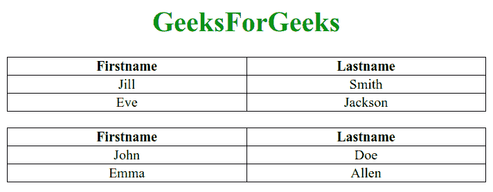

# 如何用 JavaScript 动态地将 id 插入表元素？

> 原文:[https://www . geesforgeks . org/如何使用 javascript 动态地将 id 插入到表元素中/](https://www.geeksforgeeks.org/how-to-dynamically-insert-id-into-table-element-using-javascript/)

本文解释了如何动态地将“id”插入到*表*元素中。这可以通过简单地在表中循环并动态添加“id”来实现。

**语法:**

*   *setAttribute()* 方法将指定的属性添加到元素中，并给出指定的值。

    ```html
    table.setAttribute("id", "Dynamically Generated ID")
    ```

*   也可以通过访问所选元素(表)的“id”来完成。

    ```html
    table.id = "Dynamically Generated ID";
    ```

**示例:**

## 超文本标记语言

```html
<!DOCTYPE html>
<html>

<head>
    <style>
        table,
        th,
        td {
            border: 1px solid black;
            border-collapse: collapse;
            margin: auto;
            width: 50%;
            text-align: center;
        }
    </style>
</head>

<body>
    <h1 style="color:green;text-align: center;">
        GeeksForGeeks
    </h1>

    <table>
        <tr>
            <th>Firstname</th>
            <th>Lastname</th>
        </tr>
        <tr>
            <td>Jill</td>
            <td>Smith</td>
        </tr>
        <tr>
            <td>Eve</td>
            <td>Jackson</td>
        </tr>
    </table>
    <br>

    <table>
        <tr>
            <th>Firstname</th>
            <th>Lastname</th>
        </tr>
        <tr>
            <td>John</td>
            <td>Doe</td>
        </tr>
        <tr>
            <td>Emma</td>
            <td>Allen</td>
        </tr>
    </table>

    <script>
        // Getting the table element
        var tables = document
            .getElementsByTagName("table");

        // Looping over tables
        for (var i = 0; i < tables.length; i++) {

            // Get the ith table
            var table = tables[i];

            // Set the id dynamically
            table.setAttribute("id", i + 1);

            // The line below will also give id
            // dynamically to the tables
            //table.id = i+1;
        }
    </script>
</body>

</html>
```

**输出:**两个表将分别用“id”S1 和 2 创建。

