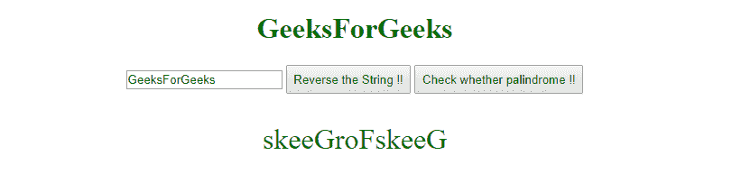
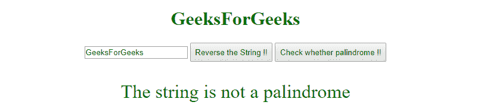

# 如何在 JS 内部动态加载 JS？

> 原文:[https://www . geesforgeks . org/如何动态加载-js-inside-js/](https://www.geeksforgeeks.org/how-to-dynamically-load-js-inside-js/)

大多数情况下，我们在开始时使用静态导入来包含脚本中的所有导出。无论是否使用模块，每次使用脚本时都会进行导入。因此，如果有人想在需要时有条件地导入模块的某些部分，静态导入将毫无帮助。
因此，给定一个 JavaScript 代码，我们需要找到一个解决方案，只有在动态需要时才加载其他 JavaScript 模块。

**进场:**

*   ES6 为我们提供了一个构造 **import()** ，它提供了按需导入模块的工具。
*   **import()** 返回承诺提供被请求模块的模块对象。
*   我们可以利用模块对象来使用各种导入。

**语法:**

```
import("#ModuleSource").then((module)=>{
     //use module object to access any of the imports.
})

```

**示例:**假设我们想要运行一个脚本，根据单击的按钮对字符串执行一些操作。
T3【逆转 T4】

```
// reverseString.mjs
// module to reverse a given string

export function reverseString(str){

    return str.split('').reverse().join('');

}
```

**证候。mj:**

```
// isPalindrome.mjs
// module to check whether string is palindrome or not

export function isPalindrome(str){

    return (str===str.split('').reverse().join(''))

}
```

**index.html:**

```
<!-- index.html:- contains frontend scripts -->
<!DOCTYPE html>
<html>

<head>
    <title>String operations</title>
</head>

<body style="text-align:center;">

    <h1 style="color:green;">  
            GeeksForGeeks  
        </h1>

    <input type="text" 
           id="myString">

    <button id="reverse" 
            style="padding: 0.5em 0.5em;">
      Reverse the String !!
  </button>

    <button id="palindrome" 
            style="padding: 0.5em 0.5em;">
      Check whether palindrome !!
  </button>

    <div id="answer" 
         style="color: green;
                font-size: 2em; 
                padding: 1em;">
  </div>

    <!-- Script to perform one of the operations. -->
    <script type="text/javascript">
        var reverseButton = document.getElementById("reverse");
        var palindromeButton = document.getElementById("palindrome");

        //module containing the logic to reverse a string.
        var module1 = '/reverseString.mjs'; 

        //module containing the logic to check 
        //whether the string is palindrome or not.
        var module2 = '/isPalindrome.mjs'; 

        reverseButton.addEventListener("click", () => {

            //consuming the value of input
            var str = document.getElementById("myString").value; 

            import (module1).then(module => {

                document.getElementById("answer").innerHTML = 
                module.reverseString(str);

            });
        });

        palindromeButton.addEventListener("click", () => {

            //consuming the value of input
            var str = document.getElementById("myString").value; 

            import (module2).then(module => {

                if (module.isPalindrome(str)) {
                    document.getElementById("answer").innerHTML = 
                    "The string is a palindrome";
                } else {
                    document.getElementById("answer").innerHTML = 
                    "The string is not a palindrome";
                }
            });
        });
    </script>
</body>

</html>
```

**输出:**


加载页面时的初始显示。



单击“反转字符串”按钮后。



点击“检查是否回文后！!"按钮。

**注意:**

这些模块也可以在正则脚本中动态加载。*   A local server needs to be set up to avoid cross site origin issue while using ES6 modules.

    **什么时候用什么？**
    当脚本中有一些很少需要的模块时，动态导入很有用。这提高了初始加载时的性能。但是，如果在一个脚本中频繁使用任何导出，那么它可能会在执行过程中造成一些延迟。