# 如何在我的浏览器中启用 JavaScript？

> 原文:[https://www . geesforgeks . org/如何在我的浏览器中启用 JavaScript/](https://www.geeksforgeeks.org/how-to-enable-javascript-in-my-browser/)

有时，我们使用的应用程序或我们访问的许多网站可能无法在我们的浏览器中工作。发生这种情况的主要原因之一是我们的浏览器禁用了 JavaScript。这是一个主要问题，在这种浏览器上运行的应用程序可能会失败或行为不当。在本文中，我们旨在修复浏览器中的这个问题，以保持应用程序无缝运行。

**方法:**为了确保在您的浏览器上启用 JavaScript，或者在禁用 JavaScript 的情况下启用它，我们将使用所讨论的特定浏览器的现有工具和设置。每个浏览器都有稍微不同的方法，这里我们将讨论大多数流行的浏览器。我们将看到如何在谷歌浏览器、Mozilla Firefox、互联网浏览器和 Safari 中启用 JavaScript。

**1。逐步实现在谷歌浏览器中启用 JavaScript:**

**第一步:**打开谷歌浏览器，在右上角，点击更多>设置。

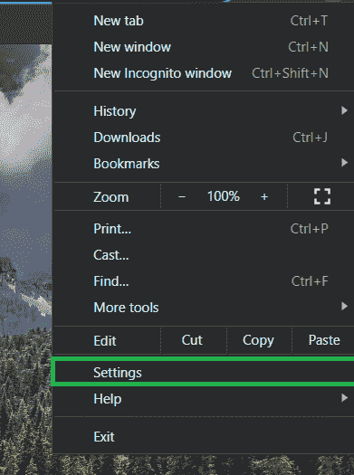

**第二步:**转到设置选项卡，打开高级。

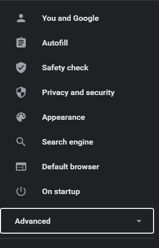

**第 3 步:**现在进入隐私和安全>网站设置。

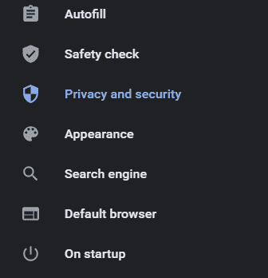 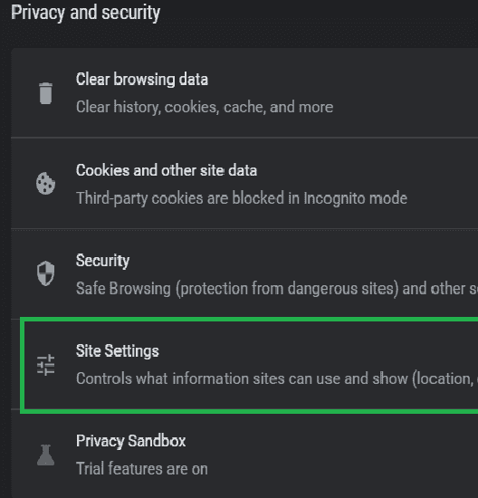

**第四步:**转到**网站**设置的内容部分，打开【JavaScript。

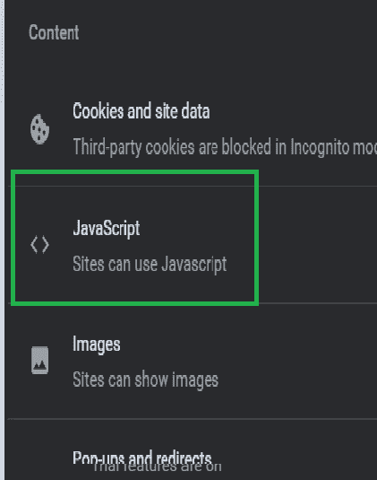

**第五步:**选择站点可以在默认部分下使用 JavaScript，也可以根据自己的方便进行自定义。

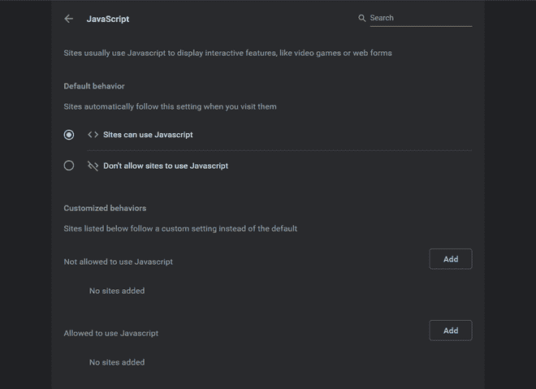

**2。在 Mozilla Firefox 中启用 JavaScript 的分步实现:**

**第一步:**在火狐浏览器选项卡中；地址栏>类型约:配置>按回车键**。**

**第二步:**点击接受风险，继续。

**第三步:**在搜索框中输入 javascript.enabled。

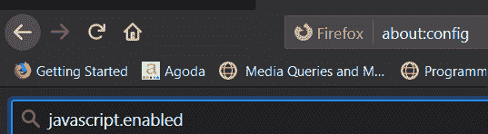

**步骤 4:** 现在在启用/禁用的首选项之间切换。

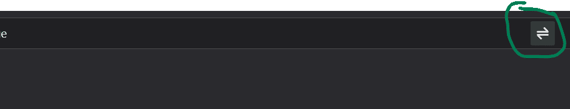

**3。在互联网浏览器中启用 JavaScript 的分步实现:**

**第一步:**打开更多>设置**。**

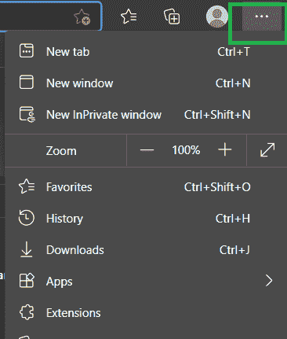

**第二步:**在搜索栏搜索 JavaScript，在**所有权限** > **JavaScript 下搜索。**

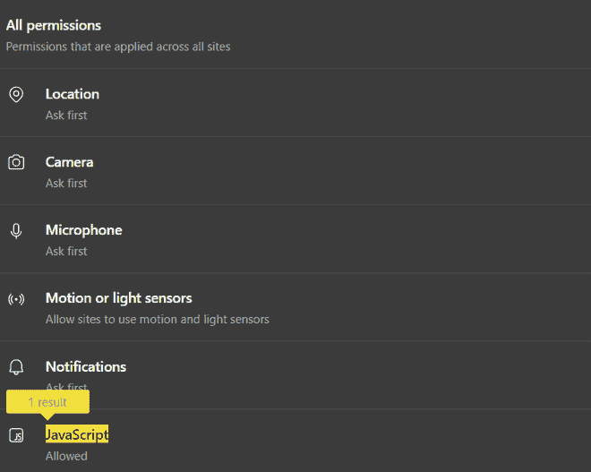

**第三步:**现在开启【允许 T2】。

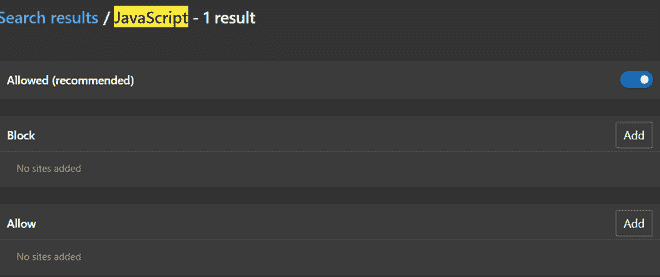

**4。在 Safari 中启用 JavaScript 的分步实现:**

**第一步:**转到工具>偏好设置。

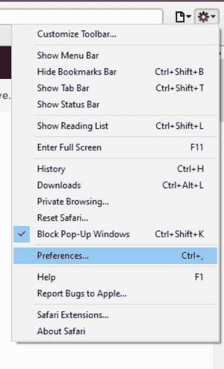

**步骤 2:** 现在转到首选项>安全选项卡。

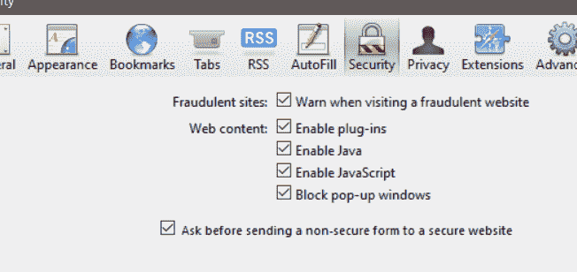

**步骤 3:** 最后转到安全选项卡>启用 JavaScript。

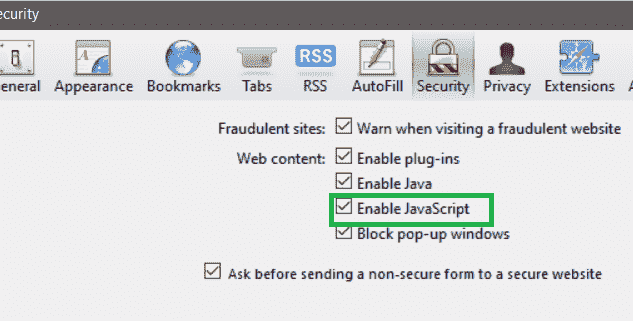