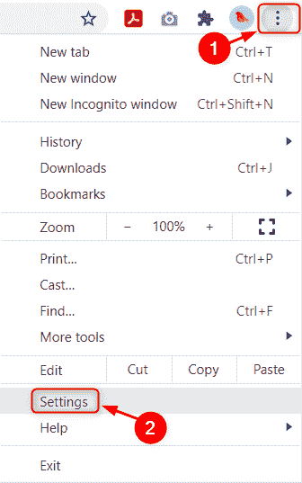
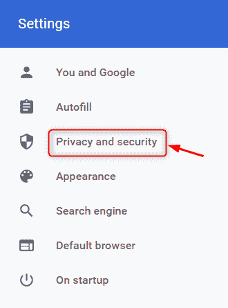
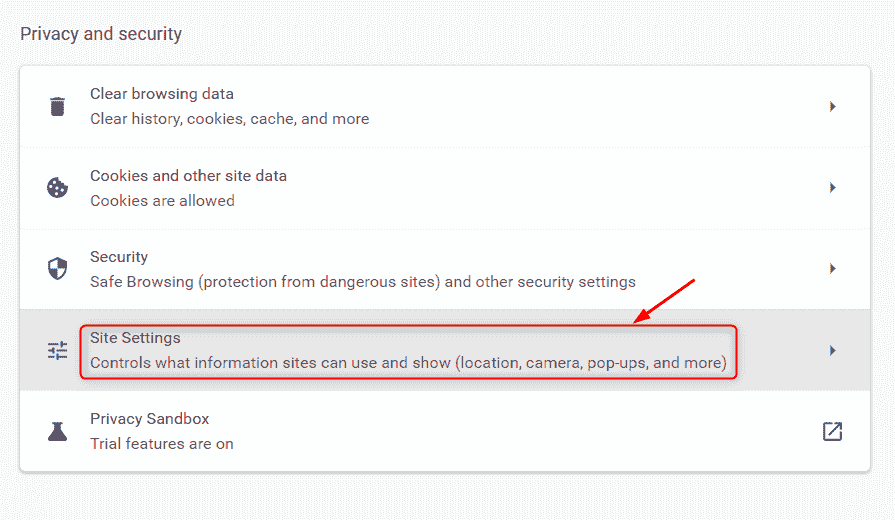
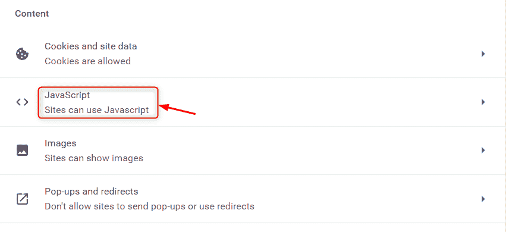
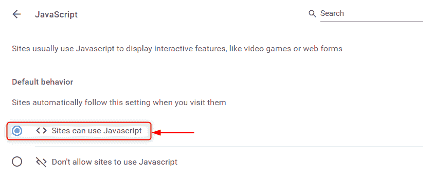

# 如何在 Windows 中启用 JavaScript？

> 原文:[https://www . geesforgeks . org/如何启用 windows 中的 JavaScript/](https://www.geeksforgeeks.org/how-to-enable-javascript-in-windows/)

每当您浏览一些网站时，您可以观察到一些区块显示不正确。它们不是动态的，而是像其他静态页面一样静止不动，这对用户来说是非常不理想的。这种行为主要是因为没有在 windows 中的浏览器上启用 JavaScript。如今，JavaScript 通过向网站添加行为，将网站变成交互式动态页面，在网页创建中发挥着主要作用。因此，让我们在本文中了解如何在 windows 中启用脚本。

**第一步:**请打开**谷歌浏览器**或你使用的任何网页浏览器。

**第二步:**点击**显示更多选项**(三个竖线点)从列表中选择**设置**，如下图截图所示。

**第三步:**然后点击设置页面左侧**隐私与安全**，如下图。

**第 4 步:**点击隐私和安全页面上的**网站设置**选项。

**第五步:**向下滚动**网站设置**页面，在内容部分选择 **JavaScript** ，如下图。

**第六步:**最后，点击显示**<>****的单选按钮，网站可以使用 JavaScript“**”，如下图所示。

现在你可以继续使用谷歌 chrome，它已经为你浏览的所有网站启用了 JavaScript，而不需要系统重启。