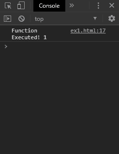
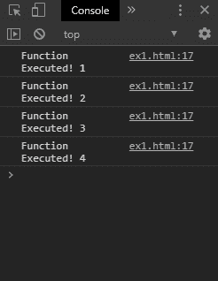

# 如何在 JavaScript 中第一次无延迟执行 setInterval 函数？

> 原文:[https://www . geeksforgeeks . org/如何执行-set interval-函数-javascript 首次无延迟/](https://www.geeksforgeeks.org/how-to-execute-setinterval-function-without-delay-for-the-first-time-in-javascript/)

setInterval()方法总是使用两种方法在延迟后第一次调用函数:

**方法 1:在执行 setInterval 之前调用函数一次:**在使用 setInterval 函数之前，可以简单地调用函数一次。这将立即执行函数一次，然后可以使用所需的回调设置 setInterval()函数。
一个新的函数被创建，它首先包含函数的调用，然后调用 setInterval()函数。这将有助于首次无延迟地模拟 setInterval()函数。

**示例:**

```
<!DOCTYPE html>
<html>

<head>
    <title>
        How to execute setInterval function without
        delay for the first time in JavaScript ?
    </title>
</head>

<body>
    <h1 style="color: green">
        GeeksforGeeks
    </h1>

    <b>
        Execute the setInterval function
        without delay the first time
    </b>

    <p>
        Click on the button to execute the
        setInterval() function without delay.
    </p>

    <button onclick="startSetInterval()">
        Start immediate setInterval
    </button>

    <script type="text/javascript">

        let count = 1;

        function exampleFunction() {
            console.log('Function Executed! ' + count);
            count = count + 1;
        }

        function noDelaySetInterval(func, interval) {
            func();
            return setInterval(func, interval);
        }

        function startSetInterval() {
            noDelaySetInterval(exampleFunction, 3000);
        }
    </script>
</body>

</html>
```

**输出:**

*   **点击按钮后立即:**
    
*   **等待 3 秒后:**
    

**方法 2:在 setInterval 函数中使用立即调用函数:**立即调用函数表达式(IIFE)是一种在声明后立即被调用的函数。这个属性可以在 setInterval()函数的回调中使用，因为它将立即执行一次，然后带有这个函数的实际 setInterval()将在指定的延迟后启动。这将有助于首次无延迟地模拟 setInterval()函数。

**示例:**

```
<!DOCTYPE html>
<html>

<head>
    <title>
        Execute the setInterval function
        without delay the first time
    </title>
</head>

<body>
    <h1 style="color: green">
        GeeksforGeeks
    </h1>

    <b>
        Execute the setInterval function
        without delay the first time
    </b>

    <p>
        Click on the button to execute the
        setInterval() function without delay.
    </p>

    <button onclick="startSetInterval()">
        Start immediate setInterval
    </button>

    <script type="text/javascript">

        function startSetInterval() {

            let count = 1;

            setInterval(function exampleFunction() {
                console.log('Function Executed! ' + count);
                count = count + 1;

                return exampleFunction;
            }(), 3000);
        }
    </script>
</body>

</html>
```

**输出:**

*   **点击按钮后立即:**
    
*   **等待 3 秒后:**
    