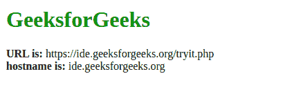
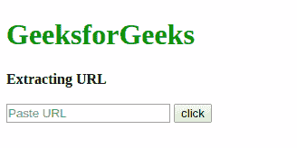

# 如何用 JavaScript 从 URL 中提取主机名？

> 原文:[https://www . geesforgeks . org/如何使用 javascript 从 url 中提取主机名/](https://www.geeksforgeeks.org/how-to-extract-the-host-name-from-url-using-javascript/)

要从网址中提取主机名部分，我们可以使用表示当前网址信息的位置对象。它是窗口对象和客户端对象的元素。

**语法:**

```html
window.location.propertyname
```

**示例 1:** 在本例中，我们将使用 self URL，代码将在其中运行以提取主机名。

*   **程序:**

    ```html
    <!DOCTYPE html>
    <html>

    <head>
        <title>
            Get domain from URL
        </title>
    </head>

    <body>
        <h1 style="color: green"> 
            GeeksforGeeks 
        </h1>

        <b>URL is:</b> 

        <script>
            document.write(window.location.href);
        </script>

        <br>
        <b>hostname is:</b> 

        <script>
            document.write(window.location.hostname);
        </script>
    </body>

    </html>
    ```

*   **输出:** 

**示例 2:** 在本例中，我们将向用户询问网址，然后对该网址执行主机名提取。

*   **程序:**

    ```html
    <!DOCTYPE html>
    <html>

    <head>
        <title>Extracting URL</title>
    </head>

    <body>
        <h1 style="color: green;">GeeksforGeeks</h1>
        <b>Extracting URL</b>
        <br><br>
        <form name="f1">
            <input type="text" name="txt" 
                   placeholder="Paste URL"/>
            <input type="button" value="click" 
                   onclick="url2()" />
        </form>
        <script>
            function url2() {

                var url3 = document.f1.txt.value;

                var j = url3.indexOf("://");

                var host = "";

                for (i = j + 3; i < url3.length; i++) {
                    if (url3.charAt(i) != '/') {
                        host = host + "" + url3.charAt(i);
                    } else {
                        break;
                    }
                }
                document.write(host);
            }
        </script>
    </body>

    </html>
    ```

*   **输出:**
    