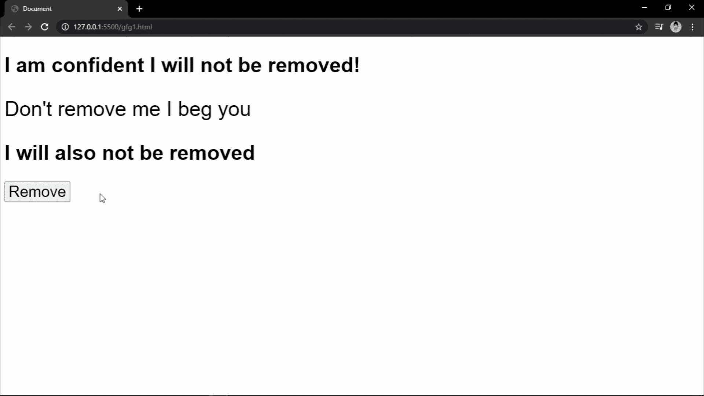

# 如何使用 CSS 和 JavaScript 淡化 DOM 元素的移除？

> 原文:[https://www . geeksforgeeks . org/如何使用 css 和 javascript 淡入淡出移除 dom 元素/](https://www.geeksforgeeks.org/how-to-fade-the-removal-of-a-dom-element-using-css-and-javascript/)

CSS 有一个广阔的领域，虽然基本的 CSS 本质上是复制粘贴，但是当它与像 JavaScript 和相关框架这样的前端技术合并时，它会变得非常复杂。因此，人们注意到一些高技能的后端开发人员努力设计他们的投资组合网站的前端。很多 JavaScript 属性和与 CSS 链接的属性很少被初学者使用。本文利用一个这样的属性来淡化并最终删除一个点击按钮的段落。

**HTML 代码:**三个文本元素和一个移除按钮被一个容器包装。

## 超文本标记语言

```html
<section class="container">
  <h1 class="notRemoved">
    I am confident I will not be removed!
  </h1>
  <p id="parId">Don't remove me I beg you</p>
  <h1 class="notRemoved">
    I will also not be removed
  </h1>
  <button>Remove</button>
</section>
```

**CSS:** 该段落被指定为*不透明度*的过渡，持续时间为一秒。此外，要添加到移除元素的“移除”类指定最终的“不透明度”为零。这给移除一个褪色的外观。

```html
#parId {
  transition: opacity 1s;
}
.removed {
  opacity: 0;
}

```

**JavaScript:** 首先，我们创建按钮和段落的 DOM 对象(带有合适的标签和 id)。此外，我们将事件监听器添加到按钮中，这个监听器将一个“移除”类添加到段落中，从而降低不透明度并启动淡入淡出过程。最后，我们在段落中添加一个监听器，监听过渡的结束。一旦过渡完成，段落就被删除。

## java 描述语言

```html
var btn = document.querySelector("button");
var par = document.querySelector("#parId");
btn.addEventListener("click", e => {  
  par.classList.add("removed");
});
par.addEventListener("transitionend", () => 
{
  par.remove();
})
```

**最终代码:**以下示例显示了上述所有代码的组合。

```html
<!DOCTYPE html>
<html>
<style>
    #parId {
        transition: opacity 1s;
    }

    .removed {
        opacity: 0;
    }
</style>

<body>
    <section class="container">
        <h1 class="notRemoved">
            I am confident I will not be removed!
        </h1>
        <p id="parId">
            Don't remove me I beg you
        </p>
        <h1 class="notRemoved">
            I will also not be removed
        </h1>
        <button>Remove</button>
    </section>
    <script>
        var btn = document.querySelector("button");
        var par = document.querySelector("#parId");
        btn.addEventListener("click", e => {
            par.classList.add("removed");
        });
        par.addEventListener("transitionend", () => {
            par.remove();
        })
    </script>
</body>

</html>
```

**输出:**
