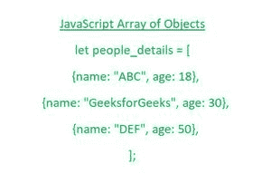

# 如何过滤 ES6 中的对象数组？

> 原文:[https://www . geesforgeks . org/如何过滤 es6 中的对象数组/](https://www.geeksforgeeks.org/how-to-filter-an-array-of-objects-in-es6/)

在本文中，我们将尝试理解如何从 ES6 中的对象数组中过滤或分离出某些数据。



让我们首先了解如何通过遵循 JavaScript 提供的特定语法来创建对象数组。

**物体阵列:**

*   对象数组帮助任何用户在单个变量中存储多个值。
*   它实际上存储了按顺序访问的固定大小的集合，以及相同类型的集合。
*   通过使用以下语法，我们可以轻松地创建多个对象的数组。

**语法:**

通过使用下面的语法，我们可以轻松地创建一个对象数组。

```
let array_of_objects = [
{ property-name: value},
{ property-name: value},
.........
]
```

为了更好地理解如何创建对象数组，让我们看下面的例子。

**示例:**

## java 描述语言

```
<script>
  let people_details = [
    {name: "ABC", age: 18},
    {name: "GeeksforGeeks", age: 30},
    {name: "DEF", age: 50},
  ];
  console.log(people_details);
</script>
```

上述代码片段的输出如下:

```
[
  { name: 'ABC', age: 18 },
  { name: 'GeeksforGeeks', age: 30 },
  { name: 'DEF', age: 50 }
]
```

既然我们已经理解了创建对象数组的概念，现在让我们看看如何根据用户需求从对象数组中过滤出一些数据。

**过滤()方法:**

以下按顺序排列的点将描述我们上面说明的任务-

*   为了从对象数组中过滤出内容，我们首先将使用 **filter()** 方法，我们将在最外面的数组部分应用该方法。
*   在该方法中，我们将传递一个函数，该函数将对数组中的所有对象执行，为了访问数组中的对象，我们将使用任何名称的元素来访问这些对象。
*   然后，根据用户的要求，来自该对象数组的数据将被过滤掉，并在需要时显示出来。

**例 1:**

## java 描述语言

```
<script>
  let people_details = [
    {name: "ABC", age: 18},
    {name: "GeeksforGeeks", age: 30},
    {name: "DEF", age: 50},
  ];
  console.log(people_details);

  let data = people_details.filter(
    element => element.age >= 30);
  console.log(data);
</script>
```

上述代码片段的输出如下:

```
[
  { name: 'ABC', age: 18 },
  { name: 'GeeksforGeeks', age: 30 },
  { name: 'DEF', age: 50 }
]

[ 
    { name: 'GeeksforGeeks', age: 30 }, 
    { name: 'DEF', age: 50 } 
]
```

**例 2:**

*   在本例中，我们将使用 filter()方法过滤掉用户所需的血型数据作为最终结果。
*   在这里，我们还将使用&&逻辑运算符，提供年龄应大于 18 岁的条件以及所需的血型是 B+。

## java 描述语言

```
</script>
  let blood_groups_data = [
    { name: "ABC", age: 19, blood_group: "B+" },
    { name: "DEF", age: 20, blood_group: "AB+" },
    { name: "JOHN", age: 25, blood_group: "A+" },
    { name: "APPLE", age: 45, blood_group: "B+" },
    { name: "PETER", age: 48, blood_group: "AB-" },
    { name: "JAMES", age: 53, blood_group: "B+" },
  ];

  console.log(blood_groups_data);

  let blood_group_required_data = blood_groups_data.filter(
    (person) => person.age > 18 && person.blood_group === "B+"
  );
  console.log(blood_group_required_data);
</script>
```

上述代码片段的输出如下:

```
[
  { name: 'ABC', age: 19, blood_group: 'B+' },
  { name: 'DEF', age: 20, blood_group: 'AB+' },
  { name: 'JOHN', age: 25, blood_group: 'A+' },
  { name: 'APPLE', age: 45, blood_group: 'B+' },
  { name: 'PETER', age: 48, blood_group: 'AB-' },
  { name: 'JAMES', age: 53, blood_group: 'B+' }
]

[
  { name: 'ABC', age: 19, blood_group: 'B+' },
  { name: 'APPLE', age: 45, blood_group: 'B+' },
  { name: 'JAMES', age: 53, blood_group: 'B+' }
]
```