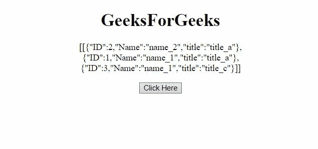
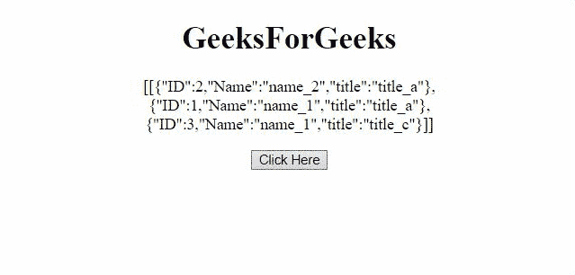

# 如何在 JavaScript 中根据字段的值过滤对象？

> 原文:[https://www . geesforgeks . org/如何根据 javascript 中的字段值过滤对象/](https://www.geeksforgeeks.org/how-to-filter-object-depending-on-the-fields-value-in-javascript/)

给定一个对象，任务是根据 JavaScript 中字段的值过滤对象。下面讨论两种方法。

**方法 1:** 首先创建一个空对象，将字段的值作为关键字。然后一个接一个地遍历原始对象，并将对象附加到对象的正确键上。使用 **push()** 方法将数组末尾的对象推送到新对象中。

*   **示例:**该示例实现了上述方法。

    ```html
    <!DOCTYPE HTML>
    <html>

    <head>
        <script src=
    "https://ajax.googleapis.com/ajax/libs/jquery/3.4.0/jquery.min.js">
        </script>
    </head>

    <body style="text-align:center;">
        <h1>GeeksForGeeks</h1>

        <p id="GFG_UP"></p>

        <button onclick="myGFG()">
            Click Here
        </button>

        <p id="GFG_DOWN"></p>

        <script>
            var up = document.getElementById("GFG_UP");
            var obj = [
                { ID: 2, Name: 'name_2', title: 'title_a' },
                { ID: 1, Name: 'name_1', title: 'title_a' },
                { ID: 3, Name: 'name_1', title: 'title_c' }
            ];

            up.innerHTML = "[" + JSON.stringify(obj) + "]";
            var down = document.getElementById("GFG_DOWN");

            function myGFG() {
                var titles = {};
                for (var i = 0; i < obj.length; i++) {
                    titles[obj[i].title] = [];
                }
                for (var i = 0; i < obj.length; i++) {
                    titles[obj[i].title].push(obj[i]);
                }
                down.innerHTML = JSON.stringify(titles);
            }
        </script>
    </body>

    </html>
    ```

*   **输出:**
    

**方法 2:** 首先，使用新的**数组()**创建一个以字段值为关键字，空数组为值的空对象。然后一个接一个地遍历原始对象，并在适当的键处追加该对象。使用 **push()** 方法将数组末端的对象推送到新对象中。

*   **示例:**该示例实现了上述方法。

    ```html
    <!DOCTYPE HTML>
    <html>

    <head>
        <script src=
    "https://ajax.googleapis.com/ajax/libs/jquery/3.4.0/jquery.min.js">
        </script>
    </head>

    <body style="text-align:center;">
        <h1>GeeksForGeeks</h1>

        <p id="GFG_UP"></p>

        <button onclick="myGFG()">
            Click Here
        </button>

        <p id="GFG_DOWN"></p>

        <script>
            var up = document.getElementById("GFG_UP");
            var obj = [
                { ID: 2, Name: 'name_2', title: 'title_a' },
                { ID: 1, Name: 'name_1', title: 'title_a' },
                { ID: 3, Name: 'name_1', title: 'title_c' }
            ];
            up.innerHTML = "[" + JSON.stringify(obj) + "]";
            var down = document.getElementById("GFG_DOWN");

            function myGFG() {
                var names = {};
                for (var i = 0; i < obj.length; i++) {
                    if (!names[obj[i].Name]) {
                        names[obj[i].Name] = new Array();
                    }
                    names[obj[i].Name].push(obj[i]);
                }
                down.innerHTML = JSON.stringify(names);
            }
        </script>
    </body>

    </html>
    ```

*   **输出:**
    