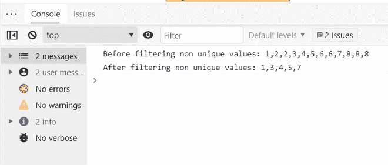

# 如何用 JavaScript 过滤掉数组中的非唯一值？

> 原文:[https://www . geesforgeks . org/如何使用 javascript 过滤掉数组中的非唯一值/](https://www.geeksforgeeks.org/how-to-filter-out-the-non-unique-values-in-an-array-using-javascript/)

在 JavaScript 中，数组是使用索引作为值的键的对象。在本文中，让我们看看如何过滤掉所有非唯一的值，并反过来获得所有唯一且不重复的元素。

**方法:**在唯一元素的数组中，元素的第一次和最后一次出现的索引必须相同，否则，如果它们不同，则确认该数组在同一数组中的某个其他索引处有重复。所有非唯一值应由**过滤器()停止**，输出应为唯一值。

**方法 1:** 使用 [**滤镜()**](https://www.geeksforgeeks.org/javascript-array-filter-method/) 方法

**filter()** 方法返回满足唯一元素的第一个出现索引和最后一个出现索引必须相同的条件的数组元素。我们使用****[**index of()**](https://www.geeksforgeeks.org/javascript-array-indexof-method/)方法获取元素的第一个出现的索引，使用**[**last index of()**](https://www.geeksforgeeks.org/javascript-array-lastindexof-method/)方法获取元素的最后一个出现的索引。******

******语法:******

```
****var** newarr=initial_arr.**filter**((**value** ,**index)**=>{
  conditions with **return** statement;
});**
```

******例:****** 

## ****java 描述语言****

```
**<script>
  var array = [1, 2, 2, 3, 4, 5, 6, 6, 7, 8, 8, 8];
  console.log("Before filtering non unique values: " + array);

  var unique = array.filter((value, index) => {
    return array.indexOf(value) === array.lastIndexOf(value);
  });
  console.log("After filtering non unique values: " + unique);
</script>**
```

******输出:******

```
**Before filtering non unique values: 1,2,2,3,4,5,6,6,7,8,8,8
After filtering non unique values: 1,3,4,5,7**
```

********

******方法二:**使用相同的原理但使用一个[**为()**](https://www.geeksforgeeks.org/javascript-for-loop/) 循环。****

****在 for 循环中，我们只将我们的唯一元素推入数组，如果它满足第一个出现索引和最后一个出现索引必须相同的条件。我们使用****indexOf()**方法获取元素的第一次出现的索引，使用 **lastIndexOf()** 方法获取元素的最后一次出现的索引。******

******语法:******

```
****for** (**let** i = start; condition to i;increment or decrement) {
    instruction1;
    instruction2;
    instruction3;
    .
    .
    .
};**
```

******例:****** 

## ****java 描述语言****

```
**<script>
  var array = [1, 2, 2, 3, 4, 5, 6, 6, 7, 8, 8, 8];
  console.log("Before filtering non unique values: " + array);
  var unique = [];
  for (let i = 0; i < array.length; i++) {
    if (array.lastIndexOf(array[i]) === array.indexOf(array[i])) {
      unique.push(array[i]);
    }
  }

  console.log("After filtering non unique values: " + unique);
</script>**
```

 ******Output:**

```
Before filtering non unique values: 1,2,2,3,4,5,6,6,7,8,8,8
After filtering non unique values: 1,3,4,5,7
```

****