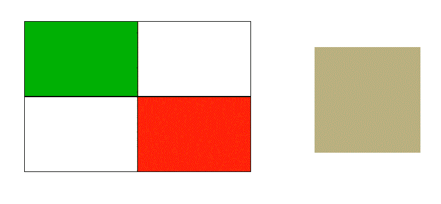

# 如何用 JavaScript 找到图像的平均颜色？

> 原文:[https://www . geesforgeks . org/如何使用 javascript 找到平均颜色的图像/](https://www.geeksforgeeks.org/how-to-find-an-average-color-of-an-image-using-javascript/)

通过在画布元素上绘制图像，可以用 JavaScript 找到图像的平均颜色。要获得图像的平均颜色，必须执行以下步骤:

1.首先使用画布 2D 应用编程接口的方法**context . drawing()**在画布上绘制图像。该方法将图像和尺寸作为参数，并将其绘制到画布上。

**语法:**

```html
context.drawImage( img, width, height );

```

2.使用 **context.getImageData()** 方法返回画布的图像数据。它返回一个 ImageData 对象，表示画布指定部分的像素数据。

**语法:**

```html
context.getImageData( x, y, width, height )
```

3.然后，通过将所有颜色值分别相加并找到该颜色的平均值，用该图像数据计算平均红色、绿色和蓝色。

**示例:**

## 超文本标记语言

```html
<!DOCTYPE html>
<html lang="en">

<head>
    <title>
        Find Average Color of
        image via JavaScript?
    </title>

    <style>
        #img {
            position: absolute;
            top: 20%;
            left: 25%;
        }

        #block {
            position: absolute;
            background-color: white;
            height: 70px;
            width: 70px;
            left: 50%;
            top: 25%;
        }
    </style>
</head>

<body>
    

    <div id="block"></div>

    <!-- Function to find the average color -->
    <script>
        function averageColor(imageElement) {

            // Create the canavs element
            var canvas
                = document.createElement('canvas'),

                // Get the 2D context of the canvas
                context
                    = canvas.getContext &&
                    canvas.getContext('2d'),
                imgData, width, height,
                length,

                // Define variables for storing
                // the individual red, blue and
                // green colors
                rgb = { r: 0, g: 0, b: 0 },

                // Define variable for the 
                // total number of colors
                count = 0;

            // Set the height and width equal
            // to that of the canvas and the image
            height = canvas.height =
                imageElement.naturalHeight ||
                imageElement.offsetHeight ||
                imageElement.height;
            width = canvas.width =
                imageElement.naturalWidth ||
                imageElement.offsetWidth ||
                imageElement.width;

            // Draw the image to the canvas
            context.drawImage(imageElement, 0, 0);

            // Get the data of the image
            imgData = context.getImageData(
                        0, 0, width, height);

            // Get the length of image data object
            length = imgData.data.length;

            for (var i = 0; i < length; i += 4) {

                // Sum all values of red colour
                rgb.r += imgData.data[i];

                // Sum all values of green colour
                rgb.g += imgData.data[i + 1];

                // Sum all values of blue colour
                rgb.b += imgData.data[i + 2];

                // Increment the total number of
                // values of rgb colours
                count++;
            }

            // Find the average of red
            rgb.r
                = Math.floor(rgb.r / count);

            // Find the average of green
            rgb.g
                = Math.floor(rgb.g / count);

            // Find the average of blue
            rgb.b
                = Math.floor(rgb.b / count);

            return rgb;
        }

        // Function to set the background
        // color of the second div as 
        // calculated average color of image
        var rgb;

        setTimeout(() => {
            rgb = averageColor(
                document.getElementById('img'));

            // Select the element and set its
            // background color
            document
                .getElementById("block")
                .style.backgroundColor =
                'rgb(' + rgb.r + ','
                + rgb.g + ','
                + rgb.b + ')';
        }, 500)
    </script>
</body>

</html>
```

**输出:**

