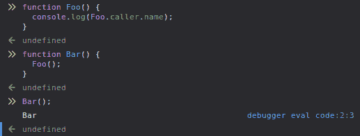
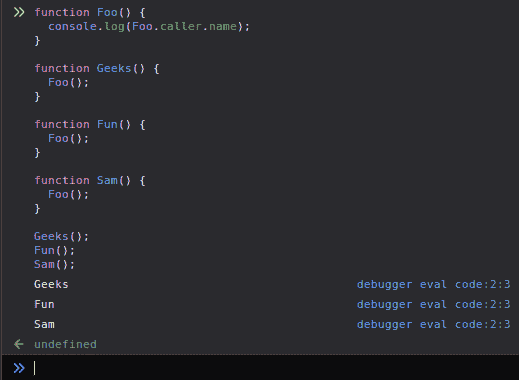

# 如何在 JavaScript 中找出调用者函数？

> 原文:[https://www . geeksforgeeks . org/如何在 javascript 中找到调用者函数/](https://www.geeksforgeeks.org/how-to-find-out-the-caller-function-in-javascript/)

有时，开发人员可能希望根据调用者函数修改函数的工作方式。为了找出调用者函数名，我们将使用函数对象的**调用者**属性。

**使用的属性:**

*   函数.调用方

在这里，函数对象被我们想要知道其父函数名的函数名所代替。

**我们来看一个例子:**

```
<script >
    // Child function 
    function Foo() {

      // This will print 'Bar' 
        console.log(Foo.caller.name); 
    }

    // Parent function 
    function Bar() {
    Foo();
}

Bar();

</script>
```

当执行上述代码时，我们可以看到被注销的父函数的名称。
**输出:**


**我们再来看一个例子:**
假设我们从多个函数中调用`Foo`函数。

```
<script>
    // Child function 
    function Foo() {

        // This will print parent function's name
        console.log(Foo.caller.name);
    }

     // Parent function
     function Geeks() {
          Foo();
     }

     // Parent function 
     function Fun() {
          Foo();
     }

     // Parent function 
     function Sam() {
          Foo();
     }

Geeks();
Fun();
Sam(); 
</script>
```

**输出:**


您可以从属性 **Function.caller** 了解更多关于父函数的信息