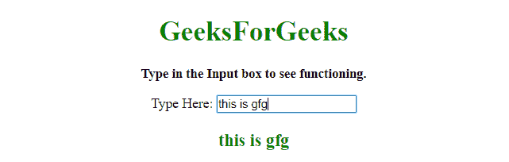

# 如何用 JavaScript 找出按了哪个字符键？

> 原文:[https://www . geeksforgeeks . org/如何使用 javascript/](https://www.geeksforgeeks.org/how-to-find-out-which-character-key-is-pressed-using-javascript/) 找出按下了哪个字符键

在这里，任务是获得字符键，按下。在下面编写的代码中，当任何键被按下并调用一个函数时触发的事件，然后该函数识别它。

**进场:**

*   将事件附加到输入框。像**上的按键事件**。
*   当该事件发生时调用一个函数，并在其中传递**事件**参数。
*   在调用的函数中，识别按下的键。

**示例 1:** 该示例使用上面定义的方法。

```
<!DOCTYPE HTML>
<html>

<head>
    <title>
        How to find out which character
      key is pressed using JavaScript?
    </title>
</head>

<body id="body" style="text-align:center;">
    <h1 style="color:green;">  
            GeeksForGeeks  
        </h1>
    <p id="GFG_UP" 
       style="font-size: 15px;
              font-weight: bold;">
    </p>
    <form>
        Type Here:
        <input type="text"
               onkeypress="return GFG_Fun(event)" />
    </form>
    <p id="GFG_DOWN" style="color:green;
              font-size: 20px;
              font-weight: bold;">
    </p>
    <script>
        var up = document.getElementById('GFG_UP');
        up.innerHTML =
            "Type in the Input box to see functioning.";
        var down = document.getElementById('GFG_DOWN');

        function GFG_Fun(e) {
            var key;
            if (window.event) {
                key = e.keyCode;
            } else if (e.which) {
                key = e.which;
            }
            var str = down.innerHTML;
            str += String.fromCharCode(key);
            down.innerHTML = str;
        }
    </script>
</body>

</html>
```

**输出:**

*   **点击按钮前:**
    
*   **点击按钮后:**
    

**示例 2:** 该示例使用上面定义的方法。

```
<!DOCTYPE HTML>
<html>

<head>
    <title>
        How to find out which character 
      key is pressed using JavaScript?
    </title>
</head>

<body id="body" style="text-align:center;">
    <h1 style="color:green;">  
            GeeksForGeeks  
        </h1>
    <p id="GFG_UP" 
       style="font-size: 15px;
              font-weight: bold;">
    </p>
    <form>
        Type Here:
        <input type="text" 
               onkeypress="return GFG_Fun(event)" />
    </form>
    <p id="GFG_DOWN" 
       style="color:green;
              font-size: 20px;
              font-weight: bold;">
    </p>
    <script>
        var up = document.getElementById('GFG_UP');
        up.innerHTML = "Type in the Input box to see functioning.";
        var down = document.getElementById('GFG_DOWN');

        function GFG_Fun(e) {
            var str = down.innerHTML;
            str += e.key
            down.innerHTML = str;
        }
    </script>
</body>

</html>
```

**输出:**

*   **点击按钮前:**
    
*   **点击按钮后:**
    