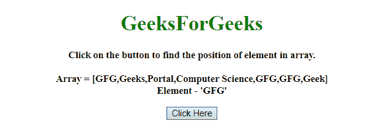
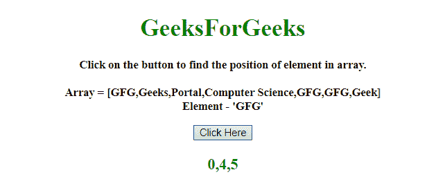

# 如何用 JavaScript 找到数组中所有出现元素的索引？

> 原文:[https://www . geeksforgeeks . org/如何使用 javascript 查找数组中所有出现元素的索引/](https://www.geeksforgeeks.org/how-to-find-the-index-of-all-occurrence-of-elements-in-an-array-using-javascript/)

给定一个包含数组元素的数组，任务是从数组中找到所有出现的元素。我们将在 JavaScript 的帮助下做到这一点。

**方法 1:** 声明一个空数组，它存储数组元素所有出现的索引。使用**逐个访问数组元素，同时循环**，如果数组元素与给定的元素匹配，则将元素的索引推入数组。访问数组的每个元素后，返回索引数组。

**示例:**该示例实现了上述方法。

```
<!DOCTYPE HTML> 
<html> 

<head> 
    <title> 
        How to find the index of all occurrences
        of element in an array using JavaScript?
    </title>
</head> 

<body style = "text-align:center;"> 

    <h1 style = "color:green;" > 
        GeeksForGeeks 
    </h1>

    <p id = "GFG_UP" style =
        "font-size: 15px; font-weight: bold;">
    </p>

    <button onclick = "GFG_Fun()">
        Click Here
    </button>

    <p id = "GFG_DOWN" style =
        "color:green; font-size: 20px; font-weight: bold;">
    </p>

    <script>
        var up = document.getElementById('GFG_UP'); 
        var down = document.getElementById('GFG_DOWN'); 

        var arr = [
            'GFG', 'Geeks', 'Portal', 
            'Computer Science', 'GFG', 
            'GFG', 'Geek'
        ];

        var elm = 'GFG';

        up.innerHTML = "Click on the button to find "
                    + "the position of element in "
                    + "array.<br><br>Array = [" 
                    + arr + "]<br>" + "Element - '"
                    + elm + "'";

        function getInd(arr, val) {
            var index = [], i = -1;
            while ((i = arr.indexOf(val, i+1)) != -1){
                index.push(i);
            }
            return index;
        }

        function GFG_Fun() {
            down.innerHTML = getInd(arr, elm);
        } 
    </script> 
</body> 

</html>
```

**输出:**

*   **点击按钮前:**
    
*   **点击按钮后:**
    

**方法 2:** 使用 **reduce()方法**逐个访问数组元素，如果数组元素与给定元素匹配，则将索引推入数组。访问数组的每个元素后，返回索引数组。

**示例:**本示例使用 **reduce()方法**来查找数组中所有出现元素的索引。

```
<!DOCTYPE HTML> 
<html> 

<head> 
    <title> 
        How to find the index of all occurrences
        of element in an array using JavaScript?
    </title>
</head> 

<body style = "text-align:center;"> 

    <h1 style = "color:green;" > 
        GeeksForGeeks 
    </h1>

    <p id = "GFG_UP" style = 
        "font-size: 15px; font-weight: bold;">
    </p>

    <button onclick = "GFG_Fun()">
        Click Here
    </button>

    <p id = "GFG_DOWN" style = 
        "color:green; font-size: 20px; font-weight: bold;">
    </p>

    <script>
        var up = document.getElementById('GFG_UP'); 
        var down = document.getElementById('GFG_DOWN'); 

        var arr = [
            'GFG', 'Geeks', 'Portal',
            'Computer Science', 'GFG',
            'GFG', 'Geek'
        ];

        var elm = 'GFG';

        up.innerHTML = "Click on the button to "
                + "find the position of element"
                + " in array.<br><br>Array = [" 
                + arr + "]<br>" + "Element - '"
                + elm + "'";

        function GFG_Fun() {
            down.innerHTML = 
                arr.reduce(function(ind, el, i) {
                    if (el === 'GFG')
                        ind.push(i);
                    return ind;
                }, []); 
        } 
    </script> 
</body> 

</html>
```

**输出:**

*   **点击按钮前:**
    
*   **点击按钮后:**
    