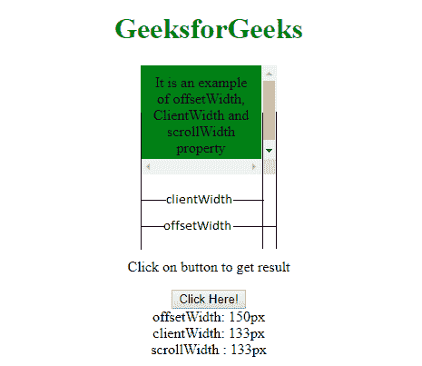

# 如何用普通的 JavaScript 找到 div 的宽度？

> 原文:[https://www . geeksforgeeks . org/如何使用普通 javascript 找到 div 宽度/](https://www.geeksforgeeks.org/how-to-find-the-width-of-a-div-using-vanilla-javascript/)

为了测量一个 **[div](https://www.geeksforgeeks.org/div-tag-html/)** 元素的宽度，我们将利用 JavaScript 的 **[偏移](https://www.geeksforgeeks.org/html-dom-offsetwidth-property/)** 属性。JavaScript 的这个属性返回一个表示元素布局宽度的整数，以像素为单位。

**语法:**

```html
element.offsetWidth
```

**Return Value:**

*   Returns the corresponding element’s layout pixel width.

    **例:**
    

    以下程序将使用**偏移说明解决方案:**
    **程序 1:**

    ```html
    <!DOCTYPE html>
    <html>

    <head>
        <title>
            GeeksforGeeks
        </title>

        <style>
            #GFG {
                height: 30px;
                width: 300px;
                padding: 10px;
                margin: 15px;
                background-color: green;
            }
        </style>
    </head>

    <body>

        <div id="GFG">
            <b>Division</b>
        </div>

        <button type="button"
                onclick="Geeks()">
            Check
        </button>

        <script>
            function Geeks() {

                var elemWidth = 
                    document.getElementById("GFG").offsetWidth;
                alert(elemWidth);
            }
        </script>
    </body>

    </html>
    ```

    **输出:**

    ```html
    320
    ```

    另一种测量 **[div](https://www.geeksforgeeks.org/div-tag-html/)** 元素宽度的方法我们将利用 JavaScript 的 **[clientWidth](https://www.geeksforgeeks.org/html-dom-clientwidth-property/) ()** 属性。

    以下程序将说明使用 **clientWidth:**
    **程序 2:** 的解决方案

    ```html
    <!DOCTYPE html>
    <html>

    <head>
        <title>
            GeeksforGeeks
        </title>

        <style>
            #GFG {
                height: 30px;
                width: 300px;
                padding: 10px;
                margin: 15px;
                background-color: green;
            }
        </style>
    </head>

    <body>

        <div id="GFG">
            <b>Division</b>
        </div>

        <button type="button" onclick="Geeks()">
            Check
        </button>

        <script>
            function Geeks() {

                var elemWidth = 
                    document.getElementById("GFG").clientWidth;
                alert(elemWidth);
            }
        </script>
    </body>

    </html>
    ```

    **输出:**

    ```html
    320
    ```

    **注意:** **客户端宽度**返回包含填充但不包含边框和滚动条的内部宽度，而**偏移量**返回包含填充和边框的外部宽度。