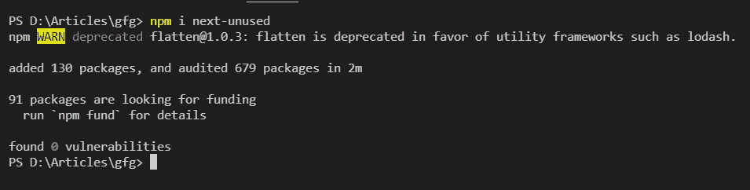
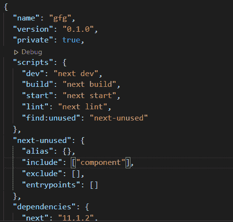
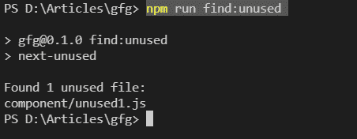

# 如何在 Next.js 中找到未使用的文件？

> 原文:[https://www . geesforgeks . org/如何在下一个 js 中查找未使用的文件/](https://www.geeksforgeeks.org/how-to-find-unused-files-in-next-js/)

在本文中，我们将学习如何在 NextJS 项目中找到未使用的文件。NextJS 是一个基于 React 的框架。它有能力为不同的平台开发漂亮的网络应用程序，如视窗、Linux 和 mac。动态路径的链接有助于有条件地呈现您的 NextJS 组件。

**方法:**为了首先找到未使用的文件，我们将在项目的根目录下创建 2 个新的 javascript 文件。之后，我们将一个文件导入到我们的 index.js 文件中，然后我们将安装并运行下一个未使用的模块来检查未使用的文件，

**创建下一个应用程序:**

**步骤 1:** 您可以使用以下命令创建一个新的 NextJs 项目:

```
npx create-next-app gfg
```

**项目结构:**会是这样的。


**未使用的文件:**使用 next-unused 模块可以很容易地在 NextJs 中找到未使用的文件。首先，我们将在项目的根目录中创建一个名为“component”的新文件夹，在这个文件夹中，我们将创建两个名为“unused1”和“used1”的新文件。然后我们将在我们的文件中添加以下内容。

**步骤 2:** 在我们项目的根目录下创建一个名为 **unused.js** 的新文件，并在该文件中创建一个名为 unused()的新函数。

```
import React from 'react'

export default function Unused() {
    return (
        <div>
            Unused File
        </div>
    )
}
```

**步骤 3:** 在我们项目的根目录下创建一个名为 **used.js** 的新文件，并在该文件中创建一个名为 used()的新函数。

```
import React from 'react'

export default function Used() {
    return (
        <div>
            Used File
        </div>
    )
}
```

**第 4 步:**在这一步中，我们将把我们的 Used.js 文件导入到我们的 **Index.js** 文件中。然后我们将创建一个名为 Home 的函数，在这个函数中，我们将调用我们的 Used 组件。

```
import Head from 'next/head'
import Image from 'next/image'
import styles from '../styles/Home.module.css'
import Used from '../component/used1'

export default function Home() {
  return (
    <div className={styles.container}>
      <Used/>
    </div>
  )
}
```

这里我们正在导入我们的 used1.js 文件。

**第 5 步:**现在为了在我们的项目中找到未使用的文件，我们将使用下面的命令安装一个模块名“next-unused”

```
npm i next-unused
```



**第 6 步:**现在我们将在 package.json 文件中为下一个未使用的模块添加脚本和属性。

#### 添加脚本:

```
"scripts": {
  "find:unused": "next-unused"
}
```

#### 添加属性:

```
{
 "next-unused": {
   "alias": {},
   "include": ["component"],
   "exclude": [],
   "entrypoints": []
 }
}
```



**运行应用程序的步骤:**现在可以在终端中使用终端命令中的以下命令运行模块。

```
npm run find:unused
```

#### 输出:

