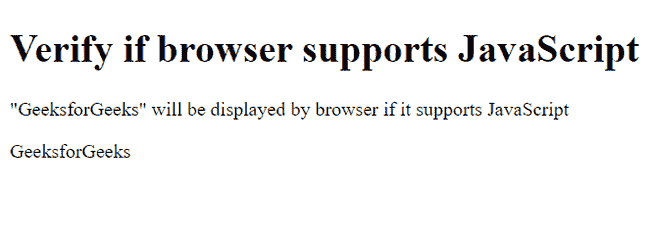
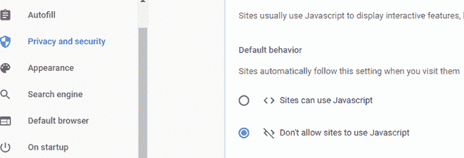
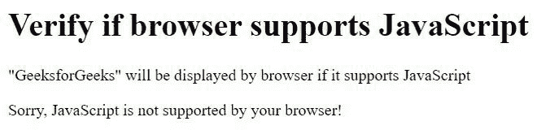

# 如何查找浏览器是否支持 JavaScript？

> 原文:[https://www . geesforgeks . org/how-to-find-browser-是否支持-JavaScript/](https://www.geeksforgeeks.org/how-to-find-whether-browser-supports-javascript-or-not/)

我们将讨论如何找到我们的浏览器是否支持 [JavaScript](https://www.geeksforgeeks.org/javascript-tutorial/) 。为此，我们需要使用 [< noscript >](https://www.geeksforgeeks.org/html-noscript-tag/) 标签，该标签定义了一个替代文本，该文本将显示给在其浏览器中禁用了 [<脚本>](https://www.geeksforgeeks.org/html-script-tag/) 标签的用户。由于 JavaScript 是在 [HTML](https://www.geeksforgeeks.org/html-tutorials/) 文档中的<脚本>标签中编写的，因此禁用了<脚本>标签的浏览器不支持 JavaScript。

<noscript>标签可以用在<a href="https://www.geeksforgeeks.org/html-head-tag/">&lt;&gt;</a>和<a href="https://www.geeksforgeeks.org/html-body-tag/"> &lt;身体&gt; </a>标签内。如果&lt;头&gt;内存在&lt; noscript &gt;标签，则&lt;链接&gt;、&lt; meta &gt;和&lt;样式&gt;标签只能插入到&lt; noscript &gt;标签中。</noscript>

**语法:**

```
<noscript> content </noscript>
```

**示例:**

## 超文本标记语言

```
<!DOCTYPE html>
<html>

<body>
    <h1>Verify if browser supports JavaScript</h1>
    <p>
      "GeeksforGeeks" will be displayed by
       browser if it supports JavaScript
    </p>

    <script>
        document.write("GeeksforGeeks");
    </script>

    <noscript>
        Sorry, JavaScript is not supported by your browser!
    </noscript>
</body>

</html>
```

**输出:**如果支持 JavaScript。



表示浏览器支持 JavaScript

**禁用谷歌 Chrome 中的 JavaScript:**

*   点击“自定义和控制谷歌浏览器”并选择“设置”。
*   在“隐私和安全”下，单击“站点设置...”。
*   当对话框窗口打开时，查找“内容”主题的“JavaScript”部分，并选择“不允许网站使用 JavaScript”。
*   关闭“设置”选项卡。
*   重新加载网页浏览器的此页面以刷新页面。

**参考图片进行设置:**



现在运行上面的 HTML 示例代码。

**输出:**如果不支持 JavaScript，



表示浏览器不支持 JavaScript