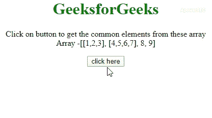

# 如何用 JavaScript/jQuery 展平数组？

> 原文:[https://www . geeksforgeeks . org/如何用 javascript-jquery 扁平化数组/](https://www.geeksforgeeks.org/how-to-flatten-array-with-the-javascript-jquery/)

JavaScript 包含许多数组(或二维数组)，任务是展平数组，使其看起来像一维 JavaScript 数组。下面讨论两种方法。也可以使用[下划线. js _。用例子](https://www.geeksforgeeks.org/underscore-js-_-flatten-with-examples/)压平()。

**方法 1:** 使用**array . prototype . concat . apply()**方法进行操作。使用 [**串联()**](https://www.geeksforgeeks.org/javascript-array-prototype-concat-function/) 和 [**应用()**](https://www.geeksforgeeks.org/javascript-function-apply/) 方法将数组串联成一维数组。

*   **例:**

    ```
    <!DOCTYPE HTML>
    <html>

    <head>
        <title>
            How to flatten array with
            the JavaScript?
        </title>

        <style>
            body {
                text-align: center;
            }

            h1 {
                color: green;
            }
        </style>
    </head>

    <body>
        <h1>GeeksforGeeks</h1>

        <p id="GFG_UP"></p>

        <button onClick="GFG_Fun()">
            click here
        </button>

        <p id="GFG_DOWN"></p>

        <script>
            var up = document.getElementById('GFG_UP');
            var down = document.getElementById('GFG_DOWN');
            var arr1 = [1, 2, 3];
            var arr2 = [4, 5, 6, 7];
            var arr = [arr1, arr2, 8, 9];

            up.innerHTML = "Click on button to get "
                    + "the common elements from these"
                    + " array <br>Array -[[" + arr[0]
                    + "], [" + arr[1] + "], " + arr[2]
                    + ", " + arr[3] + "]";

            function GFG_Fun() {
                down.innerHTML = 
                    Array.prototype.concat.apply([], arr);
            }
        </script>
    </body>

    </html>
    ```

*   **输出:**
    

**进场 2:****$。jQuery 中的 map()方法**可以用来执行操作。此方法将数组和方法作为输入。第二个参数是一个方法，它逐个获取原始数组的元素并返回其元素。

*   **例:**

    ```
    <!DOCTYPE HTML>
    <html>

    <head>
        <title>
            How to flatten array with
            the JavaScript?
        </title>

        <style>
            body {
                text-align: center;
            }

            h1 {
                color: green;
            }
        </style>
        <script src=
    "https://ajax.googleapis.com/ajax/libs/jquery/3.4.0/jquery.min.js">
        </script>
    </head>

    <body>
        <h1>GeeksforGeeks</h1>

        <p id="GFG_UP"></p>

        <button onClick="GFG_Fun()">
            click here
        </button>

        <p id="GFG_DOWN"></p>

        <script>
            var up = document.getElementById('GFG_UP');
            var down = document.getElementById('GFG_DOWN');
            var arr1 = [1, 2, 3];
            var arr2 = [4, 5, 6, 7];
            var arr = [arr1, arr2, 8, 9];

            up.innerHTML = "Click on button to get the"
                    + " common elements from these array"
                    + "<br>Array - [[" + arr[0] + "], ["
                    + arr[1] + "], " + arr[2] + ", " 
                    + arr[3] + "]";

            function GFG_Fun() {
                down.innerHTML = $.map(arr, function(n) {
                    return n;
                });
            }
        </script>
    </body>

    </html>
    ```

*   **输出:**
    