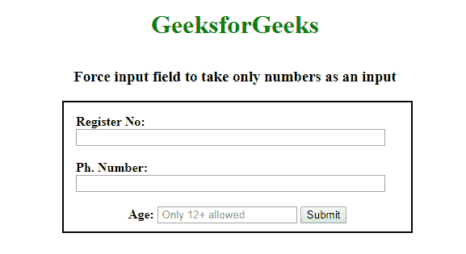
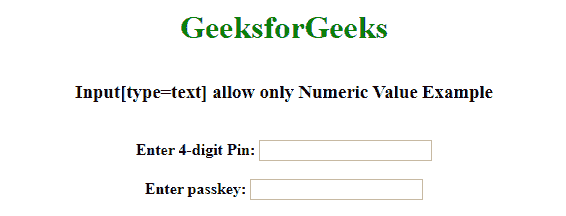

# 如何强制输入字段只使用 JavaScript 输入数字？

> 原文:[https://www . geesforgeks . org/如何使用 javascript 强制输入字段输入数字/](https://www.geeksforgeeks.org/how-to-force-input-field-to-enter-numbers-only-using-javascript/)

默认情况下，HTML 5 **输入**字段具有属性 **type="number"** ，用于获取数字格式的输入。现在强制**输入**字段 **type="text"** 只使用 Javascript 或 jQuery 接受数值。您也可以在移动设备上弹出数字键盘的输入栏中设置 **type="tel"** 属性。还有很多其他方法可以强制输入字段只接受输入数字。

以下示例将解释如何强制输入场力数值。

*   通过使用 ASCII 码
*   通过使用 replace()，isNan()函数

**示例 1:** 下面的示例说明了**输入【type = " text "】**在 ASCII 代码的帮助下，只允许使用 Javascript 的数值。

## 超文本标记语言

```
<!DOCTYPE html>
<html lang="en">

<head>
    <meta charset="utf-8">
    <meta name="viewport" 
          content="width=device-width, initial-scale=1">
    <style>
        div {
            width: 400px;
            height: 130px;
            border: 2px solid black;
            padding: 15px;
            position: absolute;
            left: 27%;
        }
    </style>
</head>

<body>
    <center>
        <h1 style="color:green;padding:13px;">
          GeeksforGeeks
        </h1>
        <h3>
          Force input field to take only numbers as an input
        </h3>
    </center>

    <div class="container">
        <form name="inputnumber" 
              autocomplete="off">
            <b>Register No:</b>
            <input type="text" 
                   onkeypress="return onlyNumberKey(event)" 
                   maxlength="11" 
                   size="50%" />

            <br>
            <br>
            <b>Ph. Number:</b>
            <input type="tel" 
                   size="50%" 
                   onkeypress="return onlyNumberKey(event)" />

            <br>
            <br>
            <center>
                <b>Age:</b>
                <input type="number" 
                       placeholder=" Only 12+ allowed" 
                       min="12" />
                <input type="submit"
                       value="Submit" 
                       onclick="return detailssubmit()">
            </center>
        </form>
    </div>
</body>
<script>
    function onlyNumberKey(evt) {

        // Only ASCII character in that range allowed
        var ASCIICode = (evt.which) ? evt.which : evt.keyCode
        if (ASCIICode > 31 && (ASCIICode < 48 || ASCIICode > 57))
            return false;
        return true;
    }
</script>
<script>
    function detailssubmit() {
        alert("Your details were Submitted");
    }
</script>

</html>
```

**输出:**



**示例 2:** 下面的示例说明了 Input[type="text"]在 jQuery 的 replace()方法和 javascript 的 **isNaN()函数**的帮助下，只允许使用 Javascript 的数值。

## 超文本标记语言

```
<!DOCTYPE html>
<html lang="en">

<head>
    <meta charset="utf-8">
    <meta name="viewport" content=
            "width=device-width, initial-scale=1">
    <script src="
https://ajax.googleapis.com/ajax/libs/jquery/3.4.1/jquery.min.js">
    </script>
</head>

<body>
    <center>
        <h1 style="color:green;padding:13px;">
         GeeksforGeeks</h1>
        <h3>
            Input[type=text] allow only
            Numeric Value Example
        </h3>
        <br>

        <form autocomplete="off" id="form1">
            <b>Enter 4-digit Pin:</b>
            <input type="text" name="numonly"
                   maxlength="4">
            <br>
            <br>

            <b>Enter passkey:</b>
            <input type="text" name="passkey"
                   id="num" 
                   oninput="return onlynum()"
                   minlength="2">
        </form>

    </center>
</body>
<script>
    $(function() {
        $("input[name='numonly']").on('input', function(e) {
            $(this).val($(this).val().replace(/[^0-9]/g, ''));
        });
    });
</script>
<script>
    function onlynum() {
        var fm = document.getElementById("form2");
        var ip = document.getElementById("num");
        var tag = document.getElementById("value");
        var res = ip.value;

        if (res != '') {
            if (isNaN(res)) {

                // Set input value empty
                ip.value = "";

                // Reset the form
                fm.reset();
                return false;
            } else {
                return true
            }
        }
    }
</script>

</html>
```

**输出:**



JavaScript 最出名的是网页开发，但它也用于各种非浏览器环境。您可以通过以下 [JavaScript 教程](https://www.geeksforgeeks.org/javascript-tutorial/)和 [JavaScript 示例](https://www.geeksforgeeks.org/javascript-examples/)从头开始学习 JavaScript。