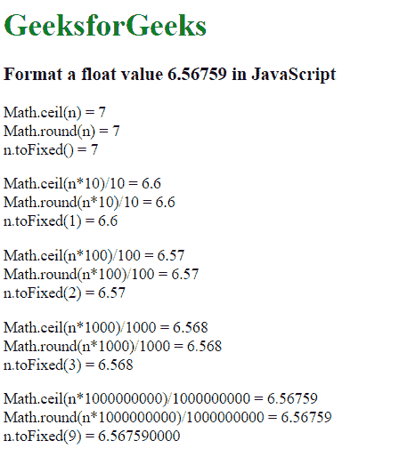
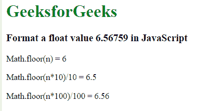
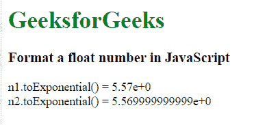
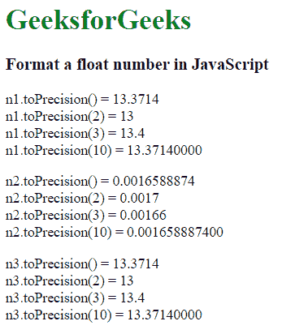

# 如何在 JavaScript 中格式化一个浮点数？

> 原文:[https://www . geesforgeks . org/如何格式化 javascript 中的浮点运算/](https://www.geeksforgeeks.org/how-to-format-a-float-in-javascript/)

格式化浮点数意味着将一个数字四舍五入到给定的小数位数、天花板、地板等。下面给出了许多用于格式化浮点数的操作:

*   [数学上限()方法](https://www.geeksforgeeks.org/javascript-math-ceil-function/)
*   [float.toFixed()方法](https://www.geeksforgeeks.org/javascript-tofixed-function/)
*   [数学圆()法](https://www.geeksforgeeks.org/javascript-math-round-function/)
*   [数学地板()方法](https://www.geeksforgeeks.org/javascript-math-floor-function/)
*   [float.toExponential()方法](https://www.geeksforgeeks.org/javascript-toexponential-function/)
*   [数字精确()方法](https://www.geeksforgeeks.org/javascript-toprecision-function/)

**Math.ceil()、float.toFixed()和 Math.round()方法:**所有的方法都是相似的，给出相同的输出。Math.ceil()和 Math.round()的实现完全相同，但是 Math.round()函数用于将一个数字舍入到其最接近的整数。

**示例:**

```
<!DOCTYPE html>
<html>

<head>
    <title>
        How to format a float
        value in javascript ?
    </title>
</head>

<body>
    <h1 style="color:green;">
        GeeksforGeeks
    </h1>

    <h3>
        Format a float value
        6.56759 in JavaScript
    </h3>

    <p id="d1"></p>
    <p id="d2"></p>
    <p id="d3"></p>
    <p id="d4"></p>
    <p id="d5"></p>

    <script>
        var n = 6.56759;

        // Rounds to next highest integer
        document.getElementById("d1").innerHTML 
                = "Math.ceil(n) = " + Math.ceil(n)
                + "<br />Math.round(n) = " + Math.round(n)
                + "<br />n.toFixed() = " + n.toFixed();

        // Rounds to the highest decimal upto one point
        document.getElementById("d2").innerHTML 
                = "Math.ceil(n*10)/10 = " + Math.ceil(n*10)/10
                + "<br />Math.round(n*10)/10 = "
                + Math.round(n*10)/10
                + "<br />n.toFixed(1) = " + n.toFixed(1);

        // Rounds to the highest decimal upto two points
        document.getElementById("d3").innerHTML
                = "Math.ceil(n*100)/100 = " 
                + Math.ceil(n*100)/100
                + "<br />Math.round(n*100)/100 = "
                + Math.round(n*100)/100
                + "<br />n.toFixed(2) = " + n.toFixed(2);

        // Rounds to the highest decimal upto three points
        document.getElementById("d4").innerHTML
                = "Math.ceil(n*1000)/1000 = " 
                + Math.ceil(n*1000)/1000
                + "<br />Math.round(n*1000)/1000 = "
                + Math.round(n*1000)/1000
                + "<br />n.toFixed(3) = " + n.toFixed(3);

        // Rounds to the specified length, as the
        // manipulation stops to the original float
        document.getElementById("d5").innerHTML
                = "Math.ceil(n*1000000000)/1000000000 = "
                + Math.ceil(n*1000000000)/1000000000
                + "<br />Math.round(n*1000000000)/1000000000 = "
                + Math.round(n*1000000000)/1000000000
                + "<br />n.toFixed(9) = " + n.toFixed(9);
    </script>
</body>

</html>
```

**输出:**


**Math.floor()方法:**math . floor()函数用于将作为参数传递的数字向下舍入到最接近的整数，即舍入到较小的值。

**示例:**

```
<!DOCTYPE html>
<html>

<head>
    <title>
        How to format a float
        value in javascript ?
    </title>
</head>

<body>
    <h1 style="color:green;">
        GeeksforGeeks
    </h1>

    <h3>
        Format a float value
        6.56759 in JavaScript
    </h3>

    <p id="d1"></p>
    <p id="d2"></p>
    <p id="d3"></p>

    <script>
        var n = 6.56759;

        // Rounds off to the floor value
        document.getElementById("d1").innerHTML
                = "Math.floor(n) = " + Math.floor(n);

        // Rounds off upto one decimal place
        document.getElementById("d2").innerHTML
                = "Math.floor(n*10)/10 = "
                + Math.floor(n*10)/10;

        // Rounds off upto two decimal place
        document.getElementById("d3").innerHTML
                = "Math.floor(n*100)/100 = "
                + Math.floor(n*100)/100;
    </script>
</body>

</html>
```

**输出:**


**float.toExponential()方法:**toExponential()方法用于将数字转换为其指数形式。它返回一个以指数表示法表示 Number 对象的字符串。

**示例:**

```
<!DOCTYPE html>
<html>

<head>
    <title>
        How to format a float
        value in javascript ?
    </title>
</head>

<body>
    <h1 style="color:green;">
        GeeksforGeeks
    </h1>

    <h3>
        Format a float number
        in JavaScript
    </h3>

    <p id="GFG"></p>

    <script>
        var n1 = 5.569999999999999999999;
        var n2 = 5.569999999999;

        // The complexity of the float results
        // in its conversion
        document.getElementById("GFG").innerHTML 
                = "n1.toExponential() = "
                + n1.toExponential() 
                + "<br />n2.toExponential() = "
                + n2.toExponential();
    </script>
</body>

</html>
```

**输出:**


**number.toPrecision()方法:**Toprecision()方法用于将数字格式化为特定的精度或长度。如果格式化的数字需要比原始数字更多的位数，则还会添加小数和空值来创建指定的长度。

**示例:**

```
<!DOCTYPE html>
<html>

<head>
    <title>
        How to format a float
        value in javascript ?
    </title>
</head>

<body>
    <h1 style="color:green;">
        GeeksforGeeks
    </h1>

    <h3>
        Format a float number
        in JavaScript
    </h3>

    <p id="d1"></p>
    <p id="d2"></p>
    <p id="d3"></p>

    <script>
        var n1 = 13.3714;
        var n2 = 0.0016588874;
        var n3 = 13.3714;

        document.getElementById("d1").innerHTML
                = "n1.toPrecision() = " + n1.toPrecision()
                + "<br \>n1.toPrecision(2) = " + n1.toPrecision(2) 
                + "<br \>n1.toPrecision(3) = " + n1.toPrecision(3)
                + "<br \>n1.toPrecision(10) = " + n1.toPrecision(10);

        document.getElementById("d2").innerHTML
                = "n2.toPrecision() = " + n2.toPrecision()
                + "<br \>n2.toPrecision(2) = " + n2.toPrecision(2)
                + "<br \>n2.toPrecision(3) = " + n2.toPrecision(3)
                + "<br \>n2.toPrecision(10) = " + n2.toPrecision(10);

        document.getElementById("d3").innerHTML
                = "n3.toPrecision() = " + n3.toPrecision()
                + "<br \>n3.toPrecision(2) = " + n3.toPrecision(2)
                + "<br \>n3.toPrecision(3) = " + n3.toPrecision(3)
                + "<br \>n3.toPrecision(10) = " + n3.toPrecision(10);
    </script>
</body>

</html>
```

**输出:**
