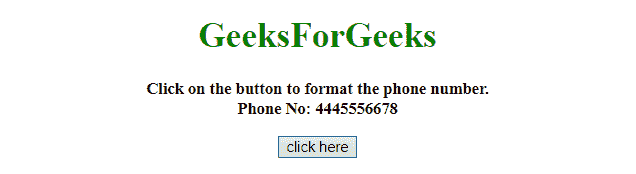
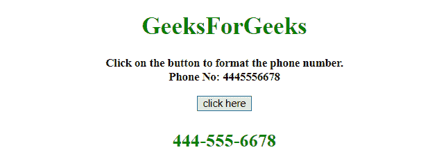

# 如何用 JavaScript 将电话号码格式化为人类可读的？

> 原文:[https://www . geesforgeks . org/如何使用 javascript 格式化人类可读的电话号码/](https://www.geeksforgeeks.org/how-to-format-a-phone-number-in-human-readable-using-javascript/)

给一个电话号码，任务是以人类容易理解的方式格式化电话号码。有两种方法可以格式化这些数字，下面将对此进行讨论:

**方法 1:**

*   正则表达式用于用人类可读的电话号码替换原始电话号码。
*   正则表达式正在搜索这 3 个数字，并将其保存在一个变量中(前 3 个数字为$1，后 3 个数字为$2，依此类推)。)
*   最后，它只是将它们与其中的“-”连接起来。

**示例:**该示例实现了上述方法。

```
<!DOCTYPE HTML>  
<html>  

<head>  
    <title>  
        How to format a phone number in
        Human-Readable using JavaScript?
    </title>

    <script src=
"https://ajax.googleapis.com/ajax/libs/jquery/3.4.1/jquery.min.js">
    </script>
</head>  

<body style = "text-align:center;">  

    <h1 style = "color:green;" >  
        GeeksForGeeks  
    </h1> 

    <p id = "GFG_UP" style = 
        "font-size: 15px; font-weight: bold;"> 
    </p>

    <button onclick = "GFG_Fun()">
        click here
    </button>

    <p id = "GFG_DOWN" style = 
        "font-size: 24px; font-weight: bold; color: green;"> 
    </p>

    <script>  
        var up = document.getElementById('GFG_UP');
        var down = document.getElementById('GFG_DOWN');
        var phoneNo = '4445556678';

        up.innerHTML = "Click on the button to format "
            + "the phone number.<br>Phone No: " + phoneNo; 

        function GFG_Fun() {
            down.innerHTML = 
                phoneNo.replace(/(\d{3})(\d{3})(\d{4})/,
                                '$1-$2-$3');
        } 
    </script>  
</body>  

</html>
```

**输出:**

*   **点击按钮前:**
    
*   **点击按钮后:**
    

**方法 2:**

*   本示例使用 **[substr()方法](https://www.geeksforgeeks.org/javascript-string-substr/)** 将电话号码格式化为人类可读格式。
*   它取一个长度为 3 的子字符串，并在其中放入“-”。剩余的字符串元素使用相同的方法。

**示例 2:** 该示例实现了上述方法。

```
<!DOCTYPE HTML>  
<html>  

<head>  
    <title>  
        How to format a phone number in
        Human-Readable using JavaScript?
    </title>

    <script src=
"https://ajax.googleapis.com/ajax/libs/jquery/3.4.1/jquery.min.js">
    </script>
</head>  

<body style = "text-align:center;">  

    <h1 style = "color:green;" >  
        GeeksForGeeks  
    </h1> 

    <p id = "GFG_UP" style = 
        "font-size: 15px; font-weight: bold;"> 
    </p>

    <button onclick = "GFG_Fun()">
        click here
    </button>

    <p id = "GFG_DOWN" style = 
        "font-size: 24px; font-weight: bold; color: green;"> 
    </p>

    <script>  
        var up = document.getElementById('GFG_UP');
        var down = document.getElementById('GFG_DOWN');
        var phoneNo = '4445556678';

        up.innerHTML = "Click on the button to format "
            + "the phone number.<br>Phone No: " + phoneNo; 

        function GFG_Fun() {
            down.innerHTML = 
                down.innerHTML = phoneNo.substr(0, 3)
                         + '-' + phoneNo.substr(3, 3)
                         + '-' + phoneNo.substr(6, 4);
        } 
    </script>  
</body>  

</html>
```

**输出:**

*   **点击按钮前:**
    
*   **点击按钮后:**
    