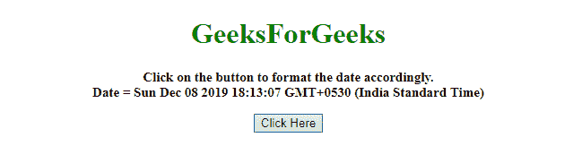
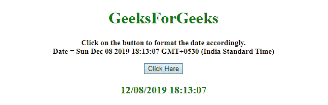

# 如何用 JavaScript 将当前日期格式化为 MM/DD/YYYY HH:MM:SS 格式？

> 原文:[https://www . geesforgeks . org/how-format-current-date-in-mm-DD-yyyy-hhmmss-format-using-JavaScript/](https://www.geeksforgeeks.org/how-to-format-current-date-in-mm-dd-yyyy-hhmmss-format-using-javascript/)

给定一个日期，任务是将当前日期格式化为毫米/日/年时:分:秒格式。这里有一些在 JavaScript 帮助下讨论最多的技术。

**方法 1:**

*   将当前日期存储在变量中。
*   使用字符串连接技术在月-日和日-年之间插入 **/和:**。
*   使用**。slice()方法**将日、月格式化为 2 位数。

**示例 1:** 该示例实现了上述方法。

```
<!DOCTYPE HTML> 
<html> 

<head> 
    <title> 
        How to format current date in
        MM/DD/YYYY HH:MM:SS format ? 
    </title>
</head> 

<body style = "text-align:center;" id = "body"> 

    <h1 id = "h1" style = "color:green;" > 
        GeeksForGeeks 
    </h1>

    <p id = "GFG_UP" style = 
        "font-size: 15px; font-weight: bold;">
    </p>

    <button onclick = "gfg_Run()"> 
        Click Here
    </button>

    <p id = "GFG_DOWN" style = "color:green; 
        font-size: 20px; font-weight: bold;">
    </p>

    <script>
        var el_up = document.getElementById("GFG_UP");
        var el_down = document.getElementById("GFG_DOWN");
        var date = new Date();
        el_up.innerHTML = "Click on the button to format"
            + " the date accordingly.<br>Date = " + date;

        function gfg_Run() {
            var Str =
                ("00" + (date.getMonth() + 1)).slice(-2)
                + "/" + ("00" + date.getDate()).slice(-2)
                + "/" + date.getFullYear() + " "
                + ("00" + date.getHours()).slice(-2) + ":"
                + ("00" + date.getMinutes()).slice(-2)
                + ":" + ("00" + date.getSeconds()).slice(-2);

            el_down.innerHTML = Str;
        }
    </script> 
</body> 

</html>
```

**输出:**

*   **点击按钮前:**
    
*   **点击按钮后:**
    

**方法 2:**

*   将当前日期存储在变量中。
*   使用**。加入()方法**在月-日和日-年之间插入 **/和:**。
*   创建一个**原型填充**，将日、月格式化为 2 位数。

**示例 2:** 该示例实现了上述方法。

```
<!DOCTYPE HTML> 
<html> 

<head> 
    <title> 
        How to format current date in
        MM/DD/YYYY HH:MM:SS format ?
    </title>
</head> 

<body style = "text-align:center;"> 

    <h1 style = "color:green;" > 
        GeeksForGeeks 
    </h1>

    <p id = "GFG_UP" style = 
        "font-size: 15px; font-weight: bold;">
    </p>

    <button onclick = "gfg_Run()"> 
        Click Here
    </button>

    <p id = "GFG_DOWN" style = "color:green; 
        font-size: 20px; font-weight: bold;">
    </p>

    <script>
        var el_up = document.getElementById("GFG_UP");
        var el_down = document.getElementById("GFG_DOWN");
        var d = new Date();

        el_up.innerHTML = "Click on the button to format"
                + " the date accordingly.<br>Date = " + d;
        Number.prototype.padding = function(base, chr) {
            var len = (String(base || 10).length
                        - String(this).length) + 1;

            return len > 0 ? new Array(len).join(chr || '0')
                    + this : this;
        }

        function gfg_Run() {
            str = [(d.getMonth()+1).padding(),
                    d.getDate().padding(),
                    d.getFullYear()].join('/')
                    + ' ' + [ d.getHours().padding(),
                    d.getMinutes().padding(),
                    d.getSeconds().padding()].join(':');
            el_down.innerHTML = str;
        } 
    </script> 
</body> 

</html>
```

**输出:**

*   **点击按钮前:**
    
*   **点击按钮后:**
    