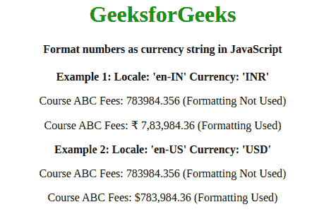

# 如何在 JavaScript 中将数字格式化为货币字符串？

> 原文:[https://www . geesforgeks . org/how-format-numbers-as-currency-in-string-JavaScript/](https://www.geeksforgeeks.org/how-to-format-numbers-as-currency-string-in-javascript/)

表示为货币价值的数字会产生影响，变得更易读，这就是将数字格式化为货币的原因。
比如一个数字，比如说 **100000** 当表示为**$ 100000.00**的时候，就变得很明白它代表的是一个货币价值，格式化的货币是 **USD** 。

不同的国家有不同的货币，以及显示货币价值的不同惯例。比如**美国**跟随**国际编号系统**代表**美元**，另一方面**印度**跟随**印度编号系统**代表 **INR** 。

**语法:**

```
Intl.NumberFormat('en-US', {style: 'currency', currency: 'target currency'})
.format(monetary_value);    

```

**说明:**
这里用的是‘en-INR’和‘en-US’作为地区，从[这里](https://ss64.com/locale.html)可以找到所有地区的列表，这里用的货币是‘INR’和‘USD’，但是支持所有的标准货币。选择不同的地区和货币将相应地格式化您的货币值。

**例 1:**

```
<!DOCTYPE html>
<html>

<head>
    <title>
        Formating number in currency string
    </title>
</head>

<body>
    <center>
        <h1 style="color:green;">GeeksforGeeks</h1>
        <h4>
         Formatting 4800 as INR
        </h4>
        <script>
            var format = new Intl.NumberFormat('en-INR', {
                style: 'currency',
                currency: 'INR',
                minimumFractionDigits: 2,
            });
            // for 4800 INR
            document.write(format.format(4800));
        </script>
    <center>
</body>

</html>
```

**输出:**


**例 2:**

```
<!DOCTYPE html>
<html>

<head>
    <meta charset="UTF-8">
    <meta name="viewport" 
          content="width=device-width, initial-scale=1">
    <title>Currency format</title>
    <!-- jQuery CDN -->
    <script src="https://code.jquery.com/jquery-3.4.1.min.js" 
            integrity="sha256-CSXorXvZcTkaix6Yvo6HppcZGetbYMGWSFlBw8HfCJo=" 
            crossorigin="anonymous">
    </script>
    <!-- End of CDN -->
</head>

<body>
    <center>
        <h1 style="color:green;">
          GeeksforGeeks
        </h1>
        <h4>
          Format numbers as currency string in JavaScript
        </h4>
        <b>Example 1: Locale: 'en-IN' Currency: 'INR'</b>
        <p>Course ABC Fees: 783984.356 (Formatting Not Used)</p>
        <p>Course ABC Fees: 
          <span class="currency-inr">783984.356</span>
          (Formatting Used)
        </p>

        <b>Example 2: Locale: 'en-US' Currency: 'USD'</b>
        <p>Course ABC Fees: 783984.356 (Formatting Not Used)</p>
        <p>Course ABC Fees: 
          <span class="currency-usd">783984.356</span> 
          (Formatting Used)
        </p>

        <script type="text/javascript">
            $('.currency-inr').each(function() {
                var monetary_value = $(this).text();
                var i = new Intl.NumberFormat('en-IN', {
                    style: 'currency',
                    currency: 'INR'
                }).format(monetary_value);
                $(this).text(i);
            });
            $('.currency-usd').each(function() {
                var monetary_value = $(this).text();
                var i = new Intl.NumberFormat('en-US', {
                    style: 'currency',
                    currency: 'USD'
                }).format(monetary_value);
                $(this).text(i);
            });
        </script>
  </center>
</body>

</html>     
```

**输出:**

**注:**我们使用 ECMAScript 国际化 API (Intl Object)进行格式化，它属于 JavaScript Standard 内置对象和用于 DOM 操作的 jQuery 的范畴。