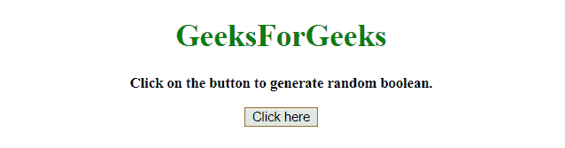
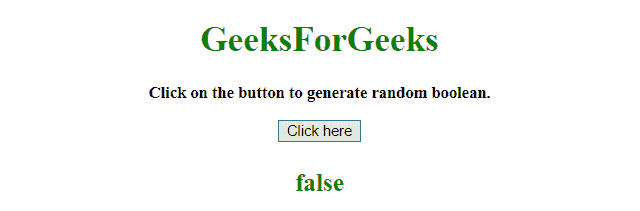
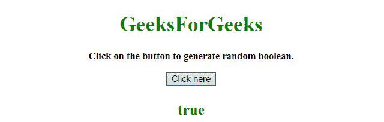

# 如何用 JavaScript 生成随机布尔？

> 原文:[https://www . geesforgeks . org/如何使用 javascript 生成随机布尔值/](https://www.geeksforgeeks.org/how-to-generate-a-random-boolean-using-javascript/)

任务是生成随机布尔值。在这里，我们将使用 JavaScript 来实现这个目标。

**方法 1:**

*   计算 **Math.random()** 函数。
*   如果小于 0.5，则为真，否则为假。

**示例 1:** 该示例实现了上述方法。

```
<!DOCTYPE HTML> 
<html> 

<head> 
    <title> 
        How to generate a random 
        boolean using JavaScript?
    </title>
</head> 

<body style = "text-align:center;" id = "body"> 

    <h1 id = "h1" style = "color:green;" > 
        GeeksForGeeks 
    </h1>

    <p id = "GFG_UP" style = 
        "font-size: 15px; font-weight: bold;">
    </p>

    <button onclick = "gfg_Run()"> 
        Click here
    </button>

    <p id = "GFG_DOWN" style = 
        "font-size: 23px; font-weight: bold; color: green; ">
    </p>

    <script>
        var el_up = document.getElementById("GFG_UP");
        var el_down = document.getElementById("GFG_DOWN");

        el_up.innerHTML = "Click on the button to "
                        + "generate random boolean.";

        function gfg_Run() {
            el_down.innerHTML = Math.random() >= 0.5;
        }         
    </script> 
</body> 

</html>
```

**输出:**

*   **点击按钮前:**
    
*   **点击按钮后:**
    

**方法 2:**

*   创建一个包含“真”和“假”值的数组。
*   计算 **Math.random()** 并取其值。
*   使用舍入值作为数组的索引，以获取布尔值。

**示例 2:** 该示例实现了上述方法。

```
<!DOCTYPE HTML>  
<html>  

<head> 
    <title> 
        How to generate a random
        boolean using JavaScript?
    </title>
</head> 

<body style = "text-align:center;" id = "body">  

    <h1 id = "h1" style = "color:green;" >  
        GeeksForGeeks  
    </h1>

    <p id = "GFG_UP" style = 
            "font-size: 15px; font-weight: bold;">
    </p>

    <button onclick = "gfg_Run()"> 
        Click here
    </button>

    <p id = "GFG_DOWN" style = 
        "font-size: 23px; font-weight: bold; color: green; ">
    </p>

    <script>
        var el_up = document.getElementById("GFG_UP");
        var el_down = document.getElementById("GFG_DOWN");
        var ar = [true, false];

        el_up.innerHTML = "Click on the button to "
                        + "generate random boolean.";

        function gfg_Run() {
            var index = Math.round(Math.random());
            el_down.innerHTML = ar[index];
        }         
    </script> 
</body>  

</html>
```

**输出:**

*   **点击按钮前:**
    
*   **点击按钮后:**
    