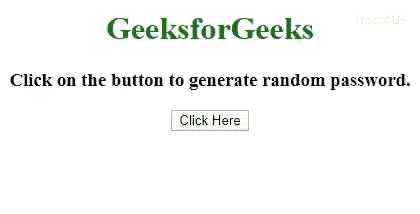
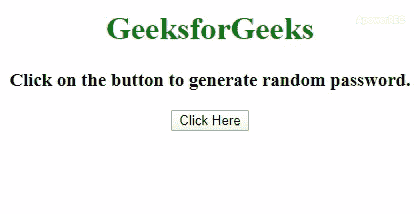

# 如何用 JavaScript 生成随机密码？

> 原文:[https://www . geesforgeks . org/如何使用 javascript 生成随机密码/](https://www.geeksforgeeks.org/how-to-generate-a-random-password-using-javascript/)

任务是生成一个随机密码，可能由字母、数字和特殊字符组成。这可以通过多种方式来实现，在本文中，我们将讨论最流行的两种方法，下面将讨论这两种方法来解决这个问题。

**方法 1:** 使字符串由字母(小写和大写)、数字和特殊字符组成。我们将使用**数学.随机()**和**数学.地板()**方法生成一个介于 0 和 l-1 之间的数字(其中 l 是字符串的长度)。要获取特定索引字符串的字符，我们可以使用**。charAt()方法**。这将继续连接字符串中的随机字符，直到获得所需长度的密码。

*   **示例:**该示例实现了上述方法。

    ```
    <!DOCTYPE HTML>
    <html>

    <head>
        <title>
            Generate a Random Password
            using JavaScript
        </title>
    </head>

    <body style="text-align:center;">

        <h1 style="color: green"> 
            GeeksforGeeks 
        </h1>

        <h3>
            Click on the button to
            generate random password.
        </h3>

        <button onclick="gfg_Run()">
            Click Here
        </button>
        <br>

        <div>
            <p id="geeks"></p>
        </div>

        <script>
            var el_down = document.getElementById("geeks");

            /* Function to generate combination of password */
            function generateP() {
                var pass = '';
                var str = 'ABCDEFGHIJKLMNOPQRSTUVWXYZ' + 
                        'abcdefghijklmnopqrstuvwxyz0123456789@#{content}apos;;

                for (i = 1; i <= 8; i++) {
                    var char = Math.floor(Math.random()
                                * str.length + 1);

                    pass += str.charAt(char)
                }

                return pass;
            }

            function gfg_Run() {
                el_down.innerHTML = generateP();
            }
        </script>
    </body>

    </html>
    ```

*   **输出:**
    

**方法 2:** 在此方法中，我们将使用 **Math.random()** 方法生成一个介于 0 和 1 之间的数字，然后使用将其转换为 **base36(由 0-9 和小写字母 a-z 组成)。toString()** 方法。去除前导零和小数点**。将使用 slice()** 方法和 **Math.random()。toString(36)。切片(2)** 生成密码。对于大写字母，使用与**相同的方法。大写()**方法与前面的方法串联。

*   **示例:**该示例实现了上述方法。

    ```
    <!DOCTYPE HTML> 
    <html> 

    <head> 
        <title> 
            Generate a Random Password
            using JavaScript
        </title>
    </head> 

    <body style = "text-align:center;"> 

        <h1 style = "color: green"> 
            GeeksforGeeks 
        </h1>

        <h3>
            Click on the button to
            generate random password.
        </h3>

        <button onclick = "gfg_Run()"> 
            Click Here
        </button>

        <p id = "geeks"></p>

        <script>
            var el_down = document.getElementById("geeks");

            function gfg_Run() {
                el_down.innerHTML = 
                    Math.random().toString(36).slice(2) + 
                    Math.random().toString(36)
                        .toUpperCase().slice(2);
                } 
        </script> 
    </body> 

    </html>      
    ```

*   **输出:**
    