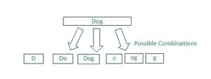

# 如何在 JavaScript 中生成一个字符串的所有组合？

> 原文:[https://www . geesforgeks . org/如何生成 javascript 中字符串的所有组合/](https://www.geeksforgeeks.org/how-to-generate-all-combinations-of-a-string-in-javascript/)

在本文中，我们将看到我们可以使用 JavaScript 方法或概念生成给定字符串的所有可能组合。

给你一个字符串，包含不同的字符，你需要通过一次选择一个字符来生成一个字符串的所有组合，然后将该字符与其他字符重新排列，这样所有的组合都可以在我们的输出中轻松生成和打印。

有几种方法可以解决这个特殊的问题，我们将逐一讨论每一种方法，但是让我们首先了解我们到底需要实现什么。

下面的图示描述了生成给定字符串的所有可能组合的场景-



作为一个例子(在上面的图示中提到过)，一个名为“Dog”的字符串可以进一步拆分成多个字符串，如“D”、“Do”等。

以下是在 JavaScript 中生成字符串所有组合的几种方法

#### 方法 1:

*   在这种方法中，我们将使用称为数组的数据结构，并在给定的字符串上运行两个 for 循环，该字符串实际上是我们代码的主要逻辑部分
*   进一步我们将使用**。推()**和**。slice()** 方法将我们的结果添加到数组中。

**示例:**

## java 描述语言

```
<script>
let possibleCombinations = (str) =>{
    let combinations = [];
      for(let i = 0 ;i < str.length; i++)
    {
        for(let j = i + 1; j< str.length + 1; j++)
        {
            combinations.push(str.slice(i , j));
        }
    }
   return combinations;
}
console.log(possibleCombinations('Dog'));
</script>
```

上述程序的输出如下-

```
[ 'd', 'do', 'dog', 'o', 'og', 'g' ]
```

#### 方法 2:

*   在这种方法中，我们将再次使用数组作为结果打印变量，并将当前索引值作为起始值(0)。
*   然后我们将运行一个 while 循环，在这个 while 循环中，我们将使用**存储当前索引值下的角色。charAt()** 方法。
*   然后我们将声明一个临时数组，在其中存储获得的字符。
*   然后我们将运行一个 for-in 循环，在其中我们将推我们的结果，然后我们将使用**将我们的结果添加到结果变量中。concat()** 方法，然后我们将增加当前的索引变量值。

示例:

## java 描述语言

```
<script>
let stringCombinations = (str) => {
  let strLength = str.length;
  let result = [];
  let currentIndex = 0;
  while (currentIndex < strLength) {
    let char = str.charAt(currentIndex);
    let x;
    let arrTemp = [char];
    for (x in result) {
      arrTemp.push("" + result[x] + char);
    }
    result = result.concat(arrTemp);
    currentIndex++;
  }
  return result;
};
console.log(stringCombinations("dog"));
</script>
```

上述代码的输出如下-

```
 [ 'd', 'o', 'do', 'g', 'dg', 'og', 'dog' ]
```

#### 方法 3:

*   在这种方法中，我们将使用两个数组一个是临时的，它将最初存储我们的结果，最后我们将把我们的结果添加到第二个结果数组中。
*   这里我们将首先使用一个 for 循环，在该 for 循环中，我们将在临时数组中添加字符串的每个字符，然后我们将起始索引值作为 0。
*   然后在 while 循环中，我们将使用**。push()** 方法将我们的结果推入临时数组，并增加当前索引值。
*   然后在 while 循环之后，我们将把结果从临时数组添加到结果数组中，然后打印结果数组。

示例:

## java 描述语言

```
<script>
let combinations = (str) => {
  let tempArr = [];
  let resultArr = [];
  for (let i = 0; i < str.length; i++) {
    tempArr = [str[i]];
    let index = 0;
    while (resultArr[index]) {
      tempArr.push("" + resultArr[index] + str[i]);
      index++;
    }
    resultArr = resultArr.concat(tempArr);
  }
  return resultArr;
};
console.log(combinations("dog"));
</script>
```

上述程序的输出将是-

```
[ 'd', 'o', 'do', 'g', 'dg', 'og', 'dog' ]
```

希望这篇文章能帮助你更有效地理解一个逻辑。