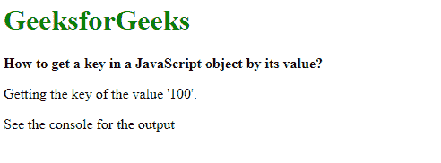
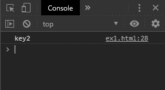
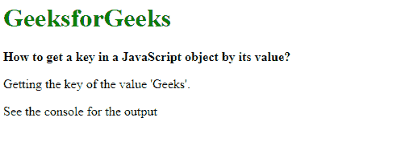
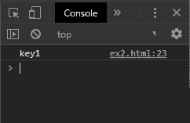

# 如何通过一个 JavaScript 对象的值来获取该对象中的一个键？

> 原文:[https://www . geeksforgeeks . org/如何按值获取 javascript 中的键对象/](https://www.geeksforgeeks.org/how-to-get-a-key-in-a-javascript-object-by-its-value/)

**方法 1:检查所有对象属性找到值:**对象的值可以通过迭代其属性来找到。可以检查这些属性中的每一个，看它们是否与提供的值匹配。对象的属性是通过在对象上使用 for 循环获得的。然后用对象的 hasOwnProperty()方法检查这些属性，以确保它是对象的直接属性，而不是继承的属性。
然后检查每个属性是否等于要找到的值。如果值匹配，则返回属性。这是对象值的关键。

**示例:**

```
<!DOCTYPE html>
<html>

<head>
    <title>
        How to get a key in a JavaScript
        object by its value ?
    </title>
</head>

<body>
    <h1 style="color: green">GeeksforGeeks</h1>

    <b>
        How to get a key in a JavaScript
        object by its value ?
    </b>

    <p>Getting the key of the value '100'.</p>

    <p>See the console for the output</p>

    <script>
        function getKeyByValue(object, value) {
            for (var prop in object) {
                if (object.hasOwnProperty(prop)) {
                    if (object[prop] === value)
                    return prop;
                }
            }
        }

        var exampleObject = {
            key1: 'Geeks',
            key2: 100,
            key3: 'Javascript'
        };

        ans = getKeyByValue(exampleObject, 100);

        console.log(ans);
    </script>
</body>

</html>
```

**输出:**

**控制台输出:**


**方法 2:使用 find 方法()比较键:**object . keys()方法用于返回对象的所有键。在这个键数组中，find()方法用于测试这些键是否与提供的值匹配。find()方法用于返回满足测试函数的第一个元素的值。如果值匹配，则满足该条件，并返回相应的密钥。这是对象值的关键。

**注意:**此方法是在 ES6 规范中添加的，可能在旧版浏览器上不支持。

**语法:**

```
function getKeyByValue(object, value) {
    return Object.keys(object).find(key => object[key] === value);
}
```

**示例:**

```
<!DOCTYPE html>
<html>

<head>
    <title>
        How to get a key in a JavaScript
        object by its value ?
    </title>
</head>

<body>
    <h1 style="color: green">GeeksforGeeks</h1>

    <b>How to get a key in a JavaScript object by its value?</b>

    <p>Getting the key of the value 'Geeks'.</p>

    <p>See the console for the output</p>

    <script>
        function getKeyByValue(object, value) {
            return Object.keys(object).find(key => 
                    object[key] === value);
        }

        var exampleObject = {
            key1: 'Geeks',
            key2: 100,
            key3: 'Javascript'
        };

        ans = getKeyByValue(exampleObject, 'Geeks');
        console.log(ans);
    </script>
</body>

</html>
```

**输出:**

**控制台输出:**
