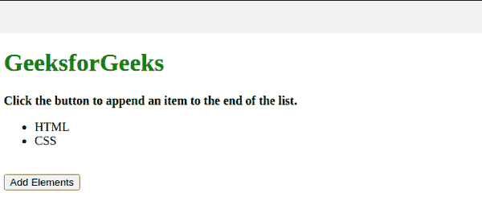

# 使用 JavaScript 在页面中添加元素时如何得到通知？

> 原文:[https://www . geeksforgeeks . org/如何使用 javascript 将元素添加到页面时获得通知/](https://www.geeksforgeeks.org/how-to-get-a-notification-when-an-element-is-added-to-the-page-using-javascript/)

要在元素添加到页面时显示通知，我们可以使用**[**【createElement()****方法**](https://www.geeksforgeeks.org/html-dom-createelement-method/) 创建具有指定名称的元素列表。之后，我们将通过 [**createTextNode()方法创建一个文本节点。**](https://www.geeksforgeeks.org/html-dom-createtextnode-method/) 然后我们将在该列表中添加新元素，并使用 [**alert()功能**](https://www.geeksforgeeks.org/html-window-alert-method/) 向用户显示通知。**

**下面的例子说明了这种方法:**

****示例:**在本例中，我们已经有了一个列表，因此我们想要在该列表中添加另一个元素，但是当我们想要在该列表中添加一个元素时，当我们单击按钮在该列表中添加一个元素时，我们将显示通知警报。**

## **超文本标记语言**

```
<!DOCTYPE html>
<html>
    <head>
        <script>
            function add() {

                // Add li element
                var node = document
                .createElement("li");

                // Add element into the list
                var textnode = document
                .createTextNode("JS");

                // Append the element into the list
                node.appendChild(textnode);
                document.getElementById("myList")
                .appendChild(node);

                // Alert message when element gets added
                alert("Element is getting added") ;    
            }
        </script>
    </head>
    <body>
            <h1 style="color: green;">
                GeeksforGeeks
            </h1>
            <b>
                Click the button to append an item
                to the end of the list.
            </b>
            <ul id="myList">
                <li>HTML</li>
                <li>CSS</li>
            </ul>
            <br>
            <button onclick="add()">
                Add Elements
            </button>
    </body>
</html>
```

****输出:****

****