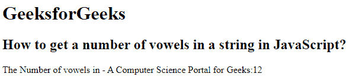

# 如何在 JavaScript 中获取一个字符串中元音的个数？

> 原文:[https://www . geesforgeks . org/如何获取 javascript 字符串中的元音数量/](https://www.geeksforgeeks.org/how-to-get-a-number-of-vowels-in-a-string-in-javascript/)

本文的方法是使用 Javascript 返回字符串中元音的数量。元音也是一个字母，代表以这种方式发出的声音:英语中的元音是 a、e、I、o、u。

**示例:**

```
Input:GeeksForGeeks
Output:  5 

Input: Hello Geeks
Output:    4
```

**解释:**这里我们创建一个用户定义的函数，叫做“get 元音()”，它读取一个字符串，并与元音列表进行比较。它将字符串的每个字符与元音进行比较。当元音匹配时，它将增加 **vowelsCount** 的值。

**示例:**下面的代码将说明这种方法。

## 超文本标记语言

```
<html>
    <head>
        <title>
            How to get a number of vowels
            in a string in JavaScript?
        </title>
    </head>
   <body>
       <h1>
           GeeksforGeeks
       </h1>
       <h2>
           How to get a number of vowels in 
           a string in JavaScript?
       </h2>
<script>
   function getVowels(string) {
      var Vowels = 'aAeEiIoOuU';
      var vowelsCount = 0;
      for(var i = 0; i < string.length ; i++) {
         if (Vowels.indexOf(string[i]) !== -1) {
            vowelsCount += 1;
        }
      }
   return vowelsCount;
   }
   document.write("The Number of vowels in -"+
   " A Computer Science Portal for Geeks:" 
   + getVowels("A Computer Science Portal for Geeks"));
</script>
</body>
</html>
```

**输出:** 