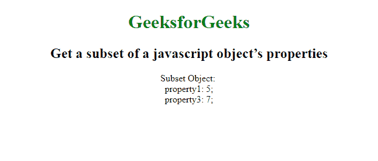
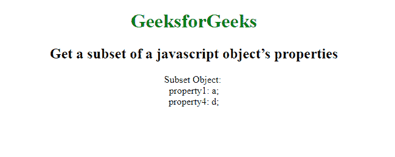

# 如何获取 javascript 对象属性的子集？

> 原文:[https://www . geesforgeks . org/如何获取 javascript 对象子集-属性/](https://www.geeksforgeeks.org/how-to-get-a-subset-of-a-javascript-objects-properties/)

为了获得一个 JavaScript 对象的属性子集，我们使用了析构和属性简写。**析构赋值**语法是一个 JavaScript 表达式，可以将数组中的值或对象中的属性解包成不同的变量。
**语法:**

```
subset = (({a, c}) => ({a, c}))(obj);
```

**示例 1:** 使用析构赋值获取 javascript 对象属性的子集。

## 超文本标记语言

```
<!DOCTYPE html>
<html>

<head>
    <title>
      Get a subset of a javascript object’s properties
  </title>
</head>

<body>
    <center>
        <h1 style="color:green">
          GeeksforGeeks
      </h1>
        <h2>
          Get a subset of a javascript object’s properties
      </h2>
        <script>
            obj = {
                property1: 5,
                property2: 6,
                property3: 7
            };
            subset = (({
                property1, property3
            }) => ({
                property1, property3
            }))(obj);

            var output = 'Subset Object: <br>';
            for (var property in subset) {
                output += property + ': ' + subset[property] + ';<br>';
            }
            document.write(output);
        </script>
    </center>
</body>

</html>
```

**输出:**



在 **ES6** 中，有一个非常简洁的方法可以使用析构来做到这一点。析构允许您轻松地添加对象并创建子集对象。
**语法:**

```
const {c, d, ...partialObject} = object;
const subset = {c, d};
```

**示例 2:** 使用析构赋值获取 javascript 对象属性的子集。

## 超文本标记语言

```
<!DOCTYPE html>
<html>

<head>
    <title>
      Get a subset of a javascript object’s properties
  </title>
</head>

<body>
    <center>
        <h1 style="color:green">
          GeeksforGeeks
      </h1>
        <h2>
          Get a subset of a javascript object’s properties
      </h2>
        <script>
            const object = {
                property1: 'a',
                property2: 'b',
                property3: 'c',
                property4: 'd',
            }

            const {
                property1,
                property4,
                ...pObject
            }

            = object;
            const subset = {
                property1,
                property4
            }

            ;
            var output = 'Subset Object: <br>';
            for (var property in subset) {
                output += property + ': ' +
                    subset[property] + ';<br>';
            }

            document.write(output);
        </script>
    </center>
</body>

</html>
```

**输出:**

