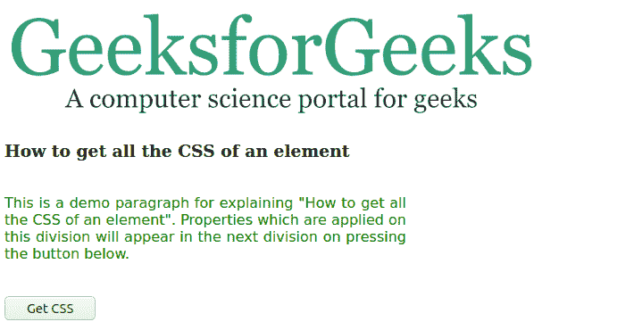
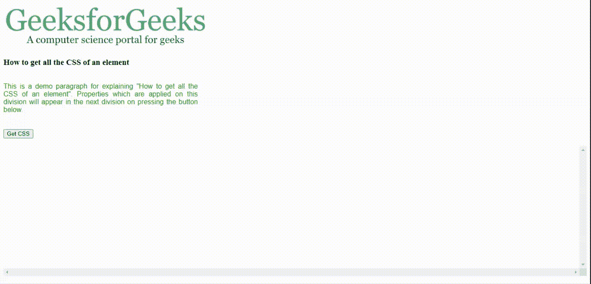
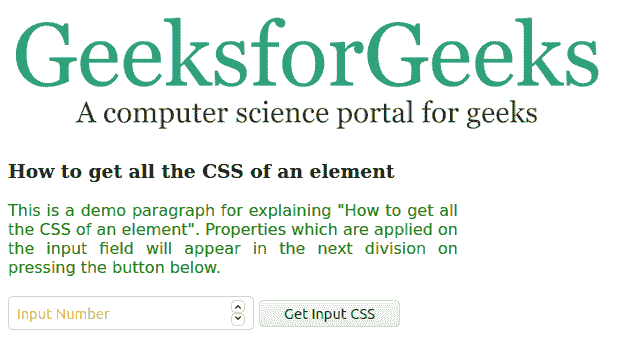
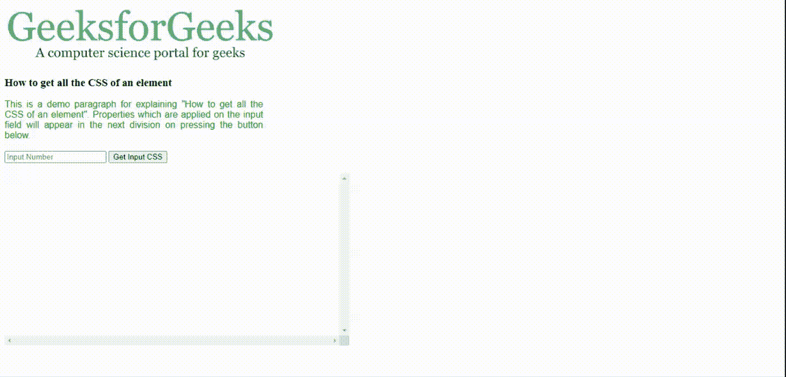

# 如何用 JavaScript 获取直接应用于一个元素的所有 CSS 样式？

> 原文:[https://www . geesforgeks . org/how-to-get-all-CSS-style-直接应用于元素-使用-javascript/](https://www.geeksforgeeks.org/how-to-get-all-css-styles-that-are-applied-directly-to-an-element-using-javascript/)

元素的 CSS 可以使用 JavaScript 中的 **getComputedStyle** 元素函数获得。它返回一个包含 CSS 属性及其值的 JavaScript 对象。该对象被编入索引，并可在属性名上进行迭代。**获取属性值(*属性* )** 用于获取一个属性的值。

在下面的代码中，将您的元素对象传递给 **getCSS( *元素* )** 使用 getComputedStyle( *元素*)和 getPropertyValue( *属性*)获取所有属性，并将它们写入单独的部分。您可以滚动结果来查看所有属性。

**示例 1:** 下面的示例演示了使用 *id='srcDiv'* 获取 *< div >* 元素的所有属性。



## 超文本标记语言

```html
<!DOCTYPE html>
<html>

<head>
    <style>
        #srcDiv {
            width: 450px;
            font-family: sans-serif;
            text-align: justify;
            justify-content: center;
            color: green;
        }

        #resDiv {
            height: 300px;
            overflow: scroll;
        }
    </style>

    <script>
        function getCSS(element) {
            var css_data = '';
            var css_obj = getComputedStyle(element);

            for (var i = 0; i < css_obj.length; i++) {
                css_data +=
                    css_obj[i] + ':' + 
                    css_obj.getPropertyValue(css_obj[i])
                    + ';<br>';
            }
            document.getElementById('resDiv')
                    .innerHTML = css_data;
            return;
        }
    </script>
</head>

<body>
    <br />

    <h3>
        How to get all the 
        CSS of an element
    </h3>
    <br />

    <div id="srcDiv">
        This is a demo paragraph for 
        explaining "How to get all the 
        CSS of an element". Properties 
        which are applied on this 
        division will appear in the
        next division on pressing the 
        button below.
    </div>
    <br /><br />

    <button onclick="getCSS(document
        .getElementById('srcDiv'))">
        Get CSS
    </button>
    <br /><br />

    <div id="resDiv"></div>
</body>

</html>
```

**输出:**点击“获取 CSS”按钮，输出显示。



**示例 2:** 下面是获取 id = ' inputTxt '的<输入>元素的属性的示例。



## 超文本标记语言

```html
<!DOCTYPE html>
<html>

<head>
    <style>
        #srcDiv {
            width: 450px;
            font-family: sans-serif;
            text-align: justify;
            justify-content: center;
            color: green;
        }

        #inputTxt {
            color: red;
        }

        #resDiv {
            height: 300px;
            width: 600px;
            overflow: scroll;
        }
    </style>

    <script>
        function getCSS(element) {
            var css_data = '';
            var css_obj = getComputedStyle(element);
            for (var i = 0; i < css_obj.length; i++) {
                css_data +=
                    css_obj[i] + ':' + css_obj
                        .getPropertyValue(css_obj[i])
                        + ';<br>';
            }
            document.getElementById('resDiv')
                    .innerHTML = css_data;
            return;
        }
    </script>
</head>

<body>
    <br />

    <h3>
        How to get all the 
        CSS of an element
    </h3>

    <div id="srcDiv">
        This is a demo paragraph for explaining 
        "How to get all the CSS of an element". 
        Properties which are applied on the input 
        field will appear in the next division on
        pressing the button below.
    </div>
    <br />

    <input id="inputTxt" type="number" 
            placeholder="Input Number" />

    <button onclick="getCSS(document
        .getElementById('inputTxt'))">
        Get Input CSS
    </button>
    <br /><br />

    <div id="resDiv"></div>
</body>

</html>
```

**输出:**点击**【获取输入 CSS】**按钮，显示如下输出。



**注意:**请注意，每个例子中传递到 **getCSS()** 函数的对象。