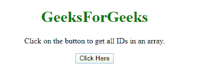
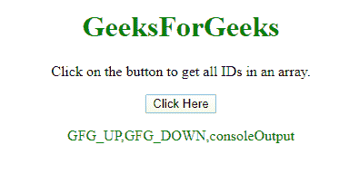

# 如何用 JavaScript 获取 DOM 元素的所有 ID？

> 原文:[https://www . geesforgeks . org/how-to-to-id-of-DOM-elements-with-JavaScript/](https://www.geeksforgeeks.org/how-to-get-all-id-of-the-dom-elements-with-javascript/)

给定一个 HTML 文档，任务是获取数组中 DOM 元素的所有标识。有两种方法可以解决这个问题，讨论如下:

**方法 1:**

*   首先使用 **$('*)选择器**选择所有元素，该选择器选择文档的每个元素。
*   使用**。每个()方法**遍历所有元素，检查它是否有标识。
*   如果它有标识，那么在数组中推送它。

**示例:**该示例实现了上述方法。

```
<!DOCTYPE HTML>
<html>

<head>
    <title>
        How to get all ID of the DOM
        elements with JavaScript ?
    </title>

    <script src=
"https://ajax.googleapis.com/ajax/libs/jquery/3.4.1/jquery.min.js">
    </script>
</head>

<body style="text-align:center;">

    <h1 style="color: green"> 
        GeeksForGeeks 
    </h1>

    <p id="GFG_UP"></p>

    <button onclick="gfg_Run()">
        Click Here
    </button>

    <p id="GFG_DOWN" style="color:green;"></p>

    <script>
        var el_up = document.getElementById("GFG_UP");
        var el_down = document.getElementById("GFG_DOWN");
        el_up.innerHTML = "Click on the button to get "
                            + "all IDs in an array.";

        function gfg_Run() {
            var ID = [];
            $("*").each(function() {
                if (this.id) {
                    ID.push(this.id);
                }
            });
            el_down.innerHTML = ID;
        }
    </script>
</body>

</html>
```

**输出:**

*   **点击按钮前:**
    
*   **点击按钮后:**
    

**方法 2:**

*   首先使用 **$('*)选择器**选择所有元素，该选择器选择文档的每个元素。
*   使用**。map()方法**遍历所有元素，检查是否有 ID。
*   如果它有 ID，那么使用**将它推入数组。get()方法**。

**示例 2:** 该示例实现了上述方法。

```
<!DOCTYPE HTML>
<html>

<head>
    <title>
        How to get all ID of the DOM
        elements with JavaScript ?
    </title>

    <script src=
"https://ajax.googleapis.com/ajax/libs/jquery/3.4.1/jquery.min.js">
    </script>
</head>

<body style="text-align:center;">

    <h1 style="color: green"> 
        GeeksForGeeks 
    </h1>

    <p id="GFG_UP"></p>

    <button onclick="gfg_Run()">
        Click Here
    </button>

    <p id="GFG_DOWN" style="color:green;"></p>

    <script>
        var el_up = document.getElementById("GFG_UP");
        var el_down = document.getElementById("GFG_DOWN");
        el_up.innerHTML = "Click on the button to "
                    + "get all IDs in an array.";

        function gfg_Run() {
            var ID = [];

            ID = $("*").map(function() {
                if (this.id) {
                    return this.id;
                }
            }).get();
            el_down.innerHTML = ID;
        }
    </script>
</body>

</html>
```

**输出:**

*   **点击按钮前:**
    
*   **点击按钮后:**
    