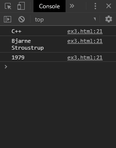
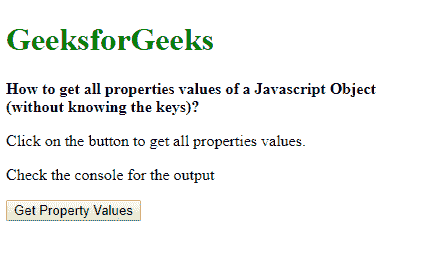

# 如何获取一个 JavaScript 对象的所有属性值(不知道键值)？

> 原文:[https://www . geesforgeks . org/如何在不知道密钥的情况下获取 javascript 对象的所有属性值/](https://www.geeksforgeeks.org/how-to-get-all-property-values-of-a-javascript-object-without-knowing-the-keys/)

**方法 1:使用 Object.values()方法:****object . values()**方法用于返回对象自身可枚举属性值的数组。可以使用 for 循环来循环数组，以获取对象的所有值。因此，获取所有属性值不需要知道这些键。

**语法:**

```
let valuesArray = Object.values(exampleObj);

for (let value of valuesArray) {
    console.log(value);
}
```

**示例:**

```
<!DOCTYPE html>
<html>
<head>
  <title>
    How to get all properties
    values of a Javascript Object
    (without knowing the keys)?
  </title>
</head>
<body>
  <h1 style="color: green">
    GeeksforGeeks
  </h1>
  <b>
    How to get all properties
    values of a Javascript Object
    (without knowing the keys)?
  </b>
  <p>
    Click on the button to get all
    properties values.
  </p>
  <p>
    Check the console for the output
  </p>
  <button onclick="getValues()">
    Get Property Values
  </button>
  <script type="text/javascript">
    function getValues() {
      let exampleObj = {
        language: "C++",
        designedby: "Bjarne Stroustrup",
        year: "1979"
      };

      let valuesArray = Object.values(exampleObj);

      for (let value of valuesArray) {
        console.log(value);
      }
    }
  </script>
</body>
</html>
```

**输出:**

*   **点击按钮前:**
    
*   **点击按钮后:**
    

**方法 2:提取访问属性的键:****object . keys()**方法用于返回对象自身可枚举属性名的数组。此数组使用 forEach()方法来访问每个键。每个属性值都可以使用带有对象数组符号的键来访问。
因此，获取所有属性值不需要事先知道密钥。

**语法:**

```
let objKeys = Object.keys(exampleObj);

objKeys.forEach(key => {
    let value = exampleObj[key];

    console.log(value);
});
```

**示例:**

```
<!DOCTYPE html>
<html>
<head>
   <title>
    How to get all properties
    values of a Javascript Object
    (without knowing the keys)?
  </title>
</head>
<body>
  <h1 style="color: green">
    GeeksforGeeks
  </h1>
  <b>
    How to get all properties
    values of a Javascript Object
    (without knowing the keys)?
  </b>
  <p>
    Click on the button to get all
    properties values.
  </p>
  <p>
    Check the console for the output
  </p>
  <button onclick="getValues()">
    Get Property Values
  </button>
  <script type="text/javascript">
    function getValues() {
      let exampleObj = {
          language: "C++",
          designedby: "Bjarne Stroustrup",
          year: "1979"
        };

      let objKeys = Object.keys(exampleObj);

      objKeys.forEach(key => {
        let value = exampleObj[key];

        console.log(value);
      });
    }
  </script>
</body>
</html>
```

**输出:**

*   **点击按钮前:**
    
*   **点击按钮后:**
    