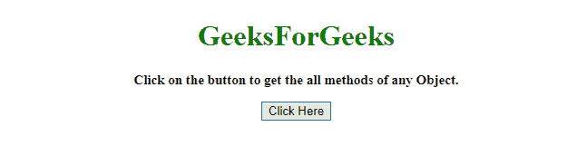
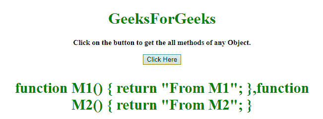
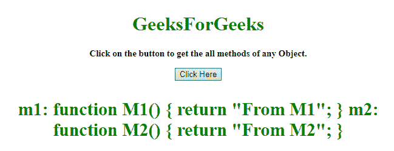

# 如何用 JavaScript 获取一个对象的所有方法？

> 原文:[https://www . geesforgeks . org/如何使用 javascript 获取对象的所有方法/](https://www.geeksforgeeks.org/how-to-get-all-the-methods-of-an-object-using-javascript/)

一个 HTML 文档包含一些方法，任务是获取对象的所有方法。有两种方法可以解决这个问题，讨论如下:

**方法 1:**

*   创建一个以对象为输入的函数。
*   使用**类型的运算符**，检查对象的类型是否为功能。
*   如果对象的类型是函数，那么它返回对象。

**示例:**该示例实现了上述方法。

```
<!DOCTYPE HTML>
<html>

<head>
    <title>
        Ways to print all methods of an object.
    </title>

    <script src=
"https://ajax.googleapis.com/ajax/libs/jquery/3.4.1/jquery.min.js">
    </script>
</head>

<body style="text-align:center;">

    <h1 style="color: green"> 
        GeeksForGeeks 
    </h1>

    <p id="GFG_UP" style=
        "font-size: 15px;font-weight: bold;">
    </p>

    <button onclick="gfg_Run()">
        Click Here
    </button>

    <p id="GFG_DOWN" style="color:green; 
            font-size: 30px; font-weight: bold;">
    </p>

    <script>
        var el_up = document.getElementById("GFG_UP");

        var el_down = document.getElementById("GFG_DOWN");

        el_up.innerHTML = "Click on the button to get "
                    + "the all methods of any Object.";

        function Obj() {
            this.m1 = function M1() {
                return "From M1";
            }
            this.m2 = function M2() {
                return "From M2";
            }
        }

        function getAllMethods(obj = this) {
            return Object.keys(obj)
                .filter((key) => typeof obj[key] === 'function')
                .map((key) => obj[key]);
        }

        function gfg_Run() {
            el_down.innerHTML = getAllMethods(new Obj());
        }
    </script>
</body>

</html>
```

**输出:**

*   **点击按钮前:**
    
*   **点击按钮后:**
    

**方法 2:**

*   创建一个以对象为输入的函数。
*   使用**类型的运算符**，检查对象的类型是否为功能。此示例还检查是否发生了任何错误，如果发生了，请正确处理。
*   如果对象的类型是函数，那么返回它。

**示例 2:** 该示例实现了上述方法。

```
<!DOCTYPE HTML>
<html>

<head>
    <title>
        Ways to print all methods of an object.
    </title>
    <script src=
"https://ajax.googleapis.com/ajax/libs/jquery/3.4.1/jquery.min.js">
    </script>
</head>

<body style="text-align:center;"
      id="body">
    <h1 id="h1"
        style="color: green">  
            GeeksForGeeks  
        </h1>
    <p id="GFG_UP" 
       style="font-size: 15px;
              font-weight: bold;">
    </p>
    <button onclick="gfg_Run()">
        Click Here
    </button>
    <p id="GFG_DOWN" 
       style="color:green;
              font-size: 30px;
              font-weight: bold;">
    </p>
    <script>
        var el_up = 
            document.getElementById("GFG_UP");
        var el_down = 
            document.getElementById("GFG_DOWN");
        el_up.innerHTML = 
"Click on the button to get the all methods of any Object.";

        function Obj() {
            this.m1 = function M1() {
                return "From M1";
            }
            this.m2 = function M2() {
                return "From M2";
            }
        }

        function getAllMethods(obj) {
            var result = [];
            for (var id in obj) {
                try {
                    if (typeof(obj[id]) == "function") {
                        result.push(id + ": " + obj[id].toString());
                    }
                } catch (err) {
                    result.push(id + ": Not accessible");
                }
            }
            return result;
        }

        function gfg_Run() {
            el_down.innerHTML = getAllMethods(new Obj()).join("\n");
        }
    </script>
</body>

</html>
```

**输出:**

*   **点击按钮前:**
    
*   **点击按钮后:**
    