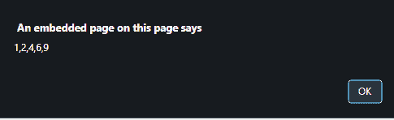
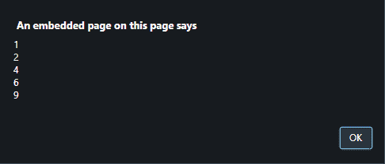

# 如何在 JavaScript 中用 alert()获取数组结构？

> 原文:[https://www . geesforgeks . org/如何通过 javascript 中的警报获取数组结构/](https://www.geeksforgeeks.org/how-to-get-array-structure-with-alert-in-javascript/)

下面是使用 **alert()** 查看数组结构的代码。下面讨论几个技巧

**方法 1:**

*   首先取一个变量中的值。
*   在**警报()**中传递数组名称。
*   我们可以直接使用数组名，因为 **arrayName** 自动转换为 **arrayName.toString()**

**示例 1:** 该示例遵循上面讨论的方法。

```
<!DOCTYPE HTML>
<html>

<head>
    <title>
        How to get array structure 
        with alert() in JavaScript?
    </title>
</head>

<body style="text-align:center;" id="body">
    <h1 style="color:green;"> 
            GeeksForGeeks 
    </h1>

    <p id="GFG_UP" style="font-size: 15px; font-weight: bold;">
    </p>

    <button onclick="gfg_Run()">
        Click here
    </button>

    <script>
        var el_up = document.getElementById("GFG_UP");
        var arr = [1, 2, 4, 6, 9];
        el_up.innerHTML = 
"Click on the button to see the array structure using Alert().<br> Array is = "
        + arr;

        function gfg_Run() {
            alert(arr);
        }
    </script>
</body>

</html>
```

**输出:**

*   **点击按钮前:**
    
*   **点击按钮后:**
    

**方法 2:**

*   首先取一个变量中的值。
*   在**警报()**中传递数组名称。
*   我们可以用**。join()方法**为了简单起见，我们把数组元素看成一行。

**示例 2:** 该示例遵循上面讨论的方法。

```
<!DOCTYPE HTML>
<html>

<head>
    <title>
        How to get array structure
        with alert() in JavaScript?
    </title>
</head>

<body style="text-align:center;" id="body">
    <h1 style="color:green;"> 
            GeeksForGeeks 
        </h1>
    <p id="GFG_UP" style="font-size: 15px; font-weight: bold;">
    </p>
    <button onclick="gfg_Run()">
        Click here
    </button>
    <script>
        var el_up = document.getElementById("GFG_UP");
        var arr = [1, 2, 4, 6, 9];
        el_up.innerHTML = 
"Click on the button to see the array structure using Alert().<br> Array is = "
        + arr;

        function gfg_Run() {
            alert(arr.join('\n'));
        }
    </script>
</body>

</html>
```

**输出:**

*   **点击按钮前:**
    
*   **点击按钮后:**
    